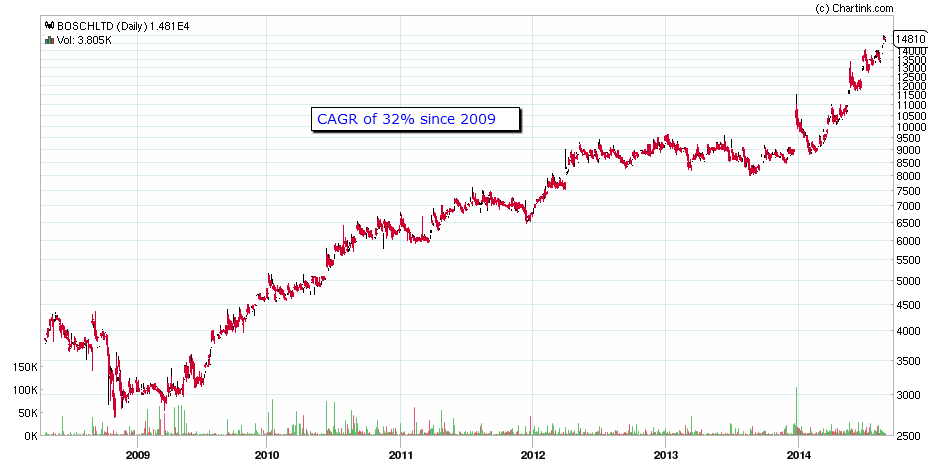
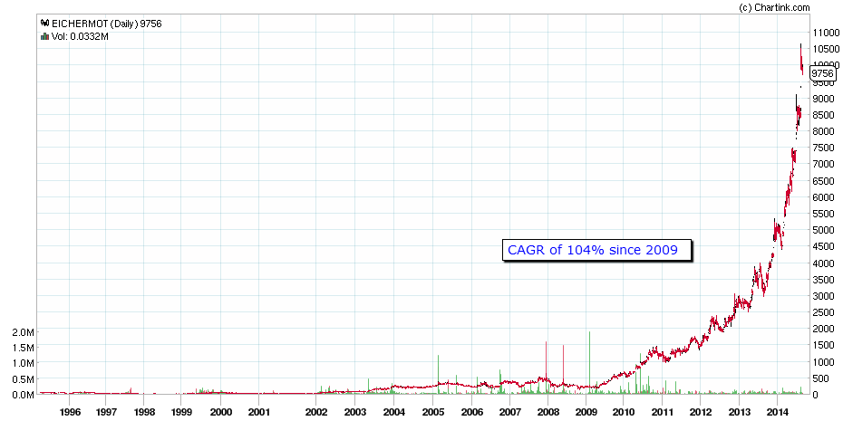
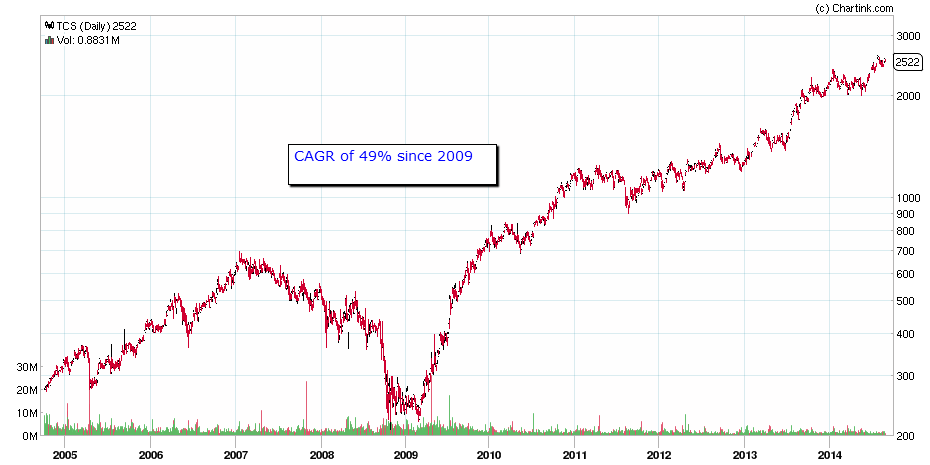
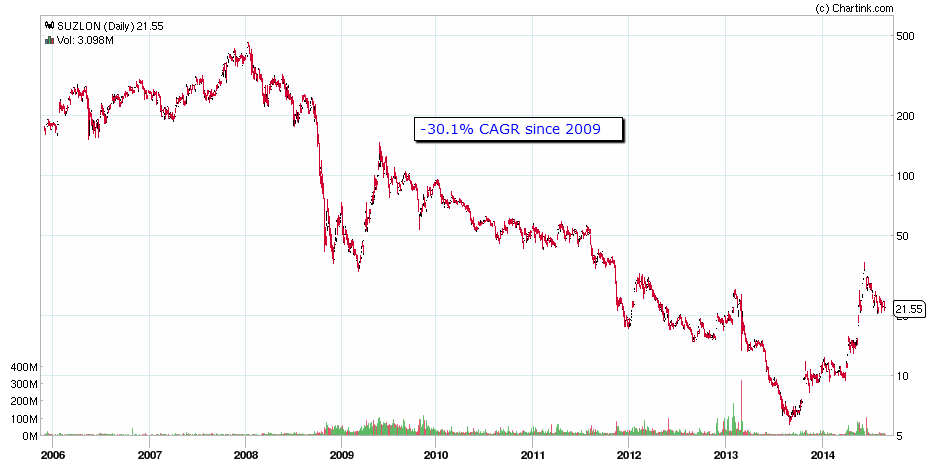
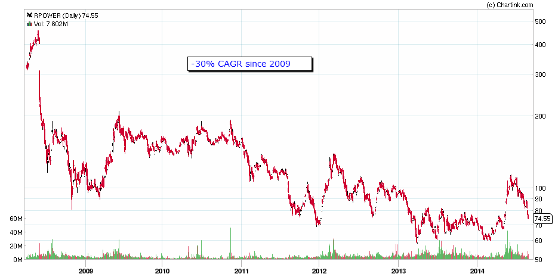
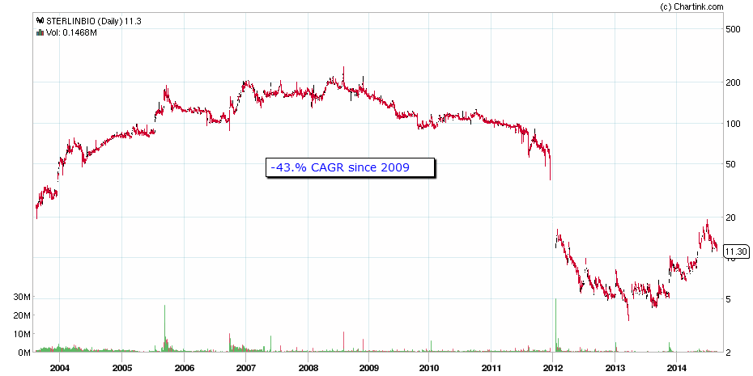

- https://zerodha.com/varsity/chapter/introduction-fundamental-analysis/
- 
- ## 1.1 – Overview
  
  Fundamental Analysis (FA) is a holistic approach to study a business. When an investor wishes to invest in a business for the long term (say 3 – 5 years), it becomes essential to understand the business from various perspectives. It is critical for an investor to separate the daily short term noise in the stock prices and concentrate on the underlying business performance. Over the long term, a fundamentally strong company’s stock prices tend to appreciate, thereby creating wealth for its investors.
  
  We have many such examples in the Indian market. To name a few, one can think of companies such as Infosys Limited, TCS Limited, Page Industries, Eicher Motors, Bosch India, Nestle India, TTK Prestige etc. Each of these companies has delivered an average over 20% compounded annual growth return (CAGR) year on year for over 10 years. At a 20% CAGR, the investor would double his money in roughly about 3.5 years to give you a perspective. Higher the CAGR faster is the wealth creation process. Some companies such as Bosch India Limited have delivered close to 30% CAGR. Therefore, you can imagine the magnitude and the speed at which wealth is created if one would invest in fundamentally strong companies.
  
  Here are long term charts of Bosch India, Eicher Motors, and TCS Limited that can set you thinking about long term wealth creation. Do remember these are just 3 examples amongst the many that you may find in Indian markets.
  
  {:height 397, :width 778} 
  
   
  
   
  
  At this point, you may think that I am biased as I am selectively posting charts that look impressive. You may wonder how the long term charts of companies such as Suzlon Energy, Reliance Power, and Sterling Biotech may look? Well here are the long term charts of these companies:
  
  
  
  
  
  
- These are just 3 examples of the wealth destructors amongst the many you may find in the Indian Markets.
  
  The trick has always been to separate the investment-grade companies which create wealth from the companies that destroy wealth. All investment-grade companies have a few common attributes that set them apart. Likewise, all wealth destructors have a few common traits which are clearly visible to an astute investor.
  
  Fundamental Analysis is the technique that gives you the conviction to invest for a long term by helping you identify these attributes of wealth-creating companies.
-
- ## 1.2 – Can I be a fundamental analyst?
  
  Of course, you can be. It is a common misconception that only chartered accountants and professionals from commerce background can be good fundamental analysts. This is not true at all. A fundamental analyst adds 2 and 2 to ensure it sums up to 4. To become a fundamental analyst, you will need a few basic skills:
- Understanding the basic financial statements
- Understand businesses concerning the industry in which it operates
- Basic arithmetic operations such as addition, subtraction, division, and multiplication
  
  This module’s objective on Fundamental Analysis is to ensure that you gain the first two skill sets.
- ## 1.3 – I’m happy with Technical Analysis, so why bother about Fundamental Analysis?
  
  Technical Analysis (TA) helps you garner quick short term returns. It helps you time the market for a better entry and exit. However, TA is not an effective approach to create wealth. Wealth is created only by making intelligent long term investments. However, both TA & FA must coexist in your market strategy. To give you a perspective, let me reproduce the chart of Eicher Motors:
  
  
  
  Let us say a market participant identifies Eicher motors as a fundamentally strong stock to invest and therefore invests his money in the stock in 2006. You can see the stock made a relatively negligible move between 2006 and 2010. The real move in Eicher Motors started only from 2010. This also means FA based investment in Eicher Motors did not give the investor any meaningful return between 2006 and 2010. The market participant would have been better off taking short term trades during this time. Technical Analysis helps the investor in taking short term trading bets. Hence both TA & FA should coexist as a part of your market strategy. In fact, this leads us to an important capital allocation strategy called “The Core Satellite Strategy”.
  
  Let us say, a market participant has a corpus of Rs.500,000/-. This corpus can be split into two unequal portions; for example, the split can be 60 – 40. The 60% of capital, Rs 300,000/- can be invested for a long term is fundamentally strong. This 60% of the investment makes up the core of the portfolio. One can expect the core portfolio to grow at least 12% to 15% CAGR year on year basis.
  
  The balance 40% of the amount, which is Rs.200,000/- can be utilized for active short term trading using Technical Analysis technique on equity, futures, and options. The Satellite portfolio can be expected to yield at least 10% to 12% absolute return every year.
  
  
- ## 1.4 – Tools of FA
  
  The tools required for fundamental analysis are fundamental, most of which are available for free. Specifically, you would need the following:
- The company’s annual report – All the information you need for FA is available in the annual report. You can download the annual report from the company’s website for free
- Industry-related data – You will need industry data to see how the company under consideration is performing concerning the industry. Basic data is available for free and is usually published in the industry’s association website
- Access to the news – Daily News helps you stay updated on the latest developments in the industry and the company you are interested in. A good business newspaper or services such as Google Alert can help you stay abreast of the latest news
- MS Excel – Although not free, MS Excel can be extremely helpful in fundamental calculations
  
  With just these four tools, one can develop a fundamental analysis that can rival institutional research. You can believe me when I say that you don’t need any other tool to do good fundamental research. In fact, even at the institutional level, the objective is to keep the research simple and logical.
  
  ---
- ### Key takeaways from this chapter
- Fundamental Analysis is used to make long term investments.
- Investment in a company with good fundamentals creates wealth.
- Using Fundamental Analysis, one can separate an investment-grade company from a junk company.
- All investment-grade companies exhibit a few common traits. Likewise, all junk companies exhibit common traits.
- Fundamental analysis helps the analysts identify these traits.
- Both Technical analysis and fundamental analysis should coexist as a part of your market strategy.
- To become a fundamental analyst, one does not require any special skill. Common sense, basic mathematics, and a bit of business sense are all that is required.
- A core-satellite approach to capital allocation is a prudent market strategy.
- The tools required for FA are generally fundamental; most of these tools are available for free.