- 
- direction cosines and direction ratios of a line
	- if a directed line L passing through the origin makes angles \alpha, \beta, \gamma with x, y, z-axes, called direction angles, then cosine of these angles  cos \alpha, cos \beta, cos \gamma are called direction cosines of the directed line L.
	- if we reverse the direction of L, then the direction angles are replaced by their supplements, i.e., \pi-\alpha, \pi-\beta, \pi-\gamma. thus, the signs of the direction cosines are reversed.
	- 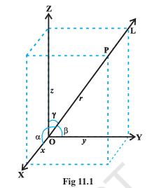
		- note that a given line in space can be extended in 2 opposite directions and so it has 2 sets of direction cosines. in order to have a unique set of direction cosines for a given line in space, we must take the given line as a directed line. these unique direction cosines are denoted by l, m, n
		- remark: if the given line in space does not pass through the origin, then, in order to find its direction cosines, we draw a line through the origin and parallel to the given line. now take one the directed lines from the origin and find its direction cosines as 2 parallel line have same set of direction cosines.
			- any 3 numbers which are proportional to the direction cosines of a line are called the `direction ratios (direction numbers)` of the line. if l, m, n are direction cosines and a, b, c are direction ratios of a line, then a = \lambda l, b = \lambda m, c = \lambda n, for any nonzero \lambda in $\mathbb{R}$
			- a, b, c be direction ratios of a line and let l, m, n be the direction cosines (d.c's) of the line. then
			  $\frac{l}{a} = \frac{m}{b} = \frac{n}{c} = k$, k being a constant
			  l = ak, m = bk, n = ck
			  $l^2 + m^2 + n^2 = 1$
			  therefore $k^2(a^2 + b^2 + c^2) = 1$
			  $k = \pm \frac{1}{\sqrt{a^2 + b^2 + c^2}}$
			  d.c's of the line are
			  $l = \pm \frac{a}{\sqrt{a^2 + b^2 + c^2}}, m = \pm \frac{b}{\sqrt{a^2 + b^2 + c^2}}, n = \pm \frac{c}{\sqrt{a^2 + b^2 + c^2}}$
			  where, depending on the desired sign of k, either a positive or a negative sign is to be taken for l, m and n
			- for any line if a, b, c are direction ratios of a line, then ka, kb, kc; k \neq 0 is also a set of direction ratios. so, any 2 sets of direction rations of a line are also proportional. also, for any line there are infinitely many sets of direction ratios.
	- relation between the direction cosines of a line
		- 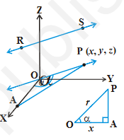
		- consider a line RS with direction cosines l, m, n. through the origin draw a line parallel to the given line and take a point P(x, y, z) on the line. for P draw a perpendicular PA on the x-axis.
		- OP = r. then $cos \alpha = \frac{OA}{OP} = \frac{x}{r}$. this gives x = lr
		  similarly y = mr, z = nr
		  thus $x^2 + y^2 + z^2 = r^2 (l^2 + m^2 + n^2)$
		  but $x^2 + y^2 + z^2 = r^2$
		  hence $l^2 + m^2 + n^2 = 1$
	- direction cosines of a line passing through 2 points
		- 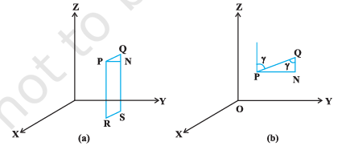
		- since one and only one line passes through 2 given points, we can determine the direction cosines of a line passing through the given points $P(x_1, y_1, z_1)$ and $Q(x_2, y_2, z_2)$ as follows
		- l, m, n be the direction cosines of the line PQ and let it makes angles \alpha, \beta, \gamma with x, y, z -axis
		- draw perpendiculars from P and Q to XY-plane to meet at R and S. draw a perpendicular from P to QS to meet at N. now in right angle triangle PNQ, $\angle{PQN} = \gamma$
		  id:: 6a954e34-dc05-4af5-a520-e695b01bd33a
		  therefore $cos \gamma = \frac{NQ}{PQ} = \frac{z_2 - z_1}{PQ}$
		  $cos \alpha = \frac{x_2 - x_1}{PQ}$ and
		  $cos \beta = \frac{y_2 - y_1}{PQ}$
		  hence, the direction cosines of the line segment joining the points $P(x_1, y_1, z_1)$ and $Q(x_2, y_2, z_2)$ are $\frac{x_2 - x_1}{PQ}$, $\frac{y_2 - y_1}{PQ}$, $\frac{z_2 - z_1}{PQ}$
		  where PQ = $\sqrt{(x_2 - x_1)^2 + (y_2 - y_1)^2 + (z_2 - z_1)^2}$
		- note: the direction ratios of the line segment joining $P(x_1, y_1, z_1)$ and $Q(x_2, y_2, z_2)$ may be taken as $x_2 - x_1, y_2 - y_1, z_2 - z_1$ or $x_1 - x_2, y_1 - y_2, z_1 - z_2$
- equation of a line in space
	- vector and cartesian equations of a line in space.
	- a line is uniquely determined if
		- it passes through a given point and has given direction or
		- it passes through 2 given points
	- equation of a line through a given point and parallel to a given vector $\overrightarrow{b}$
		- 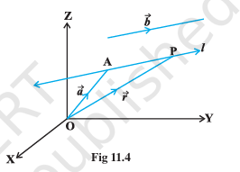
		- $\overrightarrow{a}$ be the position vector of the given point A with respect to the origin O of the rectangular coordinate system. l be the line which passes through point A and is parallel to given vector $\overrightarrow{b}$. let $\overrightarrow{r}$ be the position vector of an arbitrary point p on the line.
		- then $\overrightarrow{AP}$ is parallel to the vector $\overrightarrow{b}$ i.e., $\overrightarrow{AP} = \lambda \overrightarrow{b}$, where \lambda is some real number
		  but $\overrightarrow{AP} = \overrightarrow{OP} - \overrightarrow{OA}$
		  $\lambda \overrightarrow{b} = \overrightarrow{r} - \overrightarrow{a}$
		  conversely, for each value of the parameter \lambda, this equation gives the position vector of a point P on the line. hence the vector equation of the line is given by
		  $\overrightarrow{r} = \overrightarrow{a} + \lambda \overrightarrow{b}$
		- remark: if $\overrightarrow{b} = a \hat{i} + b \hat{j} + c \hat{k}$, then a, b, c are direction ratios of the line and conversely, if a, b, c are direction ratios of a line, then $\overrightarrow{b} = a \hat{i} + b \hat{j} + c \hat{k}$ will be the parallel to the line. here, b should not be confused with $|\overrightarrow{b}|$
		- derivation of cartesian form from vector form
			- let the coordinates of the given point A be $(x_1, y_1, z_1)$ and the direction ratios of the line be a, b, c. consider the coordinates of any point P be (x, y, z). then
			  $\overrightarrow{r} = x \hat{i} + y \hat{j} + z \hat{k}$, $\overrightarrow{a} = x_1 \hat{i} + y_1 \hat{j} + z_1 \hat{k}$
			  and $\overrightarrow{b} = a \hat{i} + b \hat{j} + c \hat{k}$
			  substituting in vector equation of the line and equating coefficients of $\hat{i}, \hat{j}, \hat{k}$, we get
			  $x = x_1 + \lambda a; y = y_1 + \lambda b; z = z_1 + \lambda c$
			  $\frac{x - x_1}{a} =\frac{y - y_1}{b} = \frac{z - z_1}{c}$
			  this is the Cartesian equation of the line
			- note: l, m, n are the direction cosines of the line, the equation of the line is $\frac{x - x_1}{l} =\frac{y - y_1}{m} = \frac{z - z_1}{n}$
	- equation of a line passing through 2 given points
		- $\overrightarrow{a}$, $\overrightarrow{b}$ 2 position vectors of 2 points $A(x_1, y_1, z_1)$ and $B(x_2, y_2, z_2)$ that are lying on a line
		- 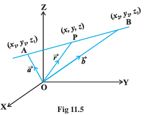
		- $\overrightarrow{r}$ be the position vector of an arbitrary point P (x, y, z) then P is a point on the point on the line if and only if $\overrightarrow{AP}$ = $\overrightarrow{r}$ - $\overrightarrow{a}$ and $\overrightarrow{AB}$ = $\overrightarrow{b}$ -$\overrightarrow{a}$ are collinear vectors. therefore, P is on the line if and only if 
		  $\overrightarrow{r} - \overrightarrow{a} = \lambda ( \overrightarrow{b} - \overrightarrow{a})$
		  or $\overrightarrow{r} = \overrightarrow{a} + \lambda ( \overrightarrow{b} - \overrightarrow{a}), \lambda \in \mathbb{R}$
		  this is the vector equation of the line.
		- derivation of cartesian form from vector form
			- $\overrightarrow{r} = x \hat{i} + y \hat{j} + z \hat{k}, \overrightarrow{a} = x_1 \hat{i} + y_1 \hat{j} + z_1 \hat{k}, \overrightarrow{b} = x_2 \hat{i} + y_2 \hat{j} + z_2 \hat{k}$
			  :LOGBOOK:
			  CLOCK: [2026-09-01 Tue 15:32:51]--[2026-09-01 Tue 15:32:53] =>  00:00:02
			  :END:
			  $x \hat{i} + y \hat{j} + z \hat{k} = x_1 \hat{i} + y_1 \hat{j} + z_1 \hat{k} + \lambda [(x_2 - x_1) \hat{i} + (y_2 - y_1) \hat{j} + (z_2 - z_1) \hat{k}$]
			  equating the like coefficients of $\hat{i}, \hat{j}, \hat{k}$, we get
			  $x = x_1 + \lambda (x_2 - x_1); y = y_1 + \lambda (y_2 - y_1); z = z_1 + \lambda (z_2 - z_1)$
			  $\frac{x - x_1}{x_2 - x_1} = \frac{y - y_1} {y_2 - y_1} = \frac{z - z_1}{z_2 - z_1}$
			  which is the equation of the line in Cartesian form
- angle between 2 lines
	- 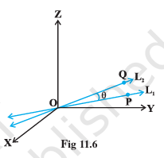
	- $L_1, L_2$ be 2 lines passing through the origin and with direction ratios $a_1, b_1, c_1$ and $a_2, b_2, c_2$. P be a point on $L_1$ and Q be a point on $L_2$. consider the directed lines OP, OQ. \theta be the acute angle between OP and OQ. now recall that the directed line segments OP and OQ are vectors with components $a_1, b_1, c_1$ and $a_2, b_2, c_2$. therefore the angle \theta between them is given by
	  $$
	  cos \theta = \begin{vmatrix} \frac{a_1 a_2 + b_1 b_2 + c_1 c_2}{\sqrt{a_1^{2} + b_1^{2} + c_1^{2}} \sqrt{a_2^{2} + b_2^{2} + c_2^{2}}} \end{vmatrix}
	  $$
	  the angle between the lines in terms of 
	  $sin \theta = \sqrt{1 - cos^2 \theta}$
	  $= \sqrt{1 - \frac{(a_1 a_2 + b_1 b_2 + c_1 c_2)^2}{(a_1^{2} + b_1^{2} + c_1^{2}) (a_2^{2} + b_2^{2} + c_2^{2})}}$
	  $= \frac{\sqrt{(a_1^{2} + b_1^{2} + c_1^{2}) (a_2^{2} + b_2^{2} + c_2^{2}) - (a_1 a_2 + b_1 b_2 + c_1 c_2)^2}}{\sqrt{(a_1^{2} + b_1^{2} + c_1^{2})} \sqrt{(a_2^{2} + b_2^{2} + c_2^{2})}}$
	  $= \frac{\sqrt{(a_1 b_2 - a_2 b_1)^{2} + (b_1 c_2 - b_2 c_1)^{2} + (c_1 a_2 - c_2 a_1)^2}}{\sqrt{(a_1^{2} + b_1^{2} + c_1^{2})} \sqrt{(a_2^{2} + b_2^{2} + c_2^{2})}}$
	- note: in case lines $L_1, L_2$ do not pass through the origin, we may take lines $L_1', L_2'$ which are parallel to $L_1, L_2$ and pass through the origin
	- if instead of direction ratios for the line $L_1, L_2$, direction cosines, $l_1, m_1, n_1$ for $L_1$, $l_2, m_2, n_2$ for $L_2$ are given
	  $cos \theta = |l_1 l_2 + m_1 m_2 + n_1 n_2|$ (as $l_1^2 + m_1^2 + n_1^2 = 1 = l_2^2 + m_2^2 + n_2^2$)
	  and $sin \theta = \sqrt {(l_1 m_2 - l_2 m_1)^2 - (m_1 n_2 - m_2 n_1)^2 + (n_1 l_2 - n_2 l_1)^2}$
	- 2 lines with direction ratios $a_1, b_1, c_1$ and $a_2, b_2, c_2$ are
		- perpendicular i.e., if \theta = 90\deg
			- $a_1 a_2 + b_1 b_2 + c_1 c_2 =0$
		- parallel i.e., if \theta = 0
			- $\frac{a_1}{a_2} = \frac{b_1}{b_2} = \frac{c_1}{c_2}$
	- angle between 2 lines when their equations are given. if \theta is acute angle between the lines
		- $\overrightarrow{r} = \overrightarrow{a_1} + \lambda \overrightarrow{b_1}$ and $\overrightarrow{r} = \overrightarrow{a_2} + µ \overrightarrow{b_2}$
		  then $cos \theta = \begin{vmatrix} \frac{\overrightarrow{b_1} \overrightarrow{b_2}}{|\overrightarrow{b_1}| |\overrightarrow{b_2}|} \end{vmatrix}$
		- in Cartesian form, if \theta is the angle between the lines
		  $\frac{x - x_1}{a_1} = \frac{y - y_1}{b_1} = \frac{z - z_1}{c_1}$
		  and $\frac{x - x_2}{a_2} = \frac{y - y_2}{b_2} = \frac{z - z_2}{c_2}$
		  where $a_1, b_1, c_1$ and $a_2, b_2, c_2$ are the direction ratios of the lines then
		  $$
		  cos \theta = \begin{vmatrix} \frac{a_1 a_2 + b_1 b_2 + c_1 c_2}{\sqrt{a_1^{2} + b_1^{2} + c_1^{2}} \sqrt{a_2^{2} + b_2^{2} + c_2^{2}}} \end{vmatrix}
		  $$
- shortest distance between 2 lines
	- 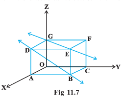
		- if 2 lines in space intersect at a point, then the shortest distance between them is 0. also, if 2 lines in spaces are parallel, then the shortest distance between them will be the perpendicular drawn from a point on one line to the other line.
		- further, in a space, there are lines which are neither intersect nor parallel. in fact, such a pair of lines are `non coplanar` and are called `skew lines`
		- example:
			- let us consider a room of size 1, 3, 2 units along x, y, z-axes. the line GE that goes diagonally across the ceiling and the line DB passes through one corner of the ceiling directly above A and goes diagonally down the wall. these lines are skew because they are not parallel and also never meet.
			- by the shortest distance between 2 lines we mean the join of a point in one line with one point on the other line so that the length of the segment so obtained is the smallest.
			- for skew lines, the line of the shortest distance will be perpendicular to both the lines
	- distance between 2 skew lines
		- 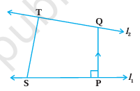
		- we now determine the shortest distance between 2 skew lines in the following ways:
			- let $l_1, l_2$ be 2 skew lines with equations
				- $\overrightarrow{r} = \overrightarrow{a_1} + \lambda \overrightarrow{b_1}$
				- and $\overrightarrow{r} = \overrightarrow{a_2} + \lambda \overrightarrow{b_2}$
			- take any point S on $l_1$ with position vector $\overrightarrow{a_1}$ and T on $l_2$, with position vector $\overrightarrow{a_2}$. then the magnitude of the shortest distance vector  will be equal to that of the projection of ST along the direction of the line of the line of the shortest distance.
			- if $\overrightarrow{PQ}$ is the shortest distance vector between $l_1$ and $l_2$, then it being perpendicular to both $\overrightarrow{b_1}$ and $\overrightarrow{b_2}$, the unit vector $\hat{n}$ along $\overrightarrow{PQ}$ would therefore be
			  $\hat{n} = \frac{\overrightarrow{b_1} \times \overrightarrow{b_2}}{|\overrightarrow{b_1} \times \overrightarrow{b_2}|}$
			  then $\overrightarrow{PQ} = d \hat{n}$
			  where, d is the magnitude of the shortest distance vector. let \theta be the angle between $\overrightarrow{ST}$ and $\overrightarrow{PQ}$, then
			  PQ = ST |cos \theta|
			  $cos \theta = \begin{vmatrix} \frac{\overrightarrow{PQ} \overrightarrow{ST}}{|\overrightarrow{PQ}| |\overrightarrow{ST}|}\end{vmatrix}$
			  $= \begin{vmatrix} \frac{d\ \hat{n}\ (\overrightarrow{a_2} - \overrightarrow{a_1})}{d\ ST}\end{vmatrix}$ (since $\overrightarrow{ST} = \overrightarrow{a_2} - \overrightarrow{a_1}$)
			  $= \begin{vmatrix} \frac{(\overrightarrow{b_1} \times \overrightarrow{b_2}) (\overrightarrow{a_2} - \overrightarrow{a_1})}{ST |\overrightarrow{b_1} \times \overrightarrow{b_2}|}\end{vmatrix}$
			  hence, the required shortest distance is
			  d = PQ = ST |cos \theta|
			  or $d = \begin{vmatrix} \frac{(\overrightarrow{b_1} \times \overrightarrow{b_2}) (\overrightarrow{a_2} - \overrightarrow{a_1})}{|\overrightarrow{b_1} \times \overrightarrow{b_2}|}\end{vmatrix}$
			- Cartesian form
				- the shortest distance between the lines
					- $l_1 : \frac{x - x_1}{a_1} = \frac{y - y_1}{b_1} = \frac{z - z_1}{c_1}$
					- and $l_2 : \frac{x - x_2}{a_2} = \frac{y - y_2}{b_2} = \frac{z - z_2}{c_2}$
					- is 
					  $$
					  \begin{vmatrix} 
					  \frac{
					  \begin{vmatrix} 
					  x_2 - x_1 & y_2 - y_1 & z_2 - z_1 \\
					  a_1 & b_1 & c_1 \\
					  a_2 & b_2 & c_2
					  \end{vmatrix}
					  }{
					  \sqrt{(b_1c_2 - b_2c_1)^2 + (c_1a_2 - c_2a_1)^2 + (a_1b_2 - a_2b_1)^2}
					  }
					  \end{vmatrix}
					  $$
	- distance between parallel lines
		- let $l_1, l_2$ be 2 parallel lines, then they are coplanar with equations $\overrightarrow{r} = \overrightarrow{a_1} + \lambda \overrightarrow{b_1}$ and $\overrightarrow{r} = \overrightarrow{a_2} + \lambda \overrightarrow{b_2}$
			- 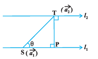
			- where, $a_1$ is the position vector of a point S on $l_1$ and $a_2$ is the position vector of a point T on $l_2$
			- as $l_1, l_2$ are coplanar, if the foot of the perpendicular from T on the line $l_1$ is P, then the distance between the lines $l1, l_2$ = |TP|
			- let \theta be the angle between the vectors $\overrightarrow{ST}$ and $\overrightarrow{b}$ then
			  $\overrightarrow{b} \times \overrightarrow{ST} = (|\overrightarrow{b}| |\overrightarrow{ST}| sin \theta) \hat{n}$
			- where $\hat{n}$ is the unit vector perpendicular to the plane of the line $l_1, l_2$
			- but $\overrightarrow{ST} = \overrightarrow{a_2} - \overrightarrow{a_1}$
			- $\overrightarrow{b} \times (\overrightarrow{a_2} - \overrightarrow{a_1}) = |\overrightarrow{b}| |\overrightarrow{PT}| \hat{n}$ (since PT = ST sin \theta)
			- $|\overrightarrow{b} \times (\overrightarrow{a_2} - \overrightarrow{a_1})| = |\overrightarrow{b}| |\overrightarrow{PT}| * 1$ (as $|\hat{n}| = 1$)
			  hence, the distance between the given parallel lines is 
			  $d = |\overrightarrow{PT}| = \begin{vmatrix} \frac{\overrightarrow{b} (\overrightarrow{a_2} - \overrightarrow{a_1})}{|\overrightarrow{b}|}\end{vmatrix}$
- plane
	- a plane is determined uniquely if any one of the following is known
		- the normal to the plane and its distance from the origin is given, i.e., equation of a plane in normal form
		- it passes through a point and is perpendicular to a given direction
		- it passes though 3 given non collinear points
	- equation of a plane in normal form
	  collapsed:: true
		- 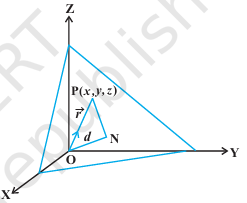
		- vector form
			- consider a plane whose perpendicular distance from the origin is d (d \neq 0)
			- if $\overrightarrow{ON}$ is the norm from the origin to the plane, and $\hat{n}$ is the normal vector along $\overrightarrow{ON}$. then $\overrightarrow{ON} = d \hat{n}$. let P be any point on the plane. therefor, $\overrightarrow{NP}$ is perpendicular to $\overrightarrow{ON}$.
			- therfore, $\overrightarrow{NP} . \overrightarrow{ON} = 0$
			- let $\overrightarrow{r}$ be the position vector of the point P, then $\overrightarrow{NP} = \overrightarrow{r} - d \hat{n}$ (as $\overrightarrow{ON} + \overrightarrow{NP} = \overrightarrow{OP}$)
			- equation of a plane perpendicular to a given vector and passing through a given point
			- equation of a plane passing through 2 non collinear points
			  $(\overrightarrow{r} - d \hat{n}) . d \hat{n} = 0$
			  $(\overrightarrow{r} - d \hat{n}) . \hat{n} = 0$ $(d \neq 0)$
			  $\overrightarrow{r} \hat{n} - d \hat{n} . \hat{n} = 0$
			  $\overrightarrow{r} \hat{n} = d$ (as $\hat{n} \hat{n} = 1$)
			- this is the vector form of the equation of the plane
		- Cartesian form
			- P (z, y, z) be any point on the plane then 
			  $\overrightarrow{OP} = \overrightarrow{r} = x \hat{i} + y \hat{j} + z \hat{k}$
			- l, m, n be the direction cosines of $\hat{n}$, then
				- $\hat{n} = l \hat{i} + m \hat{j} + n \hat{k}$
			- $(x \hat{i} + y \hat{j} + z \hat{k}) (l \hat{i} + m \hat{j} + n \hat{k}) = d$
			- $lx + my + nz = d$
			- this is the Cartesian equation of the plane in normal form
		- if $\overrightarrow{r} . (a \hat{i} + b \hat{j} + c \hat{k}) = d$ is the vector equation of a plane, then ax + by + cz = d is the Cartesian equation of the plane, where a, b and c are the direction ratios of the the normal to the plane
		- if d is the distance from the origin and l, m, n are the direction cosines of the normal to the plane through the origin, then the foot of the perpendicular is (ld, md, nd)
	- equation of a plane perpendicular to a given vector and passing through a given point
		- 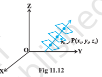
		- 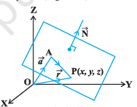
			- vector form
				- in the space, there can be many planes that are perpendicular to the given vector, but through a given point $P(x_1, y_1, z_1)$ only one such plane exists.
				- let a plane pass through a point A with position vector $\overrightarrow{a}$ and perpendicular to the the vector $\overrightarrow{N}$.
				- let $\overrightarrow{r}$ be the position vector of any point P(x, y, z) in the plane.
				- then the point P lies in the plane if and only if $\overrightarrow{AP}$ perpendicular to $\overrightarrow{N}$ i.e., $\overrightarrow{AP} . \overrightarrow{N} = 0$. but $\overrightarrow{AP} = \overrightarrow{r} - \overrightarrow{a}$. therefore $(\overrightarrow{r} - \overrightarrow{a}) . \overrightarrow{N} = 0$
				- this is the vector equation of the plane.
			- Cartesian form
				- let the given point A be $(x_1, y_1, z_1)$, P be (x, y, z) and direction ratios of $\overrightarrow{N}$ are A, B, C. then
				- $\overrightarrow{a} = x_1 \hat{i} + y_1 \hat{j} + z_1 \hat{k}$
				- $\overrightarrow{r} = x \hat{i} + y \hat{j} + z \hat{k}$ and
				- $\overrightarrow{N} = A \hat{i} + B \hat{j} + C \hat{k}$
				- $(\overrightarrow{r} - \overrightarrow{a}) * \overrightarrow{N} = 0$
				- $[(x - x_1) \hat{i} + (y - y_1) \hat{j} + (z - z_1) \hat{k})] . (A \hat{i} + B \hat{j} + C \hat{k}) = 0$
				- $A (x - x_1) + B (y - y_1) + C (z - z_1) = 0$
	- equation of a plane passing through 3 non collinear points
		- 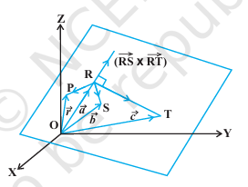
		- vector form
			- let R, S and T be 3 non-collinear points on the plane with position vectors $\overrightarrow{a}, \overrightarrow{b}, \overrightarrow{c}$
			- the vectors $\overrightarrow{RS}, \overrightarrow{RT}$ are in the given plane. therefore, the vector $\overrightarrow{RS} \times \overrightarrow{RT}$ is perpendicular to the plane containing points R, s and T. Let $\overrightarrow{r}$ be the position vector of any point P in the plane. therefore, the equation of the plane passing through R and perpendicular to the vector $\overrightarrow{RS} \times \overrightarrow{RT}$ is 
			  $(\overrightarrow{r} - \overrightarrow{a}) . ($\overrightarrow{RS} \times \overrightarrow{RT}) = 0$
			  $(\overrightarrow{r} - \overrightarrow{a}) . [(\overrightarrow{b} - \overrightarrow{a}) \times (\overrightarrow{c} - \overrightarrow{a})] = 0$
			- this is the equation of the plane in vector form passing through 3 non-collinear points
			- note: why was it necessary to say that the 3 points has to be noncollinear? if the 3 points were on the same line then there will be many planes that will contain them.
			- 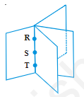
			- these planes will resemble the pages of a book where the line containing the points R, S and T are members in the binding of the book
		- Cartesian form
			- let $(x_1, y_1, z_1), (x_2, y_2, z_2), (x_3, y_3, z_3)$ be the coordinates of the points R, S, T. let (x, y, z) be the coordinates of any point P on the plane with position vector $\overrightarrow{r}$ then
			  $\overrightarrow{RP} = (x - x_1) \hat{i} + (y - y_1) \hat{j} + (z - z_1) \hat{k}$
			- $\overrightarrow{RS} = (x_2 - x_1) \hat{i} + (y_2 - y_1) \hat{j} + (z_2 - z_1) \hat{k}$
			- $\overrightarrow{RT} = (x_3 - x_1) \hat{i} + (y_3 - y_1) \hat{j} + (z_3 - z_1) \hat{k}$
			- $$
			  \begin{vmatrix}
			  x - x_1 & y - y_1 & z - z_1 \\
			  x_2 - x_1 & y_2 - y_1 & z_2 - z_1 \\
			  x_3 - x_1 & y_3 - y_1 & z_3 - z_1 \\
			  \end{vmatrix} = 0
			  $$
			  which is the equation of the plane in Cartesian form passing through 3 noncollinear points
	- intercept form of the equation of a plane
		- 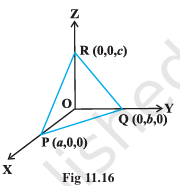
		- equation of a plane in terms of the intercepts made by the plane on the coordinate axes. let the equation of the plane be
		  Ax + By + Cz + D = 0 (D \neq 0)
		  let the plane make intercepts a, b, c on x, y, z axes.
		- hence the plane meets x, y and z axes at (a, 0, 0), (0, b, 0) (0, 0, c)
		- $\frac{x}{a} + \frac{y}{b} + \frac{z}{c} = 1$
		- equation of plane in intercept form
	- plane passing through the intersection of 2 given planes
		- 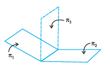
		- vector form
			- $\pi_1, \pi_2$ be 2 planes with equations $\overrightarrow{r} * \hat{n_1} = d_1$, $\overrightarrow{r} * \hat{n_2} = d_2$ the position vector of any point on the line of intersection must satisfy both the equations.
			  if $\overrightarrow{t}$ is the position vector of a point on the line, then
			  $\overrightarrow{t} * \hat{n_1} = d_1$, $\overrightarrow{t} * \hat{n_2} = d_2$
			  therefore, for all real values of \lambda, we have
			  $\overrightarrow{t} . (\hat{n_1} + \lambda \hat{n_2}) = d_1 + \lambda d_2$
			  since $\overrightarrow{t}$ is arbitrary, it satisfies for any point on the line.
			  hence, the equation $\overrightarrow{r} . (\hat{n_1} + \lambda \hat{n_2}) = d_1 + \lambda d_2$ represents a plane $\pi_3$ which is such that if any vector $\overrightarrow{r}$ satisfies both the equations $\pi_1$ and $\pi_2$, it also satisfies the equation $\pi_3$ i.e., any plane passing through the intersection of the planes.
			  $\overrightarrow{r} * \hat{n_1} = d_1$, $\overrightarrow{r} * \hat{n_2} = d_2$ has the equation $\overrightarrow{r} . (\hat{n_1} + \lambda \hat{n_2}) = d_1 + \lambda d_2$
		- Cartesian form
			- in Cartesian system, let 
			  $\overrightarrow{n_1} = A_1 \hat{i} + B_1 \hat{j} + C_1 \hat{k}$
			  $\overrightarrow{n_2} = A_2 \hat{i} + B_2 \hat{j} + C_2 \hat{k}$
			  $\overrightarrow{r} = x \hat{i} + y \hat{j} + z \hat{k}$
			  $x (A1 + \lambda A_2) + y (B_1 + \lambda B_2) + z (C_1 + \lambda C_2) = d_1 + \lambda d_2$
			  or $(A_1 x + B_1 y + C_1 z - d_1) + \lambda (A_2 x + B_2 y + C_2 z - d_2) = 0$
			  which is the required Cartesian form of the equation of the plane passing through the intersection of the given planes for each value of \lambda
- coplanarity of 2 lines
	- vector form:
		- let the given lines be $\overrightarrow{r} = \overrightarrow{a_1} + \lambda \overrightarrow{b_1}$ and $\overrightarrow{r} = \overrightarrow{a_2} + \mu \overrightarrow{b_2}$ 
		  line 1 passes through the point, say A, with position vector $\overrightarrow{a_1}$ and is parallel to $\overrightarrow{b_1}$
		  line 2 passes through the point, say B, with position vector $\overrightarrow{a_2}$ and is parallel to $\overrightarrow{b_2}$
		  thus $\overrightarrow{AB} = \overrightarrow{a_2} - \overrightarrow{a_1}$
		  the given lines are coplanar if and only if $\overrightarrow{AB}$ is perpendicular to $\overrightarrow{b_1} \times \overrightarrow{b_2}$
		  i.e. $\overrightarrow{AB} . (\overrightarrow{b_1} \times \overrightarrow{b_2}) = 0$ or $(\overrightarrow{a_2} - \overrightarrow{a_1}) . (\overrightarrow{b_1} \times \overrightarrow{b_2}) = 0$
	- Cartesian form
		- $(x_1, y_1, z_1), (x_2, y_2, z_2)$ be the coordinates of the points A and B respectively.
		  $a_1, b_1, c_1$ and $a_2, b_2, c_2$ be the direction ratios of $\overrightarrow{b_1}$, $\overrightarrow{b_2}$ then
		  $\overrightarrow{AB} = (x_2 - x_1) \hat{i} + (y_2 - y_1) \hat{j} + (z_2 - z_1) \hat{k}$
		  $\overrightarrow{b_1} = a_1 \hat{i} + b_1 \hat{j} + c_1 \hat{k}$ and $\overrightarrow{b_2} = a_2 \hat{i} + b_2 \hat{j} + c_2 \hat{k}$
		  the given lines are coplanar if and only if $\overrightarrow{AB} . (\overrightarrow{b_1} \times \overrightarrow{b_2}) = 0$. in the Cartesian form, it can be expressed as
		  $$
		  \begin{vmatrix}
		  x_2 - x_1 & y_2 - y_1 & z_2 - z_1 \\
		  a_1 & b_1 & c_1 \\
		  a_2 & b_2 & c_2
		  \end{vmatrix} = 0
		  $$
- angle between 2 planes
	- 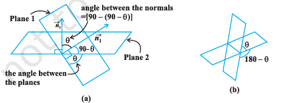
	- definition: angle between 2 planes is defined as the angle between their normals. observe that if \theta is an angle between the 2 planes, then so is 180 - \theta. we shall take the actue angle between 2 planes.
	- vector form
		- if $n_1, n_2$ are normals to the planes and \theta be the angle between the planes
		  $\overrightarrow{r} . \overrightarrow{n_1} = d_1$ and $\overrightarrow{r} . \overrightarrow{n_2} = d_2$
		  then \theta is the angle between the normals to the planes drawn from some common point.
		  we have, $cos \theta = \begin{vmatrix} \frac{\overrightarrow{n_1} . \overrightarrow{n_2}}{|n_1| |n_2|} \end{vmatrix}$
		- note: the planes are perpendicular to each other if $\overrightarrow{n_1} . \overrightarrow{n_2} = 0$ and parallel if $\overrightarrow{n_1}$ is parallel to $\overrightarrow{n_2}$
	- Cartesian form
		- let \theta be the angle between the planes,
			- $A_1 x + B_1 y + C_1 z + D_1 = 0, A_2 x + B_2 y + C_2 z + D_2 = 0$
			- the direction ratios of the normal to the planes are $A_1, B_1, C_1$ and $A_2, B_2, C_2$
			- therefore $cos \theta = \begin{vmatrix} \frac{A_1 A_2 + B_1 B_2 + C_1 C_2}{\sqrt{A_1^2 + B_1^2 + C_1^2}\sqrt{A_2^2 + B_2^2 + C_2^2}}\end{vmatrix}$
		- note:
			- if the planes are at right angles, then \theta = 90\deg and so cos \theta = 0. hence, cos \theta = $A_1 A_2 + B_1 B_2 + C_1 C_2$ = 0
			- if the planes are parallel, then $\frac{A_1}{A_2} = \frac{B_1}{B_2} = \frac{C_1}{C_2}$
- distance of a point from a plane
	- 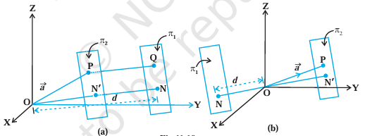
	- vector form
		- consider a point P with position vector $\overrightarrow{a}$ and a plane $\pi_1$ whose equation is $\overrightarrow{r} . \hat{n} = d$
		- consider a plane $\pi_2$ through P parallel to the plane $\pi_1$. the unit vector normal to $\pi_2$ is $\hat{n}$. hence, its equation is $(\overrightarrow{r} - \overrightarrow{a}) . \hat{n} = 0$
		  i.e., $\overrightarrow{r} \hat{n} = \overrightarrow{a} \hat{n}$
		  thus, the distance ON' of this plane from the origin is $|\overrightarrow{a} \hat{n}|$
		  therefore, the distance PQ from the plane $\pi_1$ is
		  i.e., ON - ON' = $|d - \overrightarrow{a} \hat{n}|$
		  which is the length of the perpendicular from a point to the given plane.
		- note:
			- if the equation of the plane $\pi_2$ is in the form $\overrightarrow{r} . \overrightarrow{N} = d$, where $\overrightarrow{N}$ is normal to the plane, then the perpendicular distance is $\frac{|\overrightarrow{a} \overrightarrow{N} - d|}{|\overrightarrow{N}|}$
			- the length of the perpendicular from origin O to the plane $\overrightarrow{r} . \overrightarrow{N} = d$ is $\frac{|d|}{|\overrightarrow{N}|}$ (since $\overrightarrow{a} = 0$)
	- Cartesian form
		- let P(x_1, y_1, z_1) be the given point with position vector $\overrightarrow{a}$ and Ax + By + Cz = D be the Cartesian equation of the given plane. then
		  $\overrightarrow{a} = x_1 \hat{i} + y_1 \hat{j} + z_1 \hat{k}$
		  $\overrightarrow{N} = A \hat{i} + B \hat{j} + C \hat{k}$
		  the perpendicular from P to the plane is $\begin{vmatrix}\frac{(x_1 \hat{i} + y_1 \hat{j} + z_1 \hat{k})(A \hat{i} + B \hat{j} + C \hat{k}) - D|}{\sqrt{A^2 + B^2 + C^2}}\end{vmatrix}$
		  = $\begin{vmatrix}\frac{A x_1 + B y_1 + C z_1 - D}{\sqrt{A^2 + B^2 + C^2}}\end{vmatrix}$
- angle between a line and a plane
	- 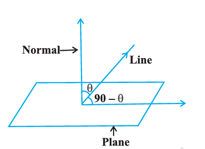
	- definition: the angle between a line an a plane is the complement of the angle between the line and normal to the plane
		- vector form:
			- if the equation of the line is $\overrightarrow{r} = \overrightarrow{a} + \lambda \overrightarrow{b}$ and the equation of the plane is  $\overrightarrow{r} . \hat{n} = d$. then the angle \theta between the line and the normal to the plane is 
			  $cos \theta = \begin{vmatrix} \frac{\overrightarrow{b}\overrightarrow{n}}{|\overrightarrow{b}|\overrightarrow{n}||}\end{vmatrix}$
			  so the angle \phi between the line and the plane is given by 90 - \theta, i.e.,
			  sin(90 - \theta) = cos \theta
			  $sin \phi = \begin{vmatrix} \frac{\overrightarrow{b}\overrightarrow{n}}{|\overrightarrow{b}|\overrightarrow{n}||}\end{vmatrix}$
			  $\phi = sin^{-1} \begin{vmatrix} \frac{\overrightarrow{b}\overrightarrow{n}}{|\overrightarrow{b}|\overrightarrow{n}||}\end{vmatrix}$
-