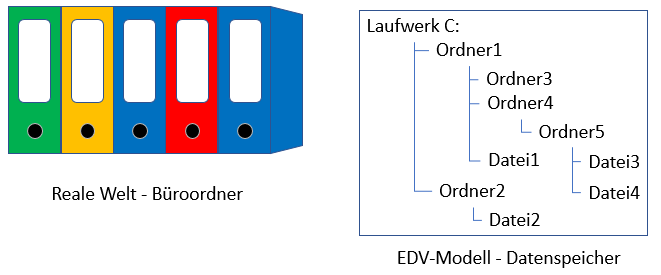
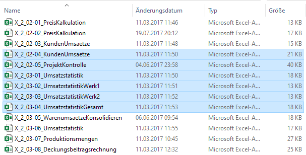
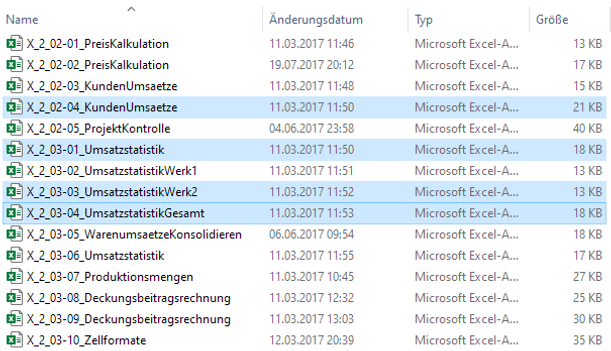
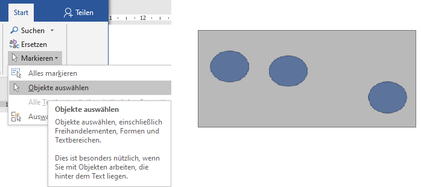
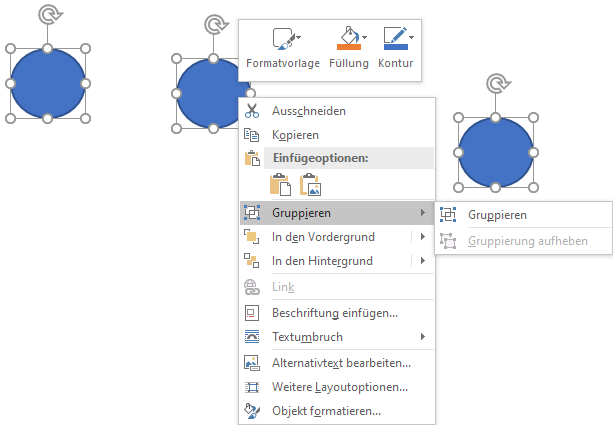
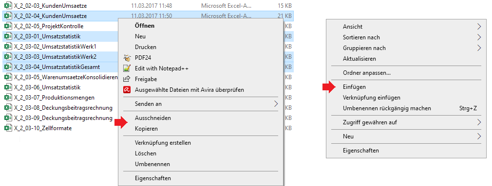
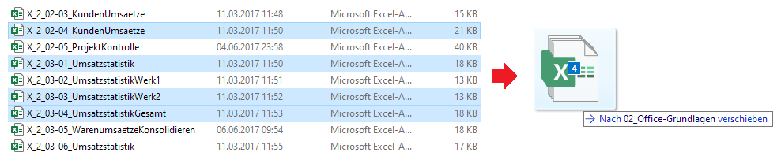
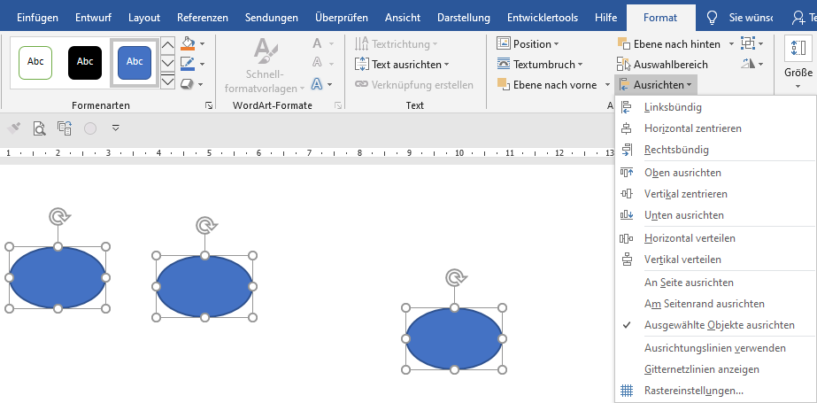
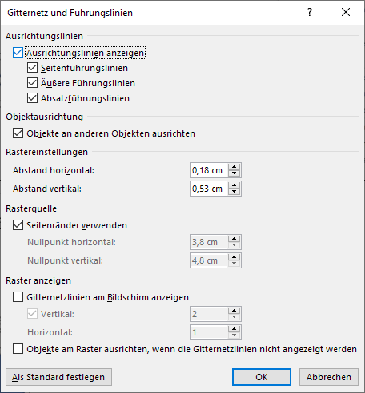

- 1.1 Introduction
  collapsed:: true
	- This book is about using your own PC (nowadays usually a laptop or notebook) in the way we are used to with a notepad, pen and calculator, without thinking long and hard about the development processes that were necessary to achieve this. At the beginning of my lectures, I like to show an essay published in Readers Digest in 1985 about the introduction of an office article in which I have blacked out important passages. When I ask which article it might be about, the answer is always clear, namely the computer. The students are all the more surprised when they learn that it is about the introduction of the pencil.
	- History teaches us that everything repeats itself and so, decades later, the introduction of the computer also caused a lot of excitement, with similar arguments. In the meantime, we are more concerned about the application and so there will certainly be new inventions in decades to come. Until then, PCs and universal programs such as Word and Excel under Office will be part of everyday life. This book is intended to make a small contribution to this.
- 1.2 Basics
  collapsed:: true
	- This chapter provides some basics and terminology. The field of computer science, whose name is derived from the terms information and automation, deals with the laws and principles of data processing, storage and transmission. The way the first computers worked is still valid today and is based on a principle developed by John von Neumann around 1945 (Fig. 1-1). This in turn is based on the work of Konrad Zuse, who built the first functional digital computer, the Z3, as early as 1941, which realised the EVA principle of data processing, input - processing - output. Only two states were used for all signals, which are symbolically represented by the digits 0 and 1. Such systems are referred to as binary systems and the smallest unit of information as a bit (binary digit). Data and control commands are managed in memories and their most important parameter is the memory capacity, measured in bytes (Table 1-1).
- 1.3 Hardware and Software
- 1.4 WIndows Operating System
- 1.5 Objects
- 1.6 Office applications
- 1.7 Menu Ribbon
- 1.8 Toolbar for quick access
- 1.9 Context Menu
- 1.10 Files and folders
  collapsed:: true
	- Let's look at a file shelf for further modelling (Fig. 1-29). The documents in the folders can be modelled into attributes such as file name, file type, folder, size in bytes, modification date, etc. and methods such as save, delete, copy, rename, print, etc.
	- 
	- Figure 1-29: Modelling using the example of a file shelf
	- The structure of the EDV model is similar to a tree structure, the drive is the root, the folders are the branches and the files are the leaves. Folders are also referred to as directories. I use the term folder in my book because the term directory is also used in a different context. A tree structure can be created for every drive on a computer. A file is clearly labelled by its path, which indicates its position in the tree structure from the root to the last branch. For example, C:/folder1/folder4/folder5/file3. Specialised software from various developers is available for managing the EDV models of all drives on a computer.
	- 1.10.1 Explorer
	- 1.10.2 Total Commander
	- 1.10.3 Backups
	- 1.10.4 Windows 10 Restore
	- 1.10.5 One Drive
- 1.11 Handling objects
  collapsed:: true
	- For the Explorer and for all Office applications, there are rules for dealing with several similar objects, especially when selecting them.
	- 1.11.1 Select multiple objects
		- Related objects of the same type can be marked as follows:
			- Click on the first object with the left mouse button.
			- Hold down the SHIFT key.
			- Click on the last object with the left mouse button.
		- All connected objects are then selected (Fig. 1-43). Clicking on a selected object without holding down the Shift key cancels the selection.
		- Non-contiguous objects of the same type can be selected as follows:
			- Click on the first object with the left mouse button.
			- Hold down the CTRL key.
			- Click on each additional object with the left mouse button.
		- All objects selected in this way are then marked (Fig. 1-44).
		- 
		- Fig. 1-43: Consecutively marked file entries in the Explorer
		- 
		- Figure 1-44: Non-contiguously marked file entries in the Explorer
		- To select objects that are hidden or stacked, such as objects behind text, a selection (Fig. 1-45) can be made as follows:
			- Under Start in the Edit group, select Select.
			- Start the Select objects method.
			- Use the left mouse button to draw a rectangle around the objects (grey area).
			- All objects in the rectangle are then selected.
		- Marked objects can often be placed more precisely with the arrow keys than with the mouse. If the SHIFT key is pressed at the same time, only the dimensions of the objects change.
		- 
		- Fig. 1-45: Selecting objects via the ribbon
	- 1.11.2 Group objects
		- If more than one object is selected, they can be combined into a group. The Group method can be found in the context menu of the selected objects (Fig. 1-46).
		- {:height 433, :width 613}
		- Fig. 1-46 Grouping several objects
		- A group is treated like a single object and can also be deleted again via its context menu. However, once a group has been created, you can continue to work with the individual elements. Stacked objects can be moved in their position in the stack via the context menu using the Move to foreground or Move to background methods.
	- 1.11.3 Copying and pasting with the clipboard
		- The methods displayed in the context menu of the selection apply to all selected objects (Fig. 1-47). They are copied to the Windows clipboard using the Cut or Copy methods and can be stored elsewhere at the target location using the Paste method. When using the Cut method, the objects are removed from their original location.
		- 
		- Fig. 1-47 Copy and paste selected objects in the Explorer using the context menu
	- 1.11.4 Drag and Drop
		- Another method for transferring selected objects is called drag and drop. The selected objects are dragged to the new target location using the left mouse button and released there (Fig. 1-48). If the CTRL key is pressed, this is a copy operation. If the Shift key is held down, the objects are moved. D&D now goes beyond copying and moving and also includes throwing files at applications. With this method, the user does not have to worry about the formalities, as the effect depends on the object type. For example, if a mail entry is dropped onto the contact icon in Outlook, the data from the e-mail is used to create a new contact.
		- 
		- Figure 1-48: Transferring selected objects using drag and drop
	- 1.11.5 Arrange objects
		- Objects in applications (images, shapes, text fields, SmartArt graphics, WordArt elements, etc.) have their own Format tab, which offers several methods (Fig. 1-49) in the Arrange group under the term Align. Marking is carried out as described above.
		- 
		- Fig. 1-49 Aligning selected objects
	- Under Grid settings, another dialogue window Grid and guidance guidelines opens (Fig. 1-50).
	- 
	- Figure 1-50: Definition of grid and guidance lines