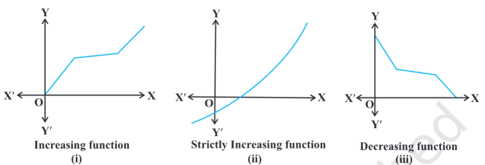
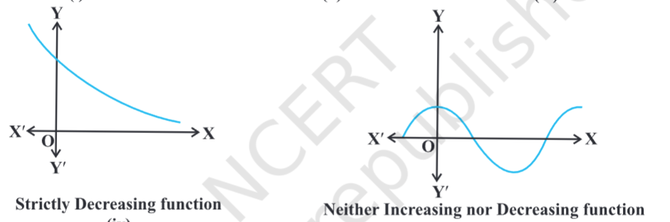
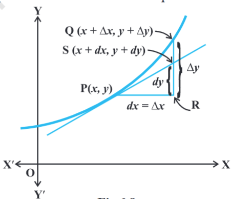
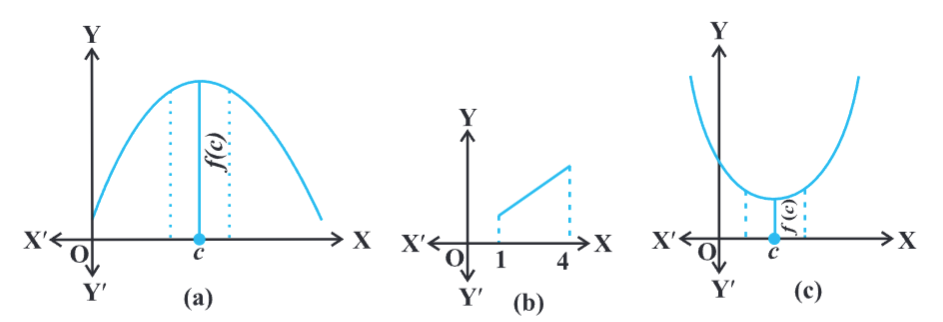
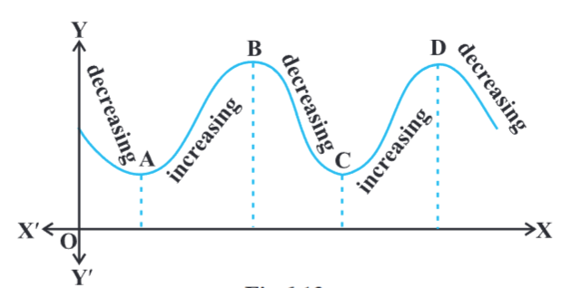
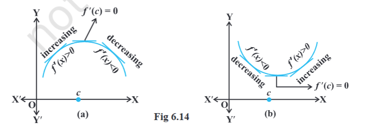
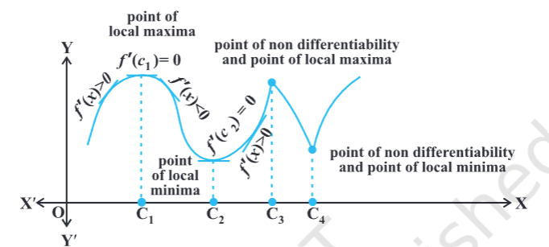
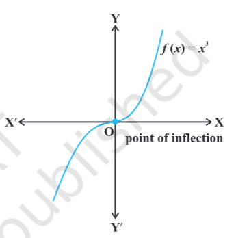
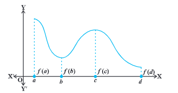

- 
- introduction
	- derivative can be used
		- to determine rate of change of quantities
		- to find the equations of tangent and normal to a curve at a point
		- to find turning points on the graph of a function which in turn will help us to locate points at which largest or smallest value (locally) of a function occurs
		- intervals on which a function is increasing or decreasing
		- approximate value of certain quantities
- rate of change of quantities
	- derivative $\frac{ds}{dt}$, we mean the rate of change of distance s with respect to the time t. whenever one quantity y varies with another quantity x, satisfying some rule y = f(x), then $\frac{dy}{dx}$ (or f'(x)) represents the rate of change of y with respect to x and $\frac{dy}{dx} ]_{x=x_0}$ (or f'($x_0$)) represents the rate of change of y with respect to x at $x = x_0$
	- further, if 2 variables x and y are varying with respect to another variable t, i.e., if x = f(t) and y = g(t), then by chain rule
	  $\frac{dy}{dx} = \frac{\frac{dy}{dt}}{\frac{dx}{dt}}$, if $\frac{dx}{dt} \neq 0$
	  thus, the rate of change of y with respect to x can be calculated using the rate of change of y and that of x both with respect to t.
	- $\frac{dy}{dx}$ is positive if y increases as x increases and is negative if y decreases as x increases
- increasing and decreasing functions
	- function may increase or decrease or none
	- definition 1
		- I be an interval contained in the domain of a real valued function f. then f is said to be
			- increasing on I if $x_1 < x_2$ in I => $f(x_1) \leq f(x_2)$ for all $x_1, x_2 \in I$
			- strictly increasing on I if $x_1 < x_2$ in I => $f(x_1) < f(x_2)$ for all $x_1, x_2 \in I$
			- decreasing on I if $x_1 < x_2$ in I => $f(x_1) \geq f(x_2)$ for all $x_1, x_2 \in I$
			- strictly decreasing on I if $x_1 < x_2$ in I => $f(x_1) > f(x_2)$ for all $x_1, x_2 \in I$
			- graphical representation of functions
				- 
				- 
	- definition 2
		- $x_0$ a point in the domain of definition of a real valued function f. then f is said to be increasing, strictly increasing, decreasing or strictly decreasing at $x_0$ if there exists an open interval I containing $x_0$ such that f is increasing, strictly increasing, decreasing or strictly decreasing, respectively, in I.
		- a function f is said to be increasing at $x_0$ if there exists an interval I = ($x_0-h, x_0+h$), h > 0 such that for $x_1, x_2 \in I$
		  $x_1 < x_2 \in I \to f(x_1) \leq f(x_2)$
	- theorem 1
		- f be continuous on [a, b] and differentiable on the open interval (a, b) then
			- f is strictly increasing in [a, b] if f'(x) > 0 for each x \in (a, b)
			- f is strictly decreasing in [a, b] if f'(x) < 0 for each x \in (a, b)
			- f is a constant function in [a, b] if f'(x) = 0 for each x \in (a, b)
		- remarks
			- if f'(x) > 0 for x in an interval excluding the end points and f is continuous in the interval, then f is strictly increasing. if f'(x) < 0 for x in an interval excluding the end points and f is continuous in the interval, then f is strictly decreasing
			- if a function is strictly increasing or strictly decreasing in an interval I, then it is necessarily increasing or decreasing in I. however, the converse need not be true.
- tangents and normals
	- use differentiation to find the equation of the tangent line and the normal line to a curve at a given point
	- equation of a straight line passing through a given point $(x_0, y_0)$ having finite slope m is given by
	  $y - y_0 = m (x - x_0)$
	- note that the slope of the tangent to the curve y = f(x) at the point $(x_0, y_0)$ is given by $\frac{dy}{dx}]_{(x_0, y_0)}$ (or $f'(x_0)$)
	- so the equation of the tangent at $(x_0, y_0)$ to the curve y = f(x) is given by
	  $y - y_0 = f'(x_0) (x - x_0)$
	- also, since the normal is perpendicular to the tangent, the slope of the normal to the curve y = f(x) at (x_0, y_0) is $\frac{-1}{f'(x_0)}$
	- therefore, the equation of the normal to the curve y = f(x) at $(x_0, y_0)$ is given by
	  $y - y_0 = \frac{-1}{f'(x_0)} (x - x_0)$
	  i.e. $y - y_0  f'(x_0) + (x - x_0) = 0$
	- if a tangent line to the curve y = f(x) makes an angle \theta with x-axis in the positive direction, then $\frac{dy}{dx}$ = slope of the tangent = tan \theta
	- particular cases
		- if slope of the tangent line is zero, then tan \theta = 0 and so \theta = 0 which means the tangent line is parallel to the x-axis. in this case, the equation of the tangent at the point $(x_0, y_0)$ is given by $y = y_0$
		- if \theta -> $\frac{\pi}{2}$, then tan \theta = \infty, which means the tangent line is perpendicular to the x-axis, i.e., parallel to the y-axis. in this case, the equation of the tangent at $(x_0, y_0)$ is given by $x = x_0$
- approximations
	- 
	- use differentials to approximate values of certain quantities
	- f : D \to R, D \sub R be a given function and let y = f(x). let \Delta x denote small increment in x. the increment in y corresponding to the increment in x, denoted by \Delta y, given by \Delta y = f(x + \Delta y) - f(x). we define the following
		- the differential of x, denoted by dx, is defined by dx = \Delta x
		- the differential of y, denoted by dy, is defined by dy = f'(x) dx or $dy = \left[ \frac{dy}{dx} \right] \Delta x$
			- in case of dy = \Delta x is relatively small when compared with x, dy is a good approximation of \Delta y and we denote it by dy \approx \Delta y
			- note: differential of the dependent variable is not equal to increment of the variable where as the differential of independent variable is equal to the increment of the variable.
- maxima and minima
	- use the concept of derivatives to calculate the maximum or minimum values of various functions. find the `turning points` of the graph of a function and thus find points at which the graph reaches its highest (or lowest) locally. the knowledge of such points is very useful in sketching the graph of a given function. we will find the absolute maximum and absolute minimum of a function that are necessary for the solution of many applied problems.
		- definition 3
		  collapsed:: true
			- f be a function defined on an interval I. then
			  collapsed:: true
				- f is said to have a `maximum value` in I, if there exists a point c in I such that f(c) > f(x), for all x \in I.
				  the number f(c) is called the maximum value of f in I and the point c is called a `point of maximum value` of f in I
				- f is said to have a `minimum value` in I, if there exists a point c in I such that f(c) < f(x), for all x \in I.
				  the number f(c) is called the minimum value of f in I and the point c is called a `point of minimum value` of f in I
				- f is said to have a `extreme value` in I, if there exists a point c in I such that f(c) is either a maximum value or a minimum value of f in I.
				  the number f(c) is called an extreme value of f in I and the point c is called an `extreme point`
				- 
				- remarks
					- monotonic function f in an interval I, we mean that f is either increasing in I or decreasing in I
					- every monotonic function assumes its maximum / minimum value at the end points of the domain of definition of the function.
					- every continuous function on a closed interval has a maximum and a minimum value
		- 
			- point A, B, C, D on the graph the function changes its nature from decreasing to increasing or vice-versa. these points are called `turning points`. points A, C may be regarded as points of `local minimum value` (or `relative minimum value`) and points B, D may be regarded as points of `local maximum value` (or `relative maximum value`) for the function. the `local maximum value` and `local minimum value` of the function are referred to as `local maxima` and `local minima` of the function
		- definition 4:
			- f be a real valued function and c be an interior point in the domain of f. then
				- c is called a point of `local maxima` if there is an h > 0 such that 
				  f(c) > f(x), for all x in (c -h, c + h)
				  the value f(c) is called the `local maximum value` of f
				- c is called a point of `local minima` if there is an h > 0 such that 
				  f(c) < f(x), for all x in (c -h, c + h)
				  the value f(c) is called the `local minimum value` of f
				- geometrically, the above definition states that if x = c is a point of local maxima of f, then the graph of f around c will as shown in fig (a). note that the function f is increasing (i.e., f'(x) > 0) in the interval (c-h, c) and decreasing (i.e., f'(x) < 0) in the interval (c, c + h)
				- this suggests that f'(c) must be zero.
				- 
				- similarly, if c is point of local minima of f, then the graph of f around c will be as shown in fig (b). here f is decreasing (i.e., f'(x) < 0) in the interval (c-h, c) and increasing (i.e., f'(x) > 0) in the interval (c, c + h). this again suggest that f'(c) must be zero.
		- theorem 2
			- f be a function defined on an open interval I. suppose c \in I be any point. if f has a local maxima or a local minima at x = c, then either f'(c) = 0 or f is not differentiable at c.
			- remark: the converse of the above theorem need not be true, that is , a point at which the derivative vanishes need not be a point of local maxima or local minima.
			- note: a point c in the domain of a function f at which either f'(c) = 0 or f is not differentiable is called a `critical point` of f. note that if f is continuous at c and f'(c) = 0, then there exists an h > 0 such that f is differentiable in the interval (c - h, c + h)
		- theorem 3 (first derivative test): working rule for finding points of local maxima or points of local minima using only the first order derivatives
			- f be a function defined on an open interval I. f be continuous at a critical point c in I. then
				- 
				- if f'(x) changes sign from positive to negative as x increases through c, i.e., if f'(x) > 0 at every point sufficiently close to and to the left of c, and f'(x) < 0 at every point sufficiently close to and to the right of c, then c is a point of `local maxima`
				- if f'(x) changes sign from negative to positive as x increases through c, i.e., if f'(x) < 0 at every point sufficiently close to and to the left of c, and f'(x) > 0 at every point sufficiently close to and to the right of c, then c is a point of `local minima`
				- if f'(x) does not change sign as x increases through c, then c is neither a point of local maxima nor a point of local minima. infact, such a point is called `point of inflection` i.e., if f'(x) > 0 at every point sufficiently close to and to the left of c, and f'(x) < 0 at every point sufficiently close to and to the right of c, then c is a point of `local maxima`
					- {:height 356, :width 345}
				- note: if c is a point of local maxima of f, then f(c) is a local maximum value of f. if c is a point of local minima of f, then f(c) is a local minimum value of f.
		- theorem 4 (second derivative test)
			- f be a function defined on an interval I and c \in I. f be twice differentiable at c. then
				- x = c is a point of local maxima if f'(c) = 0 and f''(c) < 0
				  the value f(c) is local maximum value of f
				- x = c is a point of local minima if f'(c) = 0 and f''(c) > 0
				  the value f(c) is local minimum value of f
				- the test fails if f'(c) = 0 and f''(c) = 0
				  in this case, we go back to the first derivative test and find whether c is a point of local maxima, local minima or a point of inflexion.
				- note: as f is twice differentiable at c, we mean second order derivative of f exists at c.
	- maximum and minimum values of a function in a closed interval
		- in the domain of function f in closed interval, maximum value of f is called `absolute maximum` value (`global maximum` or `greatest value`) of f on the interval. minimum value of f is called `absolute minimum value` (`global minimum` or `least value`) of f.
		- 
			- graph given in figure of a continuous function defined on a closed interval [a, d]. function f has a local minima at x = b and local minimum value is f(b). the function also has a local maxima at x = c and local maximum value is f(c). from the graph, it is evident that f has absolute maximum value f(a) and absolute minimum value f(d). further note that the absolute maximum (minimum) value of f is different from local maximum (minimum) value of f.
		- theorem 5
			- f be a continuous function on an interval I = [a, b]. then f has the absolute maximum value and f attains it at lease once in I. also, f has the absolute minimum value and attains it at least once in I.
		- theorem 6
			- f be a differentiable function on a closed interval I and let c be any interior point of I. then
				- f'(c) = 0 if f attains its absolute maximum value at c.
				- f'(c) = 0 if f attains its absolute minimum value at c.
		- in view of the above results, we have the following working rule for finding absolute maximum and / or absolute minimum values of a function in a given closed interval [a, b]
			- working rule
				- step 1: fin all critical points of f in the interval, i.e., find points x where either f'(x) = 0 or f is not differentiable
				- step 2: take the end points of the interval
				- step 3: at all these points (listed in step 1 and 2), calculate the values of f
				- step 4: identify the maximum and minimum values of f out of the values calculated in step 3. this maximum value will be the absolute maximum (greatest) value of f and the minimum value will be the absolute minimum (least) value of f.
	-