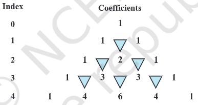

- 
- introduction
	- binomial theorem gives an easier way to expand \((a+b)^n\), where n is an integer or a rational number
- binomial theorem for positive integral indices
	- binomial means bi - two, nomial - terms
	- Pascals triangle or Meru Prastara (by Pingala)
		- coefficients of the expansions are arranged in an array called Pascal's triangle
		- 
	- binomial theorem for any positive integer n
		- $$
		  (a+b)^n = nC_0 a^n + nC_1 a^{n-1}b + nC_2 a^{n-2}b^2 + \cdots + nC_{n-1}ab^{n-1} + nC_n b^n = \sum_{k=0}^{n} nC_k \, a^{n-k} b^k
		  $$
		- the coefficients \(nC_r\) occuring in binomial theorem are known as binomial coefficients
		- there are (n+1) terms in the expansion of \((a + b)^n\). i.e., one more than the index.
		- in the successive terms in the expansion the index of a goes on decreasing by unity. it is n in the first term, (n-1) in the second term, and so on ending with zero in the last term. at the same time the index of b increases by unity, starting with zero in the first term, 1 in the second and so on ending with n in the last term.
		- in the expansion of $(a + b)^n$, the sum of the indices of a and b in every term of the expansion is n
	- general and middle terms
		- in the binomial expansion for $(a + b)^n$, $(r + 1)^{th}$ term is also called the `general term` of the expansion denoted by T_{r+1}
		  T_{r + 1} = $nC_r a^{n-r} b^{r}$
		- middle term
			- if n is even, then the number of terms in expansion will be n+1 is odd. 
			  therefore, middle term is $(\frac{n+1+1}{2})^{th}$ i.e $(\frac{n}{2}+1)^{th}$  term
			- if n is odd, then n+1 is even, so there will be 2 middle terms, namely, $(\frac{n+1}{2})^{th}$ term, and $(\frac{n+1}{2}+1)^{th}$  term
		- $(x + \frac{1}{x})^{2n}$, where x \neq 0, the middle term is $\frac{2n+1+1}{2})^{th}$ i.e., $(n + 1)^{th}$ term is $2n C_n x^n (\frac{1}{x})^n = 2n C_n$ (constant)
		  this term is called the term independent of x or the constant term
- resources
	- https://math.libretexts.org/Bookshelves/Combinatorics_and_Discrete_Mathematics/A_Spiral_Workbook_for_Discrete_Mathematics_(Kwong)/08:_Combinatorics/8.05:_The_Binomial_Theorem
	-