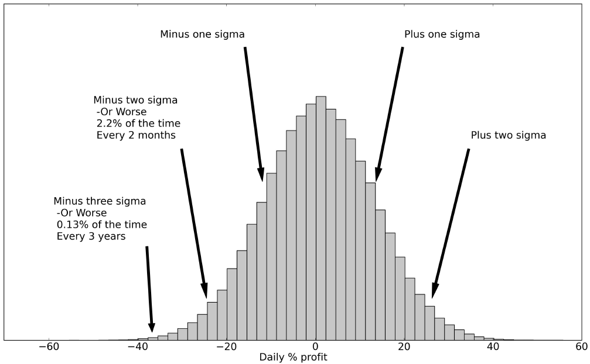

- deeply flawed when making financial decisions
- economic theories about human behaviour
- systematic trading and investing
- humans should be great traders, but...
	- the research that tells us why humans make bad decisions
	- the death of rational economic man
	- why we run losses and stop out profits
	- concept: back-test
	- gamblers anonymous
- simple trading rules
	- the dumb systems that are better at investing and trading than clever humans
- sticking to the plan
	- why you must be committed to your systems for them to work
	- trading systems must be objective
	- automation - the use of dogs in finance and engineering
- good system design
	- avoiding the human failings which can still be dangerous when designing systematic trading strategies
	- over-fitting
	- overtrading
	- over betting
	- concept: standard deviation
		- the **standard deviation** is a measure of how dispersed some data is around its average; it's a measure of risk.
		- a measure of how dispersed some data is around its average value. if your data points are \[x_1, x_2, \ldots, x_n\] then the average \[x^* = \frac{x_1 + x_2 + x_3 + \ldots + x_n}{n}\]. the standard deviation is \[\sqrt{\left( \frac{1}{n-1} \right) \left[ (x_1 - x^*)^2 + (x_2 - x^*)^2 + \ldots + (x_n - x^*)^2 \right]}\]
		- often applied to daily returns in prices or trading system profits. an approximate way to calculate an annualised standard deviation of returns is to multiply the daily standard deviation by 16 (the square root of 256, approximately the number of trading days in one year).
		- standard deviations are often used to describe the dispersion of the returns of an asset, or profits from a trading system. I use the term volatility as a shorthand for standard deviation of returns. one unit of standard deviation is also sometimes called a sigma.
		- we'll usually be dealing with daily returns and using daily volatilities, but it's often useful to think about the annualised standard deviation - how much deviation we expect to see over a year.
		- standard deviation doesn't increase linearly, but with the square root of time. over the roughly 256 business days in a year you'd expect annual standard deviation to be larger by the square root of 256, or 16. so you multiply daily standard deviations by 16 to get the annualised version, or divide by 16 to go from annualised to daily. In contract to go from average daily returns to annualised average returns you just multiply by the number of days in a year, or 256. Then to go from annualised to daily you divide by 256.
		- equities have an annualised standard deviation of about 20% a year.  bonds tend to be safer, depending on their maturity. a typical 2 year bond has an annualised $$\sigma$$ of around 1.5% a year, and a 10-year bond would be more like 8%.
		- we often assume our returns have a particular type of _distribution_. A distribution is just a way of describing the pattern of your data. A common distribution i use is the **Gaussian normal distribution**. If returns are Gaussian normal, then the mean and standard deviation alone are sufficient to say how likely certain returns will be.
		- if your daily returns are Gaussian normal then you will see movements 1 $$\sigma$$ or less around the average about 68% of the time, and returns 2 $$\sigma$$ or less about 95% of the time. in 2.5% of days you'd see a change more than 2 $$\sigma$$ above average
		- let's consider the 200% annualised standard deviation mentioned above. 200% a year translates into 12.5% a day if you divide by the square root of time, 16. for the average daily return even if you're making an optimistic 200% a year, after you've divided by 256 you earn just 0.8% per day. A +1$$\sigma$$ return would be 12.5% above the average of 0.8%, or 13.3%. A 1$$\sigma$$ loss would be 12.5% below the average of 0.8%, or -11.7%. You'll see returns between -11.7% and +13.3% a day around 68% of the time, and between -24.2% and +25.8% a day 95% of the time. around 2.5% of the time you'd see losses of more than 24.2% a day. That's quite a hefty daily loss which you'd get every couple of months. once every 3 years you'd lose 3$$\sigma$$ or 37.2% in one day!
		- scarily that's probably still optimistic because the normal distribution tends to underestimate the chance of really bad returns. according to the normal distribution we should get daily falls of more than 4$$\sigma$$ about once a century. But from 1914 to 2014 the US Dow Jones index fell by more than 4$$\sigma$$ around 30 times!
		- you or your investors need to be comfortable with the losses you're likely to make. the size of your positions must reflect the amount of risk you can handle. [[Volatility Targeting]]
		- 