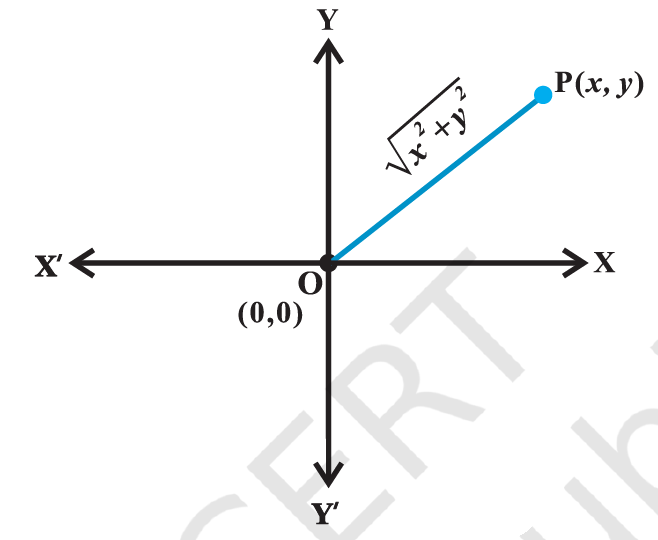
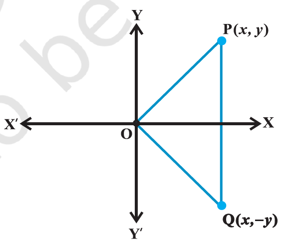
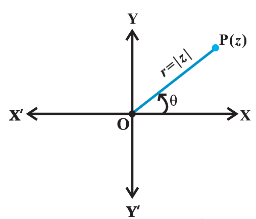
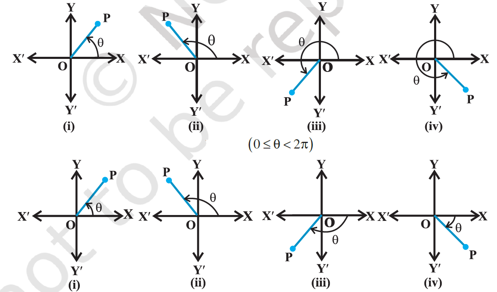

- complex numbers
	- $\sqrt{-1}$ = i, $i^2$ = -1
	- the number of the for a + ib, where a and b are real numbers, is defined to be a complex number.
	- complex number z = a + ib, `a` is called the `real part` denoted by `Re z` and `b` is called the `imaginary part` denoted by `Im z` of the complex number `z`.
		- z = 2 + i5, then Re z = 2 and Im z = 5
	- 2 complex numbers $z_1$ = a + ib and $z_2$ = c + id are equal if a = c and b = d
- algebra of complex numbers
	- addition of 2 complex numbers
		- $z_1 = a + ib$, $z_2 = c + id$ then $z_1 + z_2 = (a + c) + i (b + d), which is again a complex number
		- addition of complex numbers satisfy the following properties
			- the closure law
				- the sum of 2 complex numbers is a complex number, i.e., $z_1 + z_2$ is a complex number for all complex numbers $z_1, z_2$
			- the commutative law
				- for any 2 complex number $z_1 and  z_2$, $z_1 + z_2 = z_2 + z_1$
			- the associative law
				- for any 3 complex numbers $z_1, z_2, z_3$, $(z_1 + z_2) + z_3 = z_1 + (z_2 + z_3)$
			- the existence of additive identity
				- there exists the complex number 0 + i 0 (denoted as 0), called the `additive identity` or the `zero complex number`, such that, for every complex number z, z + 0 = z.
			- the existence of additive inverse
				- to every complex number z = a + ib, we have complex number -a + i(-b)  (denoted as - z), called the `additive inverse` or `negative of z`. we observe that z + (-z) = 0 (the additive identity)
	- difference of 2 complex numbers
		- given any 2 complex numbers $z_1 and  z_2$, the difference $z_1 - z_2$ is defined as follows:
			- $z_1 -  z_2 = z_1 + (- z_2)$
	- multiplication of 2 complex numbers
		- $z_1 = a + ib$ and  $z_2 = c + id$ be any 2 complex numbers.
		- $z_1 z_2$ = (ac - bd) + i(ad + bc)
		- the multiplication of 2 complex numbers possesses the following properties
			- the closure law
				- the product of 2 complex numbers is a complex number, the product $z_1  z_2$ is a complex number for all complex numbers $z_1$ and $z_2$
			- the commutative law
				- for any 2 complex numbers $z_1$ and $z_2$, $z_1 z_2 = z_2 z_1$
			- the associative law
				- for any 3 complex numbers $z_1, z_2, z_3$, $(z_1 z_2) z_3 = z_1 (z_2 z_3)$
			- the existence of multiplicative identity
				- there exists the complex number 1 + i 0 (denoted as 1), called the `multiplicative identity` such that z . 1 = z for every complex number z.
			- the existence of multiplicative inverse
				- for every non-zero complex number z = a + ib or a + bi (a /neq 0, b /neq 0), we have the complex number $\frac{a}{a^2 + b^2} + i \frac{-b}{a^2 + b^2}$ (denoted by $\frac{1}{z} or z^{-1}$), called the multiplicative inverse of z such that z . 1/z = 1 (the multiplicative identity)
			- the distributive law
				- for any 3 complex numbers $z_1, z_2, z_3$, 
				  $z_1 (z_2 + z_3) = z_1 z_2 + z_1 z_3$
				  $(z_1 + z_2) z_3 = z_1 z_3 + z_2 z_3$
	- division of 2 complex numbers
		- given any 2 complex numbers $z_1$ and $z_2$, where z_2 /neq 0, the quotient $\frac{z_1}{z_2}$ is defined by 
		  $\frac{z_1}{z_2}$ = $z_1$ $\frac{1}{z_2}$
	- power of i
		- $i^3 = i^2 i$ = (-1) i = -i
		- $i^4 = (i^2)^2 = (-1)^2 = 1$
		- $i^5 = (i^2)^2 i = (-1)^2 i = i$
		- $i^6 = (i^2)^3 = (-1)^3 = -1$
		- also, we have $i^{-1} = \frac{1}{i}$ x $\frac{i}{i}$ = $\frac{i}{-1}$ = -i
		- $i^{-2} = \frac{1}{i^2} = \frac{1}{-1} = -1$
		- $i^{-3} = \frac{1}{i^3}$ = $\frac{1}{-i}$ x $\frac{i}{i}$ = $\frac{i}{1}$ = i
		- $i^{-4} = \frac{1}{i^4} = \frac{1}{1} = 1$
		- in general, for any integer k, $i^{4k} = 1, i^{4k + 1} = i, i^{4k + 2} = -1, i^{4k + 3} = -i$
	- square roots of a negative real number
		- note that $i^2 = -1$ and $(-i)^2 = i^2 = -1$
		- therefore, the square roots of -1 are i, -i.
		- similarly, the square roots of -3 are $\sqrt{3} i$ and $-\sqrt{3} i$
		- if `a` is a positive real number, $\sqrt{a} \sqrt{b} = \sqrt{ab}$ for all positive real number a and b. this result also hods true when either a \gt 0, b \lt 0 or a \lt 0, b \gt 0.
		- $\sqrt{a} \sqrt{b} \neq \sqrt{ab}$ if both a and b are negative real numbers
		- if any of a and b is zero, then clearly, $\sqrt{a} \sqrt{b} = \sqrt{ab}$ = 0
	- identities
		- $(z_1 + z_2) ^ 2 = (z_1)^2 + 2 z_1 z_2 + (z_2)^2$, for all complex numbers $z_1$ and $z_2$
		- $(z_1 - z_2) ^ 2 = (z_1)^2 - 2 z_1 z_2 + (z_2)^2$
		- $(z_1 + z_2) ^ 3 = (z_1)^3 + 3 z_1^2 z_2 + 3 z_1 z_2^2 + (z_2)^3$
		- $(z_1 - z_2) ^ 3 = (z_1)^3 - 3 z_1^2 z_2 + 3 z_1 z_2^2 - (z_2)^3$
		- $z_1^2 - z_2^2 = (z_1 + z_2) (z_1 - z_2)$
- the modulus and the conjugate of a complex number
	- z = a + ib, modulus of z, denoted by |z|, is defined to be the non-negative real number $\sqrt{a^2 + b^2}$, i.e., |z| = $\sqrt{a^2 + b^2}$ and the conjugate of z, denoted as $\overline{z}$ = a - ib
	- multiplicative inverse of non-zero complex number z is given by 
	  $z^{-1} = \frac{1}{a+ib} = \frac{a}{a^2 + b^2} + i \frac{-b}{a^2 + b^2} = \frac{a-ib}{a^2 + b^2} = \frac{\overline{z}}{|z|^2}$
	  or z \overline{z} = $|z|^2$
	- any 2 complex number $z_1$, $z_2$
		- $|z_1 z_2| = |z_1| |z_2|$
		- $|\frac{z_1}{z_2}| = \frac{|z_1|}{|z_2|}$ provided $|z_2| \neq 0$
		- $\overline{z_1 z_2}$ = $\overline{z_1}$ $\overline {z_2}$
		- $\overline{z_1 \pm z_2}$ = $\overline{z_1}$ \pm $\overline {z_2}$
		- $\overline{(\frac{z_1}{z_2})}$ = $\frac{\overline{z_1}}{\overline {z_2}}$ provided $z_2$ \ne 0
- Argand plane and polar representation
	- Argand plane
		- 
		- complex number x + iy which corresponds to the ordered pair (x, y) can be represented geometrically as the unique point P(x, y) in the XY-plane, set of mutually perpendicular lines known as the x-axis and the y-axis.
		- the plane having a complex number assigned to each of its point is called the complex plane or the Argand plane.
		- modulus of the complex number x + iy = $\sqrt{x^2 + y^2}$
		- the points on the x-axis corresponds to the complex numbers of the form a + i0 and the points on the y-axis corresponds to the complex numbers of the form 0 + i b.
		- the x-axis and y-axis in the Argand plane are called, respectively, the real axis and the imaginary axis.
		- {:height 511, :width 593}
		- the representation of a complex number z = x + iy and its conjugate z = x - iy in the Argand plane are, respectively, the points P (x, y) and Q (x, -y)
		- Geometrically, the point (x, -y) is the mirror image of the point (x, y) on the real axis.
	- polar representation of a complex number
		- 
		- P represent non-zero complex number z = x + iy. the directed line segment OP be of length r and \theta be the angle which OP makes with the positive direction of x-axis.
		- the point P is uniquely determined by the ordered pair of real numbers (r, \theta), called the `polar coordinates of the point P`
		- we consider the origin as the pole and the positive direction of the x axis as the initial line (polar axis).
		- we have, x = r cos \theta, y = r sin \theta and therefore, z = r (cos \theta + i sin \theta). the latter is said to be the `polar form of the complex number`.
		- here r = $\sqrt{x^2 + y^2}$ = |z| is the modulus of z and \theta is called the argument (or amplitude) of z which is denoted by arg z.
		- for any complex number z \neq 0, there corresponds only one value of \theta in the 0 \le \theta \lt 2\pi. however, any other interval of length 2\pi, for example -\pi \lt \theta \le \pi, can be such an interval.
		- we shall take the value of \theta such that -\pi < \theta \le \pi, called `principal argument` of z and denoted by `arg z`, unless specified otherwise.
		- 
		-
- quadratic equations
	- quadratic equation $ax^2 + bx + c = 0$ with real coefficients a, b, c and a \neq 0
	- discriminant ($b^2 - 4ac$) helps to determine nature of roots of the equation
		- D > 0: 2 distinct real roots
		- D = 0: one real root
		- D < 0: 2 distinct complex roots
	- if ($b^2 - 4ac$) < 0 we can find the square root of negative real numbers in the set of complex numbers
	- the solutions to the above equation are available in the set of complex numbers which are given by
	  x = $\frac{-b \pm \sqrt(b^2 - 4ac)} {2a}$ = $\frac{-b \pm \sqrt(4ac - b^2) i} {2a}$
	- A polynomial equation has at least one root
	- A polynomial equation of degree n has n roots