- 
- introduction
	- circles, ellipses, parabola, hyperbola, these curves are called `conic sections` or `conics` because they are obtained as intersections of a plane with a double napped right circular cone
	- these curves have a very wide range of applications in fields such as planetary motion, design of telescopes and antennas, reflectors in flashlights and automobile headlights, etc.
	- the names parabola and hyperbola are given by Apollonius.
- sections of a cone
	- 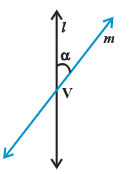
	- 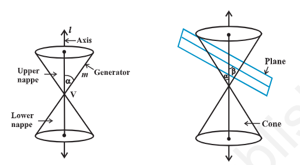
		- _l_ fixed vertical line, _m_ another line intersecting it at a fixed point V and inclined to it at an angle \alpha. rotate line m around the line l in a such a way that the angle \alpha remains constant. then the surface generated is a double-napped right circular hollow cone (referred as cone) extending indefinitely far in both directions.
		  point V is called `vertex`; line _l_ is `axis` of cone, rotating line m is called `generator` of the cone. `vertex` separates cone into 2 parts called `nappes`.
		  if we take intersection of a plane with a cone, the section so obtained is called a `conic section`. thus, conic sections are the curves obtained by intersecting a right circular cone by a plane. we obtain different kinds of conic sections depending on the position of the intersecting plane with respect to the cone and by the angle made by it with the vertical axis of the cone. \beta be the angle made by the intersecting plane with the vertical axis of the cone. the intersection of the plane with the cone with the cone can take place either at the vertex of the cone or at any other part of the nappe either below or above the vertex
	- circle, ellipse, parabola and hyperbola
		- when the plane cuts the nappe (other than the vertex) of the cone,
			- when \beta = 90°, the section is a `circle`
			- when \alpha < \beta < 90°, the section is an `ellipse`
			- when \beta = \alpha, the section is a `parabola`
			- in each of the above 3 situations, the plane cuts entirely across one nappe of the cone
			- when $0 \leq < \alpha$, the plane cuts through both the nappe s and the curves of intersection is `hyperbola`
			- 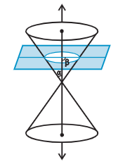 circle
			- 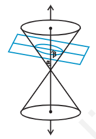 ellipse
			- 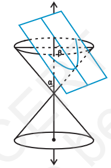 parabola
			-
			- 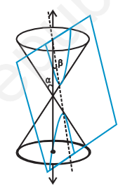 hyperbola
	- degenerated conic sections
		- when the plane cuts at the vertex of the cone, we have the following different cases
			- when \alpha < \beta $\leq$ 90°, then the section is a point
				- 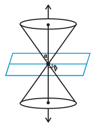
			- when \beta = \alpha, the plane contains a generator of the cone and the section is a straight line. it is degenerated case of a parabola
				- 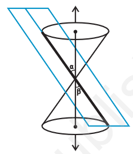
			- when 0 $\leq$ < \beta < \alpha, the section is a pair of intersecting straight lines, it is degenerated case of a hyperbola
- circle
	- definition: a circle is the set of all points in a plane that are equidistant from a fixed point in the plane
	- the fixed point is called the `centre of the circle` and the distance from the centre to a point on the circle is called the `radius` of the circle.
	- 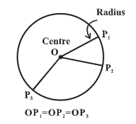
	- 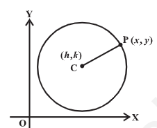
	- the equation of the circle is simplest if the centre of the circle is at the origin.
	- C (h, k) be the centre and r the raius of circle. P (x, y) any point on the circle. |CP| = r
	  $(x - h)^2 + (y - k)^2 = r^2$
	  $\sqrt{(x - h)^2 + (y - k)^2} = r$
- parabola
	- 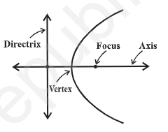
		- definition: a parabola is the set of all points in a plane that are equidistant from a fixed line and a fixed point (not on the line) in the plane.
		- the fixed line is called the `directrix` of the parabola and the fixed point F is called the `focus`
		- `para` means `for` and `bola` means `throwing`, i.e., the shape described when you throw a ball in the air
		- a line through the focus and perpendicular to the `directrix` is called the `axis` of the parabola
		- the point of intersection of parabola with the axis is called the `vertex` of the parabola
		- if the fixed point (focus) lies on the fixed line (directrix), then the set of points in the plane, which are equidistant from the focus and the directrix is the straight line through the focus and perpendicular to the directrix.
	- standard equations of parabola
		- 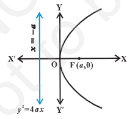
		- 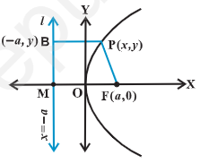{:height 191, :width 223}
		- F be focus at (a, 0) a> 0; FM perpendicular to the directrix and bisect FM at point O.
		- mid-point O on the parabola is called the vertex
		- produce MO to X. take O as origin, OX the x-axis and OY perpendicular to it as the y-axis
		- distance from directrix to the focus 2a
		- coordinates of the focus are (a, 0)
		- equation of directrix x + a = 0
		- P (x, y) point on the parabola PF = PB
		- PB is perpendicular to l, coordinates of B are (-a, y)
		- PF = $\sqrt{(x - a)^2 + y^2}$ and PB = $\sqrt{(x + a)^2}$
		- PF = PB
		  $\sqrt{(x - a)^2 + y^2}$ = $\sqrt{(x + a)^2}$
		  $x^2 - 2ax + a^2 + y^2$ = $x^2 + 2ax + a^2$
		  $y^2 = 4ax$ (a > 0)
		  hence any point on the parabola satisfies $y^2 = 4ax$
		- conversely, P(x, y) satisfy the equation
		  PF = $\sqrt{(x - a)^2 + y^2}$ = $\sqrt{(x - a)^2 + 4ax}$
		       = $\sqrt{(x + a)^2}$ = PB
		  so P(x, y) lies on the parabola
		- equation of parabola with vertex at the origin, focus at (a, 0) and directrix x = -a is $y^2 = 4ax$
		- similarly the equations of the parabolas $y^2 = -4ax$
			- 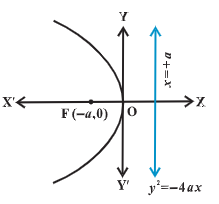
		- $x^2 = 4ay$
			- 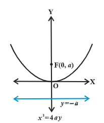
		- $x^2 = -4ay$
			- 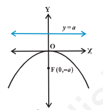
		- observations
			- parabola is symmetric with respect to the axis of the parabola. if the equation has a $y^2$ term, then the axis of symmetry is along the x-axis and if the equation has an $x^2$ term, then the axis of symmetry is along y-axis.
			- when the axis of symmetry is along the x-axis the parabola opens to the
				- right if the coefficient of x is positive
				- left if the coefficient of x is negative
			- when the axis of symmetry is along the y-axis the parabola opens
				- upwards if the coefficient of y is positive
				- downwards if the coefficient of y is negative
	- latus rectum
		- definition: latus rectum of a parabola is a line segment perpendicular to the axis of the parabola, through the focus and whose end points lie on the parabola
		- to find the length of the latus rectum of the parabola $y^2 = 4ax$
		  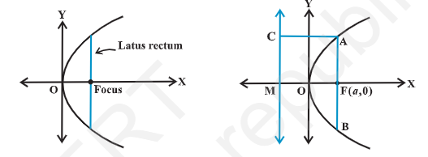
		- to find the length of the latus rectum of the parabola $y^2 = 4ax$
		  by definition of parabola, AF = AC
		  AC = FM = 2a
		  AF = 2a
		  since parabola is symmetric with respect to x-axis AF = FB and so 
		  AB = Length of the latus rectum = 4a
- ellipse
	- relationship between semi-major axis, semi-minor axis and the distance of the focus from the centre of the ellipse
	- special cases of an ellipse
	- eccentricity
	- standard equations of an ellipse
	- latus rectum
- hyperbola
	- eccentricity
	- standard equation of hyperbola
	- latus rectum