- 
- introduction
	- circles, ellipses, parabola, hyperbola, these curves are called `conic sections` or `conics` because they are obtained as intersections of a plane with a double napped right circular cone
	- these curves have a very wide range of applications in fields such as planetary motion, design of telescopes and antennas, reflectors in flashlights and automobile headlights, etc.
	- the names parabola and hyperbola are given by Apollonius.
- sections of a cone
	- 
	- 
		- _l_ fixed vertical line, _m_ another line intersecting it at a fixed point V and inclined to it at an angle \alpha. rotate line m around the line l in a such a way that the angle \alpha remains constant. then the surface generated is a double-napped right circular hollow cone (referred as cone) extending indefinitely far in both directions.
		  point V is called `vertex`; line _l_ is `axis` of cone, rotating line m is called `generator` of the cone. `vertex` separates cone into 2 parts called `nappes`.
		  if we take intersection of a plane with a cone, the section so obtained is called a `conic section`. thus, conic sections are the curves obtained by intersecting a right circular cone by a plane. we obtain different kinds of conic sections depending on the position of the intersecting plane with respect to the cone and by the angle made by it with the vertical axis of the cone. \beta be the angle made by the intersecting plane with the vertical axis of the cone. the intersection of the plane with the cone with the cone can take place either at the vertex of the cone or at any other part of the nappe either below or above the vertex
	- circle, ellipse, parabola and hyperbola
		- when the plane cuts the nappe (other than the vertex) of the cone,
			- when \beta = 90°, the section is a `circle`
			- when \alpha < \beta < 90°, the section is an `ellipse`
			- when \beta = \alpha, the section is a `parabola`
			- in each of the above 3 situations, the plane cuts entirely across one nappe of the cone
			- when $0 \leq < \alpha$, the plane cuts through both the nappe s and the curves of intersection is `hyperbola`
			-  circle
			-  ellipse
			-  parabola
			-
			-  hyperbola
	- degenerated conic sections
		- when the plane cuts at the vertex of the cone, we have the following different cases
			- when \alpha < \beta $\leq$ 90°, then the section is a point
				- 
			- when \beta = \alpha, the plane contains a generator of the cone and the section is a straight line. it is degenerated case of a parabola
				- 
			- when 0 $\leq$ < \beta < \alpha, the section is a pair of intersecting straight lines, it is degenerated case of a hyperbola
- circle
	- definition: a circle is the set of all points in a plane that are equidistant from a fixed point in the plane
	- the fixed point is called the `centre of the circle` and the distance from the centre to a point on the circle is called the `radius` of the circle.
	- 
	- 
	- the equation of the circle is simplest if the centre of the circle is at the origin.
	- C (h, k) be the centre and r the raius of circle. P (x, y) any point on the circle. |CP| = r
	  $(x - h)^2 + (y - k)^2 = r^2$
	  $\sqrt{(x - h)^2 + (y - k)^2} = r$
- parabola
	- 
		- definition: a parabola is the set of all points in a plane that are equidistant from a fixed line and a fixed point (not on the line) in the plane.
		- the fixed line is called the `directrix` of the parabola and the fixed point F is called the `focus`
		- `para` means `for` and `bola` means `throwing`, i.e., the shape described when you throw a ball in the air
		- a line through the focus and perpendicular to the `directrix` is called the `axis` of the parabola
		- the point of intersection of parabola with the axis is called the `vertex` of the parabola
		- if the fixed point (focus) lies on the fixed line (directrix), then the set of points in the plane, which are equidistant from the focus and the directrix is the straight line through the focus and perpendicular to the directrix.
	- standard equations of parabola
		- 
		- {:height 191, :width 223}
		- F be focus at (a, 0) a> 0; FM perpendicular to the directrix and bisect FM at point O.
		- mid-point O on the parabola is called the vertex
		- produce MO to X. take O as origin, OX the x-axis and OY perpendicular to it as the y-axis
		- distance from directrix to the focus 2a
		- coordinates of the focus are (a, 0)
		- equation of directrix x + a = 0
		- P (x, y) point on the parabola PF = PB
		- PB is perpendicular to l, coordinates of B are (-a, y)
		- PF = $\sqrt{(x - a)^2 + y^2}$ and PB = $\sqrt{(x + a)^2}$
		- PF = PB
		  $\sqrt{(x - a)^2 + y^2}$ = $\sqrt{(x + a)^2}$
		  $x^2 - 2ax + a^2 + y^2$ = $x^2 + 2ax + a^2$
		  $y^2 = 4ax$ (a > 0)
		  hence any point on the parabola satisfies $y^2 = 4ax$
		- conversely, P(x, y) satisfy the equation
		  PF = $\sqrt{(x - a)^2 + y^2}$ = $\sqrt{(x - a)^2 + 4ax}$
		       = $\sqrt{(x + a)^2}$ = PB
		  so P(x, y) lies on the parabola
		- equation of parabola with vertex at the origin, focus at (a, 0) and directrix x = -a is $y^2 = 4ax$
		- similarly the equations of the parabolas $y^2 = -4ax$
			- 
		- $x^2 = 4ay$
			- 
		- $x^2 = -4ay$
			- 
		- observations
			- parabola is symmetric with respect to the axis of the parabola. if the equation has a $y^2$ term, then the axis of symmetry is along the x-axis and if the equation has an $x^2$ term, then the axis of symmetry is along y-axis.
			- when the axis of symmetry is along the x-axis the parabola opens to the
				- right if the coefficient of x is positive
				- left if the coefficient of x is negative
			- when the axis of symmetry is along the y-axis the parabola opens
				- upwards if the coefficient of y is positive
				- downwards if the coefficient of y is negative
	- latus rectum
		- definition: latus rectum of a parabola is a line segment perpendicular to the axis of the parabola, through the focus and whose end points lie on the parabola
		- to find the length of the latus rectum of the parabola $y^2 = 4ax$
		  
		- to find the length of the latus rectum of the parabola $y^2 = 4ax$
		  by definition of parabola, AF = AC
		  AC = FM = 2a
		  AF = 2a
		  since parabola is symmetric with respect to x-axis AF = FB and so 
		  AB = Length of the latus rectum = 4a
- ellipse
	- 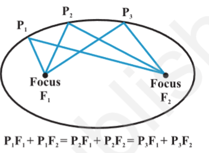
		- definition: an `ellipse` is the set of all points in a plane, the sum of whose distances from 2 fixed points in the plane is a constant
		- the 2 fixed points are called `foci` (plural of `focus`) of the ellipse
		- the constant which is the sum of the distances of a point on the ellipse from the 2 fixed points is always greater than the distance between the 2 fixed points
		- the mid point of the line segment joining the foci is called the `centre` of the ellipse
		- the line segment through the foci of the ellipse is called the `major axis` and the line segment through the centre and perpendicular to the major axis is called the `minor` axis.
		- the end points of the major axis are called the `vertices` of the ellipse
		- 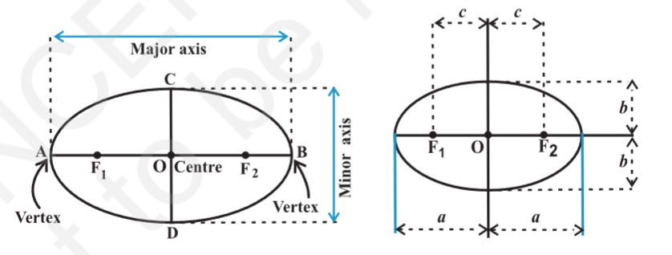
		- length of major axis 2a
		- length of minor axis 2b
		- distance between foci 2c
		- length of semi-major axis a
		- length of semi-minor axis b
	- relationship between semi-major axis, semi-minor axis and the distance of the focus from the centre of the ellipse
		- 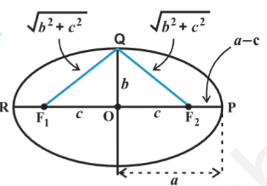
		- point P at one end of major axis.
		- sum of distances of the point P to the foci is 
		  $$
		  F_1P + F_2P = F_1O + OP + F_2P
		                       = c + a + a - c
		                       = 2a
		  $$
		  point Q at one end of the minor axis
		  sum of the distances from point Q to the foci is
		  $$
		  F_1Q + F_2Q = \sqrt{b^2 + c^2} +  \sqrt{b^2 + c^2} = 2 \sqrt{b^2 + c^2}
		  $$
		  since both P and Q lies on the ellipse
		  by the definition of ellipse, we have
		  $$
		  2 \sqrt{b^2 + c^2} = 2a \quad i.e., \quad a =  \sqrt{b^2 + c^2}
		  or \quad a^2 =  b^2 + c^2 \quad i.e., \quad c =  \sqrt{a^2 - b^2}
		  $$
	- special cases of an ellipse
		- in equation $c^2 = a^2 - b^2$, keep a fixed and vary c from 0 to a, the resulting ellipses will vary in shape
		- case 1: 
		  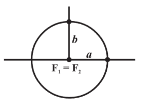 
		  when c = 0, both foci merge together with the centre of the ellipse and $a^2 = b^2$, i.e., a = b, and so the ellipse becomes circle. thus, circle is a special case of ellipse
		- case 2: 
		  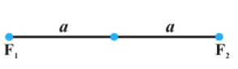 
		  when c = a, then b = 0. the ellipse reduces to the line segment $F_1F_2$ joining 2 foci
	- eccentricity
		- the eccentricity (denoted by `e`)of an ellipse is the ration of the distances from the centre of the ellipse to one of the focii and to one of the vertices of the ellipse
		  $e = \frac{c}{a}$
		  distance of focus from centre in terms of eccentricity is `ae` from centre
	- standard equations of an ellipse
		- 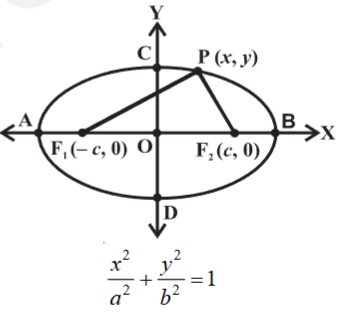
			- $F_1, F_2$ be the foci and O be the midpoint of the line segment $F_1F_2$. O be at origin and line from O through $F_2$ be the positive x-axis and that through $F_1$ as negative x-axis. line through O perpendicular to x-axis be the y-axis. coordinates of $F_1$ be (-c, 0) and $F_2$ be (c, 0)
			  P (x, y) point on the ellipse sum of the distances from P to 2 foci be 2a
			  $PF_1 + PF_2 = 2a$
			  $\sqrt{(x + c)^2 + y^2} +  \sqrt{(x - c)^2 + y^2} = 2a$
			  $\sqrt{(x + c)^2 + y^2} = 2a -  \sqrt{(x - c)^2 + y^2}$
			  squaring both sides  $(x + c)^2 + y^2 = 4a^2 -  4a\sqrt{(x - c)^2 + y^2} +  (x - c)^2 + y^2$
			  $\sqrt{(x - c)^2 + y^2} = a - \frac{c}{a} x$
			  squaring again and simplifying, we get
			  $\frac{x^2}{a^2} + \frac{y^2}{a^2 - c^2} = 1$
			  i.e., $\frac{x^2}{a^2} + \frac{y^2}{b^2} = 1 \quad (since \quad c^2 = a^2 - b^2)$
			- conversely any point that satisfies $\frac{x^2}{a^2} + \frac{y^2}{b^2} = 1$, satisfies the geometric condition $PF_1 + PF_2 = 2a$ and so P(x, y) lies on the ellipse
			- equation of an ellipse with centre at the origin and major axis along the x-axis is
			  $\frac{x^2}{a^2} + \frac{y^2}{b^2} = 1$
			- discussion:
				- from the equation of the ellipse obtained above, it follows that for every point P (x, y) on the ellipse, we have
				  $\frac{x^2}{a^2} = 1 - \frac{y^2}{b^2}$ 
				  i.e., $x^2 \leq a^2, \quad so \quad -a \leq x \leq a$
				  therefore, the ellipse lies between the lines x = -a and x = a and touches these lines.
				  similarly, the ellipse lies between y = -b and y = b and touches these lines.
				- 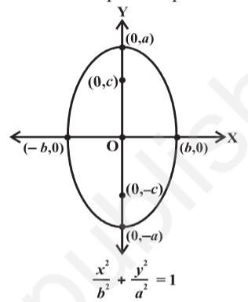
					- equation of ellipse is $\frac{x^2}{b^2} + \frac{y^2}{a^2} = 1$
				- these 2 equations are known as `standard equations` of the ellipse
				- ellipse is symmetric with respect to both the coordinate axes since if (x, y) is a point on the ellipse, the (-x, y), (x, -y) and (-x, -y) are also points on the ellipse.
				- the foci always lie on the major axis. the major axis can be determined by finding the intercepts on the axes of symmetry. that is, major axis is along the x-axis if the coefficient of $x^2$ has the larger denominator and it is along the y-axis if the coefficient of $y^2$ has the larger denominator
	- latus rectum
		- 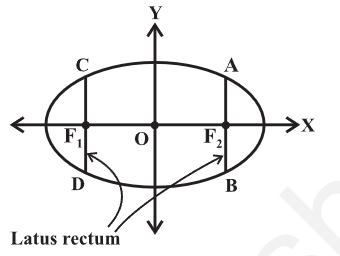
		- definition: latus rectum of an ellipse is a line segment perpendicular to the major axis through any of the foci and whose end points lie on the ellipse
		- length of latus rectum of the ellipse $\frac{x^2}{a^2} + \frac{y^2}{b^2} = 1$
			- length of $AF_2$ be `l`
			- coordinates of A are (c, l) i.e., (ae, l)
			- since A lies on the ellipse
			  $\frac{(ae)^2}{a^2} + \frac{(l)^2}{b^2} = 1$
			  => $l^2 = b^2(1 - e^2)$
			  but $e^2 = \frac{c^2}{a^2} = \frac{a^2 - b^2}{a^2} = 1 - \frac{b^2}{a^2}$
			  therefore $l^2 = \frac{b^4}{a^2}, \quad i.e., \quad l = \frac{b^2}{a}$
			  since the ellipse is symmetric with respect to y-axis (of course, it is symmetric w.r.t both the coordinate axes). $AF_2 = F_2B$
			  so length of the latus rectum is $\frac{2b^2}{a}$
- hyperbola
	- 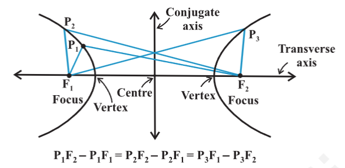
		- definition: a hyperbola is the set of all points in a plane, the difference of whose distances from 2 fixed points in the plane is a constant.
		- the term `difference` that is used in the definition means the distance to the farthest point minus the distance to the closer point. the 2 fixed points are called the foci of the hyperbola. the mid-point of the line segment joining the foci is called `centre of the hyperbola`. the line through the foci called the `traverse axis` and the line through the centre and perpendicular to the traverse axis is called the `conjugate` axis. the points at which the hyperbola intersects the traverse axis are called the `vertices of the hyperbola`
		- 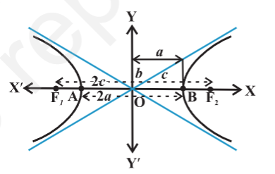
			- distance between 2 foci is 2c
			- distance between 2 vertices (length of traverse axis) 2a
			- $b = \sqrt{c^2 - a^2}$
			- 2b length of the conjugate axis
			- constant $P_1F_2 - P_1F_1$
				- taking point P at A and B
				- $BF_1 - BF_2 = AF_2 - AF_1$ (by definition of hyperbola)
				- $BA + AF_1 - BF_2 = AB + BF_2 - AF_1$
				  i.e., $AF_1 = BF_2$
				- so that, $BF_1 - BF_2 = BA + AF_1 - BF_2 = BA = 2a$
	- eccentricity
		- the ratio $e = \frac{c}{a}$ is called the `eccentricity of the hyperbola`.
		- since $c \geq a$, the eccentricity is never less than 1.
		- foci are at a distance of `ae` from the centre
	- standard equation of hyperbola
		- 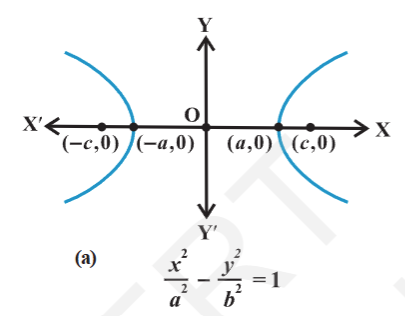
		- 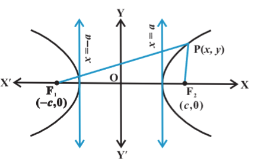
			- $F_1, F_2$ foci and O mid-point of the line segment $F_1, F_2$. O be at origin. line through O and $F_2$ positive x-axis and through $F_1$ is negative x-axis
			- line through O perpendicular to the x-axis be the y-axis
			- coordinates of $F_1$ be (-c, 0) and $F_2$ be (c, 0)
			- point P(x, y) on hyperbola difference of distances from P to the farther point minus the closer point be 2a
			  using distance formula
			  $\sqrt{(x + c)^2 + y^2} - \sqrt{(x - c)^2 + y^2} = 2a$
			  $\sqrt{(x + c)^2 + y^2} = 2a + \sqrt{(x - c)^2 + y^2}$
			  squaring both sides,
			  $(x + c)^2 + y^2 = 4a^2 + 4a \sqrt{(x - c)^2 + y^2} + (x - c)^2 + y^2$
			  on simplifying, we get
			  $\frac{cx}{a} - a = \sqrt{(x - c)^2 + y^2}$
			  on squaring again and further simplifying,
			  $\frac{x^2}{a^2} - \frac{y^2}{c^2 - a^2} = 1$
			  i.e., $\frac{x^2}{a^2} - \frac{y^2}{b^2} = 1$ (since $c^2 - a^2 = b^2)
			  hence any point on the hyperbola satisfies $\frac{x^2}{a^2} - \frac{y^2}{b^2} = 1$
			- conversely, P(x, y) satisfy the above equation with 0 < a < c,
			  $y^2 = b^2 \left(\frac{x^2 - a^2}{a^2} \right)$
			  therefore, $PF_1 = + \sqrt{(x + c)^2 + y^2}$
			                              = + $\sqrt{(x + c)^2 + b^2 \left(\frac{x^2 - a^2}{a^2} \right)} = a + \frac{c}{a}x
			  similarly $PF_2 =  a - \frac{c}{a}x$
			- in hyperbola c > a; and since P is to the right of the line x = a, x > a, $\frac{c}{a}x > a. therefore, $a - \frac{c}{a}x$ becomes negative, thus, $PF_2 = \frac{c}{a}x -a$
			  therefore $PF_1 - PF_2 = a + \frac{c}{a}x - \frac{c}{a}x + a = 2a$
			- if P is to the left of the line x = -a, then
			  $PF_1 = -\left( a + \frac{c}{a}x \right), \quad PF_2 =  a - \frac{c}{a}x$
			  in that case $PF_2 - PF_1 = 2a$
			- so any point that satisfies $\frac{x^2}{a^2} - \frac{y^2}{b^2} = 1$, lies on the hyperbola
			- equation of hyperbola with origin (0, 0) and traverse axis along x-axis is $\frac{x^2}{a^2} - \frac{y^2}{b^2} = 1$
			- a hyperbola in which a = b is called an `equilateral hyperbola`
			- discussion
				- for every point (x, y) on the hyperbola, $\frac{x^2}{a^2} - \frac{y^2}{b^2} = 1$
				  $\frac{x^2}{a^2} = 1 + \frac{y^2}{b^2} \geq 1$
				  i.e., $|\frac{x}{a}| \geq 1, \quad i.e., x \leq -a \quad or \quad x \geq a$
				- therefore, no portion of the curve lies between the line x = +a and x = -a (i.e., no real intercept on the conjugate axis)
				- 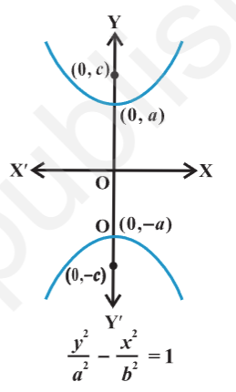
					- equation of hyperbola in this case is $\frac{y^2}{a^2} - \frac{x^2}{b^2} = 1$
				- 2 equations are knows as `standard equations of hyperbolas`
				- hyperbola is symmetric with respect to both the axes, since if (x, y) is a point on the hyperbola, then (-x, y), (x, -y) and (-x, -y) are also points on the hyperbola.
				- the foci are always on the traverse axis. it is the positive term whose denominator gives the traverse axis.
					- for example $\frac{x^2}{9} - \frac{y^2}{16} = 1$ has traverse axis along the x-axis of length 6
					- $\frac{y^2}{25} - \frac{x^2}{16} = 1$ has traverse axis along y-axis of length 10
	- latus rectum
		- latus rectum of hyperbola is a line segment perpendicular to the traverse axis through any of the foci and whose end points lies on the hyperbola.
		- length of the latus rectum in hyperbola is $\frac{2b^2}{a}$