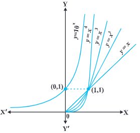

- 
- continuity
	- definition: continuous function
		- f is a real function on a subset of the real numbers and let c be a point in the domain of f. then f is continuous at c if 
		  $lim_{x \to c} f(x) = f(c)$
		- more elaborately, if the left hand limit, right hand limit and the value of the function at x = c exist and equal to each other, then f is said to be continuous at x = c. if the right hand and left hand limits at x = c coincide, the we say that the common value is the limit of the function at x = c. hence, we may rephrase the definition of continuity as follows: a function is continuous at x = c if the functions is defined at x = c and if the value of the function at x = c equals the limit of the function at x = c. if f is not continuous at c, we say f is discontinuous at c and c is called a point of discontinuity of f.
	- definition:
		- a real function f is said to be continuous if it is continuous at every point in the domain of f
		- this definition requires a bit of elaboration. suppose f is a function defined on a closed interval [a, b], then for f to be continuous, it needs to be continuous at every point in [a, b] including the end points a and b. continuity of f at a means
		  $lim_{x \to a^{+}} f(x) = f(a)$
		  and continuity of f at b means
		  $lim_{x \to b^{-}} f(x) = f(b)$
		  observe that $lim_{x \to a^{-}} f(x) = f(a)$ and $lim_{x \to b^{+}} f(x) = f(b)$ do not make sense. as a consequence of this definition, if f is defined only at one point, it is continuous there, i.e., if the domain of f is a singleton, f is a continuous function
	- algebra of continuous functions
		- continuity of a function at a point is entirely dictated by the limit of the function at that point.
		- theorem 1: f and g be 2 real functions continuous at a real number c. then
			- f + g is continuous at x = c
			- f - g is continuous at x = c
			- f . g is continuous at x = c
			- $\frac{f}{g}$ is continuous at x = c, (provided g(c) \neq 0)
			- remarks
				- as a special case of multiplication, if f is a constant function, i.e., f(x) = \lambda for some real number \lambda, then the function (\lambda . g) defined by (\lambda. g) (x) = \lambda . g(x) is also continuous. in particular if \lambda = -1, the continuity of f implies continuity of -f.
				- as a special case of division, if f is the constant function f(x) = \lambda, then the function $\frac{\lambda}{g}$ defined by $\frac{\lambda}{g}(x) = \frac{\lambda}{g(x)}$ is also continuous wherever g(x) \neq 0. in particular, the continuity of g implies continuity of $\frac{1}{g}$
		- theorem 2: f and g are real valued functions such that $(f \circ g)$ is defined at c. if g is continuous at c and if f is continuous at g(c), then $(f \circ g)$ is continuous at c
- differentiability
	- LATER f is a real function and c is a point in its domain. the derivative of f at c is defined by
	  $lim_{h \to 0}\frac{f(c+h) - f(c)}{h}$ provided this limit exists.
	  derivative of f at c is denoted by f'(c) of $\frac{d}{dx}(f(x))|_c$
	  the function defined by
	  $f'(x) = lim_{h \to 0}\frac{f(x + h) - f(x)}{h}$ wherever the limit exists is defined to be the derivative of f. the derivative of f is denoted by f'(x) or $\frac{d}{dx}(f(x))$ or if y = f(x) by $\frac{dy}{dx}$ or y'.
	  the process of finding derivative of a function is called differentiation. we also use the phrase `differentiate f(x) with respect to x` to mean `find f'(x)`
	  following rules were established as a part of algebra of derivative:
	  (u \pm v)' = u' \pm v'
	  (uv)' = u'v + uv' (Leibnitz or product rule)
	  $(\frac{u}{v})' = \frac{u'v - uv'}{v^2}$, wherever v \neq 0 (quotient rule)
	- list of derivatives of certain standard functions
		- |f(x)|x^n|sin x|cos x|tan x|
		  |f'(x)|nx^{n-1}|cos x|-sin x|$sec^2$ x|
		- whenever we defined derivative, we had put a caution `provided the limit exists`. now the natural question is; what if it doesn't? the question is quite pertinent and so is its answer. if $lim_{h \to 0}\frac{f(c+h) - f(c)}{h}$ does not exist, we say that f is not differentiable at c. in other words, we say that a function f is differentiable at a point c in its domain if both $lim_{h \to 0^-}\frac{f(c+h) - f(c)}{h}$ and $lim_{h \to 0^+}\frac{f(c+h) - f(c)}{h}$ are finite and equal. a function is said to be differentiable in an interval [a, b] if it is differentiable at every point of [a, b]. as in case of continuity, at the end point a and b, we take the right hand limit and left hand limit, which are nothing but left hand derivative and right hand derivative of the function at a and b respectively. similarly, a function is said to be differentiable in an interval (a, b) if it is differentiable at every point of (a, b)
	- theorem 3:
		- if a function f is differentiable at a point c, then it is also continuous at that point
		- corollary 1: every differentiable function is continuous
			- we remark that the converse of the above statement is not true. indeed we have seen that the function defined by f(x) = |x| is a continuous function. consider the left hand limit
			  $lim_{h \to 0^-} \frac{f(0 + h) - f(0)}{h} = \frac{-h}{h} = -1$
			  right hand limit
			  $lim_{h \to 0^+} \frac{f(0 + h) - f(0)}{h} = \frac{h}{h} = 1$
			  since the above left and right hand limits at 0 are not equal, 
			  $lim_{h \to 0} \frac{f(0 + h) - f(0)}{h}$  does not exist and hence f is not differentiable at 0. thus f is not a differentiable function
	- derivatives of composite functions
		- theorem 4: chain rule
			- f be a real valued function which is a composite of 2 functions u and v; i.e., $f = v \circ u$
			  suppose t = u(x) and if both $\frac{dt}{dx}$ and $\frac{dv}{dt}$ exist, we have
			  $\frac{df}{dx} = \frac{dv}{dt} . \frac{dt}{dx}$
			- suppose f is a real valued function which is a composite of 3 functions, u, v and w; i.e.,
			  $f = (w \circ u) \circ v$
			  if t = v(x), s = u(t), f = w(s) then
			  $\frac{df}{dx} = \frac{d(w \circ u)}{dt} . \frac{dt}{dx} = \frac{dw}{ds} . \frac{ds}{dt} . \frac{dt}{dx}$
			  provided all the derivatives in the statement exist.
	- derivatives of implicit functions
		- when a relationship between x and y expressed in a way that it is easy to solve for y and write y = f(x), we say that y is given as an `explicit function` of x.
		- x + sin xy - y = 0
		  y is a function of x, gives function `implicitly`
			- example: find $\frac{dy}{dx}$, if y + sin y = cos x
			  $$
			  \frac{dy}{dx} + \frac{d}{dx} (sin y) = \frac{d}{dx}cos x \\
			  \frac{dy}{dx} + cos y . \frac{dy}{dx} = - sin x \\
			  \frac{dy}{dx} = - \frac{sin x}{1 + cos y}
			  $$
	- derivatives of inverse trigonometric functions
		- |f(x)|$sin^{-1}x$|$cos^{-1}x$|${tan^{-1}x}$|$cosec^{-1}x$|${sec^{-1}x}$|$cot^{-1}x$|
		  |f'(x)|$\frac{1}{\sqrt{1-x^{2}}}$|$\frac{-1}{\sqrt{1-x^{2}}}$|$\frac{1}{1+x^{2}}$|$\frac{-1}{x\sqrt{x^{2}}}$|$\frac{1}{x\sqrt{x^{2}}}$|$\frac{-1}{1+x^{2}}$|
		  |Domain of f'|(-1, 1)|(-1, 1)|$\mathbb{R}$|(-\infty, -1) \cup (1, \infty)|$(-\infty, -1) \cup (1, \infty)$|$\mathbb{R}$|
- exponential and logarithmic functions
	- different classes of functions
		- polynomial functions
		- rational functions
		- trigonometric functions
		- exponential functions
		- logarithmic functions
		- 
		- figure gives a sketch of $y = f_1(x) = x$, $y = f_2(x) = x^2$, $y = f_3(x) = x^3$, $y = f_4(x) = x^4$. observe that the curves get steeper as the power of x increases. steeper the curve, faster is the rate of growth. what this means is that for a fixed increment in the value of (x > 1), the increment in the value of $y = f_n(x)$ increases as n increases for n = 1, 2, 3, 4. it is conceivable that such a statement is true for all positive values of n, where $f_n(x) = x^n$. essentially, this means that the graph of $y = f_n(x)$ leans more towards the y-axis as n increases. for example, consider $f_{10}(x) = x^{10}$ and $f_{15}(x) = x^{15}$. if x increases from 1 to 2, $f_{10}$ increases from 1 to $2^{10}$ whereas $f_{15}$ increases from 1 to $2^{15}$. thus, for the same increment in x, $f_{15}$ grow faster that $f_{10}$.
		- upshot of the above discussion is that the growth of polynomial functions is dependent on the degree of the polynomial function - higher the degree, greater is the growth. the next natural question is: is there a function which grows faster than any polynomial function. the answer is in affirmative and an example of such a function is 
		  $y = f(x) = 10^x$
		- our claim is that this function f grows faster than $f_n(x) = x^n$ for any  positive integer n. for example, we can prove that $10^x$ grows faster than $f_{100}(x) = x^{100}$. for large values of x like $x = 10^3$, note that $f_{100}x = (10^3)^{100} = 10^{300}$ where as $f(10^3) = 10^{10^3} = 10^{1000}$. clearly f(x) is much greater that $f_100(x)$. it is not difficult to prove that for all $x > 10^{3}$, $f(x) > f_{100} (x)$. similarly, by choosing large values of x, one can verify that f(x) grows faster than $f_n(x)$ for any positive integer n.
		- definition 3: the exponential function with positive base b > 1 is the function $y = f(x) = b^x$
			- salient features of exponential functions
				- domain of the exponential function is $\mathbb{R}$, the set of all real numbers.
				- range of the exponential function is the set of all positive real numbers.
				- the point (0, 1) is always on the graph of the exponential function (this is a restatement of fact that $b^0 = 1$ for any real b > 1)
				- exponential function is ever increasing; i.e., as we move from left to right, the graph rises above
				- for very large negative values of x, the exponential function is very close to 0. in other words, in the second quadrant, the graph approaches x-axis (but never meets it)
			- exponential function with base 10 is called the `common exponential function`
			- sum of the series $1 + \frac{1}{1!} + \frac{1}{2!} + ...$ is a number between 2 and 3 and is denoted by `e`. using this `e` as the base we obtain an extremely important exponential function $y = e^x$
			  this is called `natural exponential function`.
		- definition 4: b > 1 be a real number. then we say logarithm of a to base b is x if $b^x = a$
			- is denoted by $log_b a$. thus $log_b a = x$ if $b^x = a$
		- on a slightly more mature note, fixing a base b > 1, we may look at a logarithm as a function from positive real numbers to all real numbers. this function, called the `logarithmic function` is defined by
		  $log_b : \mathbb{R^+} \to \mathbb{R}$
		  $x \to log_b x = y \text{ if }b^y = x$
		- theorem 5
- logarithmic differentiation
- derivatives of functions in parametric forms
- second order derivative
- mean value theorem