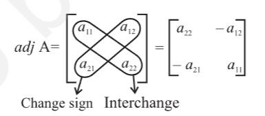

- 
- introduction
	- a system of linear equations like
	  $$
	  a_1 x + b_1 y = c_1 \\
	  a_2 x + b_2 y = c_2
	  $$ can be represented as
	  $$
	  \begin{bmatrix}
	  a_1 & b_1 \\
	  a_2 & b_2
	  \end{bmatrix}
	  \begin{bmatrix}
	  x \\
	  y
	  \end{bmatrix}
	  = 
	  \begin{bmatrix}
	  c_1 \\
	  c_2
	  \end{bmatrix}
	  $$
	- now, this system of equations has a unique solution or not, is determined by the number $a_1 b_2 - a_2 b_1$
	- if $\frac{a_1}{a_2} \neq \frac{b_1}{b_2}$ or $a_1 b_2 - a_2 b_1 \neq 0$, then the system of linear equations has a unique solution.
	- the number $a_1 b_2 - a_2 b_1$ which determines uniqueness of solution is associated with the matrix 
	  $$
	  \begin{bmatrix}
	  a_1 & b_1 \\
	  a_2 & b_2
	  \end{bmatrix}
	  $$ and is called the determinant of A or det A.
	- determinants have wide applications in engineering, science, economics, social science etc.
- determinant
	- definition
		- to every square matrix A = [a_{ij}] of order n, we can associate a number (real or complex) called determinant of the square matrix A, where a_{ij} = (i, j)^{th} element of A. this may be thought of as a function which associates each square matrix with a unique number (real or complex). if M is the set of square matrices, K is the set of numbers (real or complex) and f: M -> K is defined by f(A) = k, where A \in M and k \in K, then f(A) is called the determinant of A. it is also denoted by |A| or det A or \Delta
		- if A = 
		  $$
		  \begin{bmatrix}
		  a & b \\
		  c & d
		  \end{bmatrix}
		  $$, then determinant of A is written as |A| = 
		  $$
		  \begin{vmatrix}
		  a & b \\
		  c & d
		  \end{vmatrix} = det (A)
		  $$
		- for matrix A, |A| is read as determinant of A and not modulus of A
		- only square matrices have determinants
	- determinant of a matrix of order one
		- A = [a] be the matrix of order 1, then determinant of A is defined to be equal to a
	- determinant of a matrix of order two
		- $$
		  A = 
		  \begin{bmatrix}
		  a_{11} & a_{12} \\
		  a_{21} & a_{22}
		  \end{bmatrix}
		  $$ be a matrix of order 2 x 2
		- then the determinant of A is defined as
			- det(A) = |A| = \Delta = $a_{11}a_{22} - a_{21}a_{12}$
	- determinant of a matrix of order 3 x 3
		- determinant of a matrix of order 3 can be determined by expressing it in terms of second order determinants. this is known as expansion of a determinant along a row (or a column). there are 6 ways of expanding a determinant of order 3 corresponding to each of 3 rows ($R_1, R_2$ and $R3$) and 3 columns ($C_1, C_2,$ and $C_3$) giving the same value as shown below.
		- consider the determinant of square matrix A = $[a_{ij}]_{3\times 3}$
		- i.e., |A| = 
		  $$
		  \begin{vmatrix}
		  a_{11} & a_{12} & a_{13} \\
		  a_{21} & a_{22} & a_{23} \\
		  a_{31} & a_{32} & a_{33}
		  \end{vmatrix}
		  $$
		- expansion along first row $R_1$
			- $(-1)^{1+1}\left[(-1)^{\text{sum of suffixes of }a_{11}}\right]$
			- $$
			  \left| A \right| = (-1)^{1+1} a_{11}
			  \begin{vmatrix}
			  a_{22} & a_{23} \\
			  a_{32} & a_{33}
			  \end{vmatrix} 
			  + (-1)^{1+2} a_{12}
			  \begin{vmatrix}
			  a_{21} & a_{23} \\
			  a_{31} & a_{33}
			  \end{vmatrix} 
			  + (-1)^{1+3} a_{13}
			  \begin{vmatrix}
			  a_{21} & a_{22} \\
			  a_{31} & a_{32}
			  \end{vmatrix}
			  $$
			  
			  $$
			  = a_{11}
			  \begin{vmatrix}
			  a_{22} & a_{23} \\
			  a_{32} & a_{33}
			  \end{vmatrix} 
			  - a_{12}
			  \begin{vmatrix}
			  a_{21} & a_{23} \\
			  a_{31} & a_{33}
			  \end{vmatrix} 
			  + a_{13}
			  \begin{vmatrix}
			  a_{21} & a_{22} \\
			  a_{31} & a_{32}
			  \end{vmatrix}
			  $$
	- remarks:
		- for easier calculations, we shall expand the determinant along that row or column which contains maximum number of zeros.
		- while expanding, instead of multiplying by (-1)^{i+j}, we can multiply by +1 or -1 according as (i + j) is even or odd
		- if A = kB where A and B are square matrices of order n, then |A| = k^n |B|, where n = 1, 2, 3
- properties of determinants
	- property 1
		- the value of the determinant remains unchanged if its rows and columns are interchanged
		- A is square matrix, A' is transpose of A then det (A) = det (A')
		- if $R_i$ = ith row and $C_i$ = ith column, then for interchange of row and column, we will symbolically write $C_i$ ↔ $R_i$
	- property 2
		- if any 2 rows (or columns) of a determinant are interchanged, then sign of determinant changes
		- note: we can denote the interchange of rows by $R_i$ ↔ $R_j$ and interchange of columns by $C_i$ ↔ $C_j$
	- property 3
		- it any 2 rows (or columns) of a determinant are identical (all corresponding elements are same), then value of determinant is zero
	- property 4
		- if each element of a row (or a column) of a determinant is multiplied by constant k, then its value gets multiplied by k
		- by this property, we can take out any common factor from any one row or any one column of a given determinant
		- if corresponding elements of any 2 rows (or columns) of a determinant are proportional (in the same ratio), then its value is zero.
	- property 5
		- if some or all elements of a row or column of a determinant are expressed as sum of 2 (or more) terms, then the determinant can be expressed as sum of 2 (or more) determinants
		- $$
		  \begin{vmatrix}
		  a_1 + \lambda_1 & a_2 + \lambda_2 & a_3 + \lambda_3 \\
		  b_1 & b_2 & b_3 \\
		  c_1 & c_2 & c_3
		  \end{vmatrix}
		  =
		  \begin{vmatrix}
		  a_1 & a_2 & a_3 \\
		  b_1 & b_2 & b_3 \\
		  c_1 & c_2 & c_3
		  \end{vmatrix}
		  +
		  \begin{vmatrix}
		  \lambda_1 & \lambda_2 & \lambda_3 \\
		  b_1 & b_2 & b_3 \\
		  c_1 & c_2 & c_3
		  \end{vmatrix}
		  $$
	- property 6
		- if, to each of any row or column of a determinant, the equimultiples of corresponding elements of other row (or column) are added, then value of determinant remains the same, i.e., the value of determinant remain same if we apply the operation $R_i$ -> $R_i + kR_j$ or $C_i$ -> $C_i + kC_j$
		- if $\Delta_1$ is the determinant obtained by applying $R_i$ -> $kR_i$ or $C_i$ -> $kC_i$ to the determinant $\Delta$, then $\Delta_1 = k \Delta$
		- if more than one operation like $R_i$ -> $R_i + kR_j$ is done in one step, care should be taken to see that a row that is affected in one operation should not be used in another operation. a similar remark applies to column operations.
- area of a triangle
	- area of a triangle whose vertices are $(x_1, y_1), (x_2, y_2), (x_3, y_3)$ is given by the expression $\frac{1}{2} [x_1 (y_2 - y_3) + x_2 (y_3 - y_1) + x_3 (y_1 - y_2)]$
	- now this expression can be written in the form of a determinant as
	  $$\Delta = \frac{1}{2} 
	  \begin{vmatrix}
	  x_1 & y_1 & 1 \\
	  x_2 & y_2 & 1 \\
	  x_3 & y_3 & 1
	  \end{vmatrix}
	  $$
	- since area is a positive quantity, we always take the absolute value of the determinant
	- if are is given, use both positive and negative values of the determinant for calculation
	- the area of the triangle formed by 3 collinear points is zero
- minors and cofactors
	- minor
		- definition: minor of an element $a_ij$ of a determinant is the determinant obtained by deleting its ith row and jth column in which element $a_ij$ lies and is denoted by $M_{ij}$
		- minor of an element of a determinant of order n (n $\geq$ 2) is a determinant of order n - 1
	- cofactor
		- definition: cofactor of an element $a_ij$, denoted by $A_{ij}$ is defined by $A_{ij} = (-1)^{i + j} M_{ij}$, where $M_{ij}$ is minor of $a_{ij}$
	- $\Delta = a_{11}A_{11} + a_{12} A_{12} + a_13 A_{13}$
	  = sum of product of elements of any row (or column) with their corresponding cofactors
	- if elements of a row (or column) are multiplied with cofactors of any other row (or column), then their sum is zero
- adjoint and inverse of a matrix
	- to find inverse of a matrix A, i.e., A^{-1} we shall first define adjoint of a matrix
	- adjoint of a matrix
		- definition: the adjoint of square matrix A = [a_{ij}]_{n x n} is defined as the transpose of the matrix [A_{ij}]_{n x n}, where A_{ij} is the cofactor of the element a_{ij} and is denoted by adj A
		- $$
		  A = 
		  \begin{bmatrix}
		  a_{11} & a_{12} & a_{13} \\
		  a_{21} & a_{22} & a_{23} \\
		  a_{31} & a_{32} & a_{33}
		  \end{bmatrix}
		  $$
		- then adj A = transpose of 
		  $$
		  \begin{bmatrix}
		  A_{11} & A_{12} & A_{13} \\
		  A_{21} & A_{22} & A_{23} \\
		  A_{31} & A_{32} & A_{33}
		  \end{bmatrix}
		  =
		  \begin{bmatrix}
		  A_{11} & A_{21} & A_{31} \\
		  A_{12} & A_{22} & A_{32} \\
		  A_{13} & A_{23} & A_{33}
		  \end{bmatrix}
		  $$
		- for a square matrix of order 2, 
		  $$
		  A = 
		  \begin{bmatrix}
		  a_{11} & a_{12} \\
		  a_{21} & a_{22}
		  \end{bmatrix}
		  $$
			- the adj A can also be obtained by interchanging $a_{11}$ and $a_{22}$ and by changing signs of $a_{12}$ and $a_21$, i.e.,
			- 
		- theorem
			- if A be any given square matrix of order n, then
			  A (adj A) = (adj A) A = |A| I, where I is the identity matrix of order n
	- singular matrix
		- definition
			- a square matrix A is said to be singular if |A| = 0
			- singular does not have invert and cannot be invertible
	- non-singular matrix
		- definition
			- a square matrix A is said to be non-singular if $|A| \neq 0$.
		- non-singular matrix has inverse matrix
		- theorem
			- if A and B are nonsingular matrices of the same order, then AB and BA are also nonsingular matrices of the same order
		- theorem
			- the determinant of the product of matrices is equal to product of their respective determinants, that is, |AB| = |A| |B|, where A and B are square matrices of the same order
			- if A is a square matrix of order n, then $|adj(A)| = |A|^{n-1}$
		- theorem
			- a square matrix A is invertible if and only if A is nonsingular matrix
			- if A is invertible then $A^{-1} = \frac{1}{|A|} adj A$
- application of determinants and matrices
	- application of determinants and matrices used for solving the system of linear equations and for checking consistency of the system of linear equations
		- consistent system
			- a system of equations is said to be consistent it its solution (one or more) exists
		- inconsistent system
			- a system of equations is said to be inconsistent if its solution does not exist
	- solution of system of linear equations using inverse of a matrix
		- express the system of linear equations as matrix equations and solve them using inverse of the coefficient matrix
			- $$
			  a_1 x + b_1 y + c_1 z = d_1 \\
			  a_2 x + b_2 y + c_2 z = d_2 \\
			  a_3 x + b_3 y + c_3 z = d_3
			  $$
			- can be written as AX = B
				- $$
				  \begin{bmatrix}
				  a_1 & b_1 & c_1 \\
				  a_2 & b_2 & c_2 \\
				  a_3 & b_3 & c_3
				  \end{bmatrix}
				  \begin{bmatrix}
				  x \\
				  y \\
				  z
				  \end{bmatrix}
				  =
				  \begin{bmatrix}
				  d_1 \\
				  d_2 \\
				  d_3
				  \end{bmatrix}
				  $$
			- case 1: if A is nonsingular matrix, then its inverse exists
			  X = $A^{-1} B$
			  this matrix equation provides unique solution for the given system of equations as inverse of a matrix is unique. this method of solving of equations is known as Matrix method
			- case 2: if A is a singular matrix, then |A| = 0
			  in this case, we calculate (adj A) B
			  if $(adj A) B \neq O$, (O being zero matrix), then solution does not exist and the system of equations is called inconsistent
			  if (adj A) B = 0, then system may be either consistent or inconsistent according as the system have either infinitely many solutions or no solution.