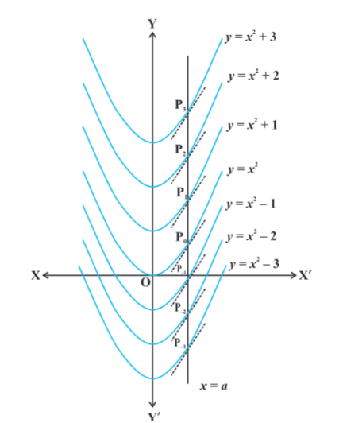

- 
- introduction
	- differential calculus is centered on the concept of the derivative. the original motivation for the derivative was the problem of defining tangent lines to the graphs of functions and calculating the slope of such lines. integral calculus is motivated by the problem of defining and calculating the area of the region bounded by the graph of the functions.
	- if a function f is differentiable in an interval I, i.e., its derivative f' exists at each point of I, then a natural question arises that given f' at each point of I, can we determine the function? the functions that could possibly have given function as a derivative are called anti derivatives (or primitive) of the function. further, the formula that gives all these anti derivatives is called the `indefinite integral` of the function and such process of finding antiderivatives is called `integration`. such type of problems arise in many practical situations. for instance, if we know the instantaneous velocity of an object at any instant, then there arises a natural question, i.e., can we determine the position of the object at any instant? there are several such practical and theoretical situations where the process of integration is involved. the development of integral calculus arises out of the efforts of solving the problems of the following types:
		- the problem of finding a function whenever its derivative is given
		- the problem of finding the area bounded by the graph of a function under certain conditions
	- these 2 problems lead to the 2 forms of the integrals, e.g. indefinite and definite integrals, which together constitute the `Integral Calculus`. there is a connection, known as the `Fundamental Theorem of Calculus`, between indefinite integral and definite integral which makes the definite integral as a practical tool for science and engineering. the definite integral is also used to solve many interesting problems from various disciplines like economics, finance and probability.
- integration as an inverse process of differentiation
	- integration is the inverse process of differentiation. instead of differentiating a function, we are given the derivative of a function and asked to find its primitive, i.e., the original function. such process is called `integration` or `anti differentiation`.
	- for any arbitrary real number C, (also called `constant of integration`)
	  $\frac{d}{dx}[F(x) + C] = f(x), \forall x \in I$
	  thus, {F + C, C \in R} denotes a family of anti derivatives of f.
	- Remark
		- functions with same derivatives differ by a constant. to show this, let g and h be 2 functions having the same derivatives on an interval I.
		- consider the function f = g - h define by f(x) = g(x) - h(x), \forall x \in I
		- then $\frac{df}{dx} = f' = g' - h'$ giving f'(x) = g'(x) - h'(x) \forall x \in I
		- or f'(x) = 0, \forall x \in I by hypothesis
		- i.e., the rate of change of f with respect to x is zero on I and hence f is constant.
		- in view of the above remark, it is justified to infer that the family {F+C, C \in R} provides all possible anti derivatives of f.
		- we introduce a new symbol, namely \int f(x) dx which will represent the entire class of anti derivatives read as the indefinite integral of f with respect to x.
		- symbolically, we write \int f(x) dx = F(x) + C
		- notation given that $\frac{dy}{dx} = f(x)$ we write y = \int f(x) dx
		- | symbols / terms / phrases | meaning|
		  | \int f(x) dx | integral of f with respect to x|
		  | f(x) in \int f(x) dx | integrand|
		  | x in \int f(x) dx| variable of integration|
		  | Integrate| find the integral|
		  | an integral of f| a function F such that F'(x) = f(x)|
		  | Integration | the process of finding the integral|
		  | constant of integration | any real number C, considered as constant function |
		- standard formlae
			- LATER | derivatives | integrals (anti derivatives) |
			  | $\frac{d}{dx}\frac{x^{n+1}}{n + 1} = x^n;$ | $\int x^n dx = \frac{x^{n+1}}{n+1} + C, n \neq -1$ |
			  | particularly, we note that $\frac{d}{dx}(x) = 1;$ | $\int dx = x + C$ |
			  | $\frac{d}{dx} (sin\ x) = cos\ x$ | \int cos x dx = sin x + C |
			  | $\frac{d}{dx} (-cos\ x) = sin\ x$ | \int sin x dx = -cos x + C |
			  | $\frac{d}{dx} (tan\ x) = sec^2\ x$ | $\int sec^2\ x\ dx = tan\ x + C$ |
			  | $\frac{d}{dx} (-cot\ x) = cosec^2\ x$ | $\int cosec^2\ x\ dx = -cot\ x + C$ |
			  | $\frac{d}{dx} (sec\ x) = sec\ x\  tan\ x$ | \int sec x tan x dx = sec x + C |
			  | $\frac{d}{dx} (-cosec\ x) = cosec\ x\  cot\ x$ | \int cosec x cot x dx = -cosec x + C |
			  | $\frac{d}{dx} (sin^{-1}\ x) = \frac{1}{\sqrt{1 - x^2}}$ | $\int \frac{dx}{\sqrt{1 - x^2}} = sin^{-1} x + C$ |
			  | $\frac{d}{dx} (-cos^{-1}\ x) = \frac{1}{\sqrt{1 - x^2}}$ | $\int \frac{dx}{\sqrt{1 - x^2}} = -cos^{-1} x + C$ |
			  | $\frac{d}{dx} (tan^{-1}\ x) = \frac{1}{1 + x^2}$ | $\int \frac{dx}{1 + x^2} = tan^{-1} x + C$ |
			  | $\frac{d}{dx} (-cot^{-1}\ x) = \frac{1}{1 + x^2}$ | $\int \frac{dx}{1 + x^2} = -cot^{-1} x + C$ |
			  | $\frac{d}{dx} (sec^{-1}\ x) = \frac{1}{x \sqrt{x^2 - 1}}$ | $\int \frac{dx}{{x \sqrt{x^2 - 1}}} = sec^{-1} x + C$ |
			  | $\frac{d}{dx} (-cosec^{-1}\ x) = \frac{1}{x \sqrt{x^2 - 1}}$ | $\int \frac{dx}{{x \sqrt{x^2 - 1}}} = -cosec^{-1} x + C$ |
			  | $\frac{d}{dx} (e^{x}) = e^x$ | $\int e^x dx = e^x + C$ |
			  | $\frac{d}{dx} log \vert x \vert = \frac{1}{x}$ | $\int \frac{1}{x} dx = log \vert x \vert + C$|
			  | $\frac{d}{dx} (\frac{a^x}{\log a}) = a^x$ | $\int a^x dx = \frac{a^x}{\log a} + C$ |
		- note: in practice, we normally do not mention the interval over which the various functions are defined. however, in any specific problem one has to keep it in mind.
	- geometrical interpretation of indefinite integral
		- let f(x) = 2x then \int f(x) dx = $x^2$ + C. for different values of C, we get different integrals. but these integrals are very similar geometrically.
		- thus, $y = x^2 + C$, where C is arbitrary constant, represents a family of integrals. by assigning different values to C, we get different members of the family. these together constitute the indefinite integral. in this case, each integral represents a parabola with its axis along y-axis.
		- {:height 540, :width 432}
		- clearly, for C = 0, we obtain $y = x^2$, a parabola with its vertex on the origin. the curve $y = x^2 + 1$ for C = 1 is obtained by shifting the parabola $y = x^2$ on unit along y-axis in the positive direction. for C = -1, $y = x^2 - 1$ is obtained by shifting the parabola $y = x^2$ one unit along y-axis in the negative direction. thus, for each positive value of C, each parabola of the family has its vertex on the positive side of the y-axis and for negative values of C, each has its vertex along the negative side of the y-axis.
		- let us consider the intersection of all these parabolas by a line x = a. we have taken a > 0. the same is true when a < 0. if the line x = a intersects the parabolas $y = x^2, y = x^2 + 1, y = x^2 + 2, y = x^2 - 1, y = x^2 - 2$ at $P_0, P_1, P_2, P_{-1}, P_{-2}$ etc., then $\frac{dy}{dx}$ at these points equals 2a. this indicates that the tangents to the curves at these points are parallel. thus, $\int 2x dx = x^2 + C = F_C (x)$, implies that the tangents to all the curves $y = F_C(x), C \in R$, at the points of intersection of the curves by the line x = a, (a \in R), are parallel.
		- further, the following equation (statement) \int f(x) dx = F(x) + C = y, represents a family of curves. the different values of C will correspond to different members of this family and these members can be obtained by shifting any one of curves parallel to itself. this is the geometrical interpretation of indefinite integral.
	- some properties of indefinite integral
		- property 1:
			- the process of differentiation and integration are inverses of each other in the sense of the following results:
			- $\frac{d}{dx}\int f(x)dx = f(x)$
			- and $\int f'(x) dx = f(x) + C$, where C is any arbitrary constant called constant of integration
		- property 2:
			- 2 indefinite integrals with the same derivative lead to the same family of curves and so they are equivalent
			- proof:
				- let f and g be 2 functions such that
				- $\frac{d}{dx}\int f(x)dx = \frac{d}{dx}\int g(x)dx$
				- or $\frac{d}{dx}[\int f(x)dx - \int g(x)dx] = 0$
				- hence $\int f(x)dx - \int g(x)dx = C$, where C is any real number
				- or $\int f(x)dx = \int g(x)dx + C$
				- so the families of curves $\{ f(x) dx + C_1, C_1 \in R\}$ and $\{ g(x) dx + C_2, C_2 \in R\}$ are identical.
				  id:: 6a9d72d8-0742-459f-8e14-04c7d793e0c9
				- hence, in this sense, $\int f(x)dx$, $\int g(x)dx$ are equivalent.
			- note: the equivalence of the families $\{ f(x) dx + C_1, C_1 \in R\}$ and $\{ g(x) dx + C_2, C_2 \in R\}$ is customarily expressed by writing $\int f(x)dx = \int g(x)dx$, without mentioning parameter
		- property 3:
			- \int [f(x) + g(x)] dx = \int f(x) dx + \int g(x) dx
		- property 4:
			- for any real number k,
				- \int k f(x) dx = k \int f(x) dx
		- property 3 & 4 can be generalised to a finited number of functions $f_1, f_2, ...., f_n$ and the real numbers, $k_1, k_2, ...., k_n$ giving
		  $\int [k_1 f_1(x) + k_2 f_2(x) + ... + k_n f_n(x)] dx = k_1 \int f_1(x) dx + k_2 \int f_2(x) dx + ... + k_n \int f_n(x) dx$
		- to find an anti derivative of a given function, we search intuitively for a function whose derivative is the given function. to search for the requisite function for finding an anti derivative is known as integration by the method of inspection.
	- comparison between differentiation and integration
		- both are operations on functions
		- both satisfy the property of linearity i.e.,
			- $\frac{d}{dx}[k_1 f_1(x) + k_2 f_2(x)] = k_1 \frac{d}{dx} f_1(x) + k_2 \frac{d}{dx} f_2(x)$
			  id:: 6a9e5f37-db90-4015-bd91-f295d7b68375
			- $\int [k_1 f_1(x) + k_2 f_2(x)] dx = k_1 \int f_1(x) dx + k_2 \int f_2(x) dx$
			- here $k_1, k_2$ are constants
		- we have already seen that all functions are not differentiable. similarly, all functions are not integrable.
		- the derivative of a function, when it exists, is a unique function. the integral of a function is not so. however, they are unique upto an additive constant, i.e., any 2 integrals of a function differ by a constant.
		- when a polynomial function P is differentiated, the result is a polynomial whose degree is 1 less than the degree of P. when a polynomial function P is integrated, the result is a polynomial whose degree is 1 more than that of P.
		- we can speak of the derivative at a point. we never speak of the integral at a point, we speak of the integral of a function over an interval on which the integral is defined.
		- the derivative of a function has a geometrical meaning, namely, the slope of the tangent to the corresponding curve at a point. similarly, the indefinite integral of a function represents geometrically, a family of curves placed parallel to each other having parallel tangents at the points of intersection of the curves of the family with the lines orthogonal (perpendicular) to the axis representing the variable of integration.
		- the derivative is used for finding some physical quantities like the velocity of a moving particle, when the distance traversed at any time t is known. similarly, the integral is used in calculating the distance traversed when the velocity at time t is known.
		- differentiation is a process involving limits. so is integration.
		- the process of differentiation and integration are inverses of each other.
- methods of integration
	- for finding integrals the following methods used for reducing them into standard forms
		- integration by substitution
		- integration using partial fractions
		- integration by parts
	- integration by substitution
		- the given integral \int f(x) dx can be transformed into another form by changing the independent variable x to t by substituting x = g(t)
		- consider I = \int f(x) dx
		- put x = g(t) so that $\frac{dx}{dt} = g'(t)$
		- we write dx = g'(t) dt
		- thus, I = \int f(x) dx = \int f(g(t)) g'(t) dt
		- this change of variable formula is one of the important tools available to us in the name of integration by substitution. is it often important to guess what will be the useful substitution. usually, we make a substitution for a function whose derivative also occurs in the integrand.
	- integration using trigonometric identities
		- when the integrand involves some trigonometric functions, we use some known identities to find the integral.
- integrals of some particular functions
	- some important formulae of integrals
		- $\int \frac{dx}{x^2 - a^2} = \frac{1}{2a} \log \left\vert \frac{x-a}{x+a}\right\vert + C$
		- $\int \frac{dx}{a^2 - x^2} = \frac{1}{2a} \log \left\vert \frac{a+x}{a-x}\right\vert + C$
		- $\int \frac{dx}{x^2 + a^2} = \frac{1}{a} tan^{-1} \frac{x}{a} + C$
		- $\int \frac{dx}{\sqrt{x^2 - a^2}} = \log\vert x + \sqrt{x^2 - a^2}\vert + C$
		- $\int \frac{dx}{a^2 - x^2} = sin^{-1} \frac{x}{a} + C$
		- $\int \frac{dx}{\sqrt{x^2 + a^2}} = \log \vert x + \sqrt{x^2 + a^2} \vert + C$
		- $\int \frac{dx}{ax^2 + bx + c}$
		  $ax^2 + bx + c = a \left[ x^2 + \frac{b}{a} x + \frac{c}{a} \right] = a \left[ \left(x + \frac{b}{2a}\right)^2 + \left(\frac{c}{a} - \frac{b^2}{4a^2} \right) \right]$
		  now, put $x + \frac{b}{2a} = t$ and $\frac{c}{a} - \frac{b^2}{4a^2} = \pm k^2$
		  we find the integral reduced to the form $\frac{1}{a} \int \frac{dt}{t^2 \pm k^2}$ depending upon the sign of $\left( \frac{c}{a} - \frac{b^2}{4a^2} \right)$
		- $\int \frac{dx}{\sqrt{ax^2 + bx + c}}$
		- $\int \frac{px + q}{ax^2 + bx + c} dx$, where p, q, a, b, c are constants, we are to find real numbers A, B such that 
		  $px + q = A \frac{d}{dx} (ax^2 + bx + c) + B = A(2ax+b) + B$
		  to determine A and B, we equate from both sides the coefficients of x and the constant terms. A and B thus obtained and hence the integral is reduced to one of known forms.
		- $\int \frac{px + q}{\sqrt{ax^2 + bx + c}} dx$
- integration by partial fractions
	- a rational function is defined as the ratio of 2 polynomials in the form $\frac{P(x)}{Q(x)}$, where P(x) and Q(x) are polynomials in x and Q(x) \neq 0. if the degree of P(x) is less than the degree of Q(x), then the rational function is called proper, otherwise it is called improper. the improper rational functions can be reduced to the proper rational functions by long division process. thus, if $\frac{P(x)}{Q(x)}$ is improper, then $\frac{P(x)}{Q(x)} = T(x) + \frac{P_1(x)}{Q(x)}$, where T(x) is a polynomial in x and $\frac{P_1(x)}{Q(x)}$ is a proper rational function. as we know how to integrate polynomials, the integration of any rational function is reduced to the integration of a proper rational function. the rational functions which we shall consider here for integration purposes will be those whose denominators can be factorised into linear and quadradic factors. assume that we want to evaluate $\int \frac{P(x)}{Q(x)} dx$, where $\frac{P(x)}{Q(x)}$ is a proper rational function. it is always possible to write the integrand as a sum of simpler rational functions by a method called partial fraction decomposition. after this, the integration can be carried out easily using the already known methods.
	- |form of the rational function|form of the partial fraction|
	  |$\frac{px + q}{(x-a)(x-b)}, a \neq b$|$\frac{A}{x-a} + \frac{B}{x-b}$|
	  |$\frac{px + q}{(x-a)^2}$|$\frac{A}{x-a} + \frac{B}{(x-a)^2}$|
	  |$\frac{px^2 + qx + r}{(x-a)(x-b)(x-c)}$|$\frac{A}{x-a} + \frac{B}{x-b} + \frac{C}{x-c}$|
	  |$\frac{px^2 + qx + r}{(x-a)^2 (x-b)}$|$\frac{A}{x-a} + \frac{B}{(x-a)^2} + \frac{C}{x-b}$|
	  |$\frac{px^2 + qx + r}{(x-a) (x^2+bx+c)}$|$\frac{A}{x-a} + \frac{Bx +C}{x^2 + bx +c}$|
	  where $x^2 + bx +c$ cannot be factorised further
	- remark:
		- if a equation is an identity i.e. a statement true for all (permissible values of x)
		- use the symbol \equiv to indicate that the statement is an identity
		- use the symbol = to indicate that the statement is an equation, i.e., to indicate that the statement is true only for certain values of x
- integration by parts
	- this method is found quite useful in integrating products of functions
		- if u and v are any 2 differentiable functions of a single variable x. then, by the product rule of differentiation
		  $\frac{d}{dx}(uv) = u \frac{dv}{dx} + v \frac{du}{dx}$
		  $uv = \int u \frac{dv}{dx} dx + \int v \frac{du}{dx} dx$
		  $\int u \frac{dv}{dx} dx = uv - \int v \frac{du}{dx} dx$
		  u = f(x) and $\frac{dv}{dx} = g(x)$ then
		  $\frac{du}{dx} = f'(x)$ and v = \int g(x) dx
		  $\int f(x) g(x) dx = f(x) \int g(x) dx - \int [\int g(x) dx] f'(x) dx$
		  $\int f(x) g(x) dx = f(x) \int g(x) dx - \int [f'(x) \int g(x) dx] dx$
		- if we take f as first function ang g as second function, then this formula may be stated as follows:
			- the integral of the product of 2 functions = (first function) x (integral of the second function) - integral of [(differential coefficient of first function) x (integral of the second function)]
		- remarks:
			- it is worth mentioning that integration by parts is not applicable to product of functions in all cases.
			- observe that while finding the integral of the second function, we did not add any constant of integration. adding a constant to the integral of the second function is superfluous while applying the method of integration by parts.
			- usually, if any function is a power of x or a polynomial in x, then we take it as the first function. however, in cases where other function is inverse trigonometric function or logarithmic function, then we take them as first function.
	- integration of type $\int e^x [f(x) + f'(x)] dx$
	- integral of some more types
- definite integral
	- definite integral as the limit of a sum
- fundamental theorem of calculus
	- area function
	- first fundamental theorem of integral calculus
	- second fundamental theorem of integral calculus
- evaluation of definite integrals by substitution
- some properties of definite integrals