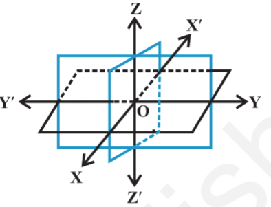
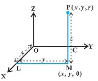
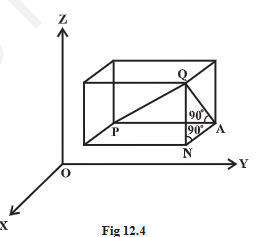
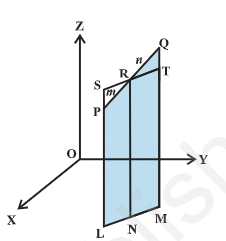

- 
- introduction
	- to locate the position of a point in a plane, we need 2 intersecting mutually perpendicular lines in a plane called the `coordinate axes` and 2 numbers are called `coordinates of the point with respect to the axes`
	- a point in space has 3 coordinates with reference to the 3 mutually perpendicular coordinate planes
- coordinate axes and coordinate planes in 3 dimensional space
	- 
	- 3 planes intersecting at a point O such that these 3 planes are mutually perpendicular to each other. these 3 planes intersect along the lines X'OX, Y'OY, Z'OZ called x, y and z-axes, respectively.
	- note that these lines are mutually perpendicular to each other. these lines constitute the `rectangular coordinate system`. the planes XOY, YOZ, and ZOX, called, respectively the XY-plane, YZ-plane and the ZX-plane, are known as the 3 coordinate planes.
	- we take the XOY plane as plane of the paper and the line Z'OZ as perpendicular to the XOY. if the plane of the paper is considered as horizontal, then the line Z'OZ will be vertical. the distances measured from XY-plane upwards in the direction of OZ are taken as positive and those measured downwards in the direction of OZ' are taken as negative. similarly, the distance measured to the right of ZX-plane and along OY are taken as positive, to the left of ZX-plane and along OY' as negative. in front of the YZ-plane along OX as positive and to the back of it along OX' as negative. the point O is called the `origin` of the coordinate system. the 3 coordinate planes  divide the space into 8 parts known as `octants`. these octants could be named as XOYZ, X'OYZ, X'OY'Z,, XOY'Z, XOYZ', X'OYZ', X'OY'Z', XOY'Z' and denoted by I, II, III, ..., VIII respectively
- coordinates of a point in space
	- 
	- having chosen a fixed coordinate system in the space, consisting of coordinates axes, coordinate planes and origin, we now explain, as to how, given a point in the space, we associate with it 3 coordinates (x, y, x) and conversely, given a triplet of 3 numbers (x, y, z), how, we locate a point in the space.
	- given a point P in space, we drop a perpendicular PM on the XY-plane with M as the foot of this perpendicular. then, from the point M, we draw a perpendicular ML to the x-axis, meeting it at L. let OL be x, LM be y and MP be z. then x, y and z are called the `x, y and z coordinates`, respectively, of the point P in the space. note that the point P(x, y, z) lies in the octant XOYZ and so all x, y, z are positive. if P was in any other octant, the signs of x, y and z would change accordingly. thus, to each point P in the space there corresponds an ordered triplet (x, y, z) of real numbers.
	- alternatively, through the point P in the space, we draw 3 planes parallel to the coordinate planes, meeting the x-axis, y-axis and z-axis in the points A, B and C, respectively. let OA = x, OB = y and OC = z. then, the point P will have the coordinates x, y and z and we write P (x, y, z). conversely, given x, y and z, we locate the 3 points A, B and C on the 3 coordinate axes. through the points A, B and C we draw planes parallel to the YZ-plane, ZX-plane and XY-plane, respectively. the point of intersection of these 3 planes, namely, ADPF, BDPE and CEPF is obviously the point P, corresponding to the ordered triplet (x, y, z). we observe that if P (x, y, x) is any point in the space, then x, y and z are perpendicular distances from YZ, ZX and XY planes, respectively.
	- the coordinates of the origin O are (0, 0, 0). the coordinates of any point on the x-axis will be as (x, 0, 0) and the coordinates of any point in YZ-plane will be as (0, y, z)
	- the sign of the coordinates of a point determine the octant in which the point lies.
	- |octants / coordinates|I|II|III|IV|V|VI|VII|VIII|
	  |x|+|-|-|+|+|-|-|+|
	  |y|+|+|-|-|+|+|-|-|
	  |z|+|+|+|+|-|-|-|-|
- distance between 2 points
	- 
	- we have studied about the distance between 2 points in 2-dimensional coordinate system. let us now extend this study to 3-dimensional system.
	- let $P(x_1, y_1, z_1)$ and $Q(x_2, y_2, z_2)$ be 2 points referred to a system of rectangular axes OX, OY and OZ. through the point P and Q draw planes parallel to the coordinate planes so as to form a rectangular parallelopiped with one diagonal PQ.
	- since $\angle PAQ$ is a right angle, it follows that, in triangle PAQ,
	  $PQ^2 =PA^2 + AQ^2$
	- also triangle ANQ is right angle triangle with $\angle ANQ$ a right angle
	- therefore $AQ^2 = AN^2 + NQ^2$
	- $PQ^2 =PA^2 + AN^2 + NQ^2$
	- $PA = y_2 - y_1, AN = x_2 - x_1, NQ = z_2 - z_1$
	- therefore PQ = $\sqrt{(x_2 - x_1)^2 + (y_2 - y_1)^2 + (z_2 - z_1)^2}$
	- this gives the distance between 2 points $(x_1, y_1, z_1)$, $(x_2, y_2, z_2)$
	- in particular, if $x_1 = y_1 = z_1 = 0$, i.e., point P is origin O, then OQ = $\sqrt{x_2^2 + y_2^2 + z_2^2}$, which gives the distance between the origin O and any point $Q(x_2, y_2, z_2)$
- section formula
	- {:height 249, :width 226}
	- in 2 dimensional geometry, we have learnt how to find the coordinates of a point dividing the line segment in a given ratio internally. now, we extend this to 3-dimensional geometry as follows:
	- let the 2 given points be P($x_1, y_1, z_1$) and Q($x_2, y_2, z_2$). let the point R(x, y, z) divide PQ in the given ration m:n internally. draw PL, QM and RN perpendicular to the XY-plane. obviously PL || RN || QM and feet of these perpendiculars li e in a XY-plane. the points L, M and N will lie on a line which is the intersection of the plane containing PL, RN and QM with XY-plane. through the point R draw a line ST parallel to the line LM. line ST will intersect the line LP externally at point S and the line MQ at T.
	- quadrilaterals LNRS and NMTR are parallelograms
	- triangles PSR and QTR are similar. therefore
	  $\frac{m}{n} = \frac{PR}{QR} = \frac{SP}{QT} = \frac{SL - PL}{QM - TM} = \frac{NR - PL}{QM - NR} = \frac{z- z_1}{z_2 - z}$
	- this implies $z = \frac{mz_2 + nz_1}{m + n}$
	- similarly, by drawing perpendiculars to the XZ and YZ-planes, we get
	  $y = \frac{my_2 + ny_1}{m + n}$ and $x = \frac{mx_2 + nx_1}{m + n}$
	- hence, the coordinates of the point R which divides the line segment joining 2 points P($x_1, y_1, z_1$) and Q($x_2, y_2, z_2$) internally in the ration m : n are
	  $\left[\frac{mx_2 + nx_1}{m + n}, \frac{my_2 + ny_1}{m + n}, \frac{mz_2 + nz_1}{m + n}\right]$
	- if the point R divides PQ externally in the ratio m : n, then its coordinates are obtained by replacing n by -n so that coordinates of point R will be
	  $\left[\frac{mx_2 - nx_1}{m - n}, \frac{my_2 - ny_1}{m - n}, \frac{mz_2 - nz_1}{m - n}\right]$
	- case 1: coordinates of the mid-point: in case R is the mid-point of PQ, then m : n = 1 : 1 so that 
	  $x = \frac{x_1 + x_2}{2}$, $y= \frac{y_1 + y_2}{2}$ and $z = \frac{z_1 + z_2}{2}$
	  these are the coordinates of the mid point of the segment joining P($x_1, y_1, z_1$) and Q($x_2, y_2, z_2$)
	- case 2: coordinates of the point R which divides PQ in the ratio k : 1 are obtained by taking k = m/n which are as given below:
	  $\left[\frac{kx_2 + x_1}{1 + k}, \frac{ky_2 + y_1}{1 + k}, \frac{kz_2 + z_1}{1 + k}\right]$
	  generally, this result is used in solving problems involving a general point on the line passing through 2 given points
	- the coordinates of the centroid of the triangle, whose vertices are ($x_1, y_1, z_1$), ($x_2, y_2, z_2$) and ($x_3, y_3, z_3$) are $\left[\frac{x_1 + x_2 + x_3}{3}, \frac{y_1 + y_2 + y_3}{3}, \frac{z_1 + z_2 + z_3}{3}\right]$