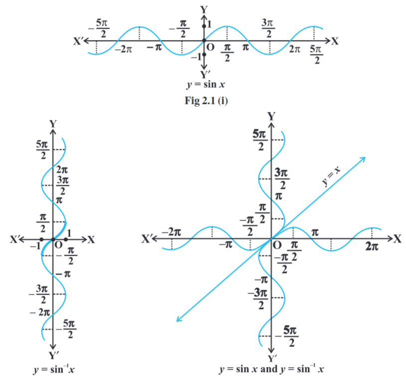
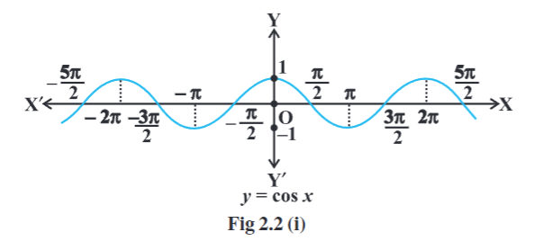
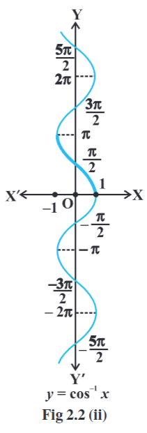
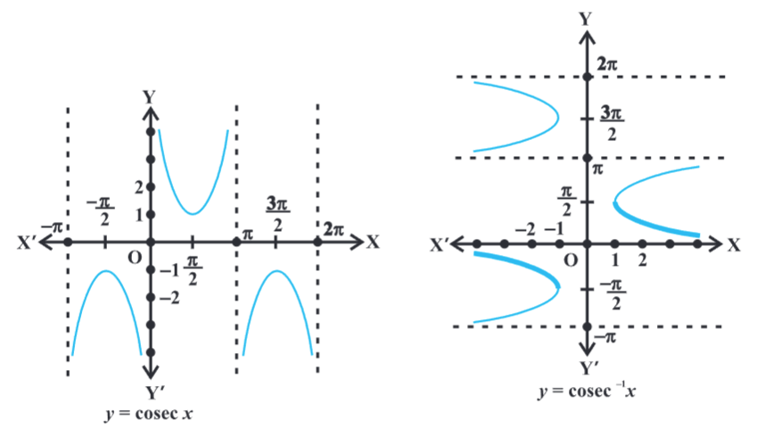
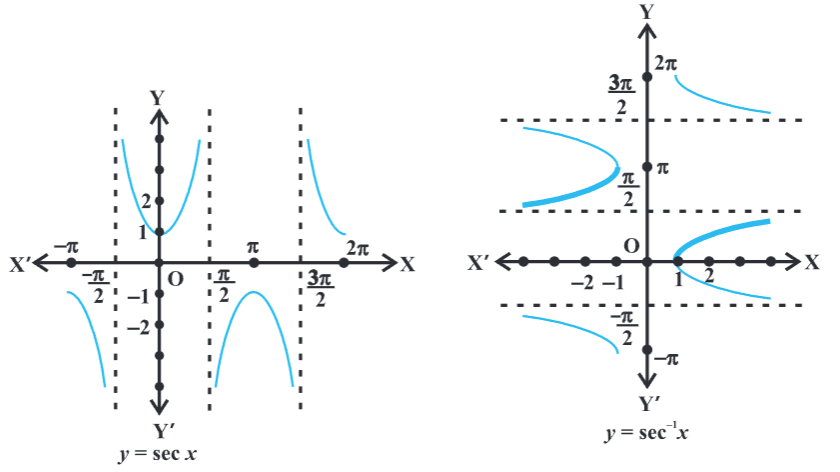

- 
- introduction
	- inverse of a function f, denoted by $f^{-1}$, exists if f is one-one and onto. there are many functions which are not one-one, onto or both.
	- trigonometric functions are not one-one and onto over their natural domains and ranges and hence their inverses do not exist.
- basic concepts
	- sine function, i.e., sine : R -> [-1, 1]
	- cosine function, i.e., cos: R -> [-1, 1]
	- tangent function, i.e., tan : R - { x : x = (2n + 1) $\frac{\pi}{2}$, n \in Z} -> R
	- cotangent function, i.e., cot : R - {x : x = n\pi, n \in Z} -> R
	- secant function, i.e., sec : R - {x : x = (2n + 1) $\frac{\pi}{2}$, n \in Z} -> R - (-1, 1)
	- cosecant function, i.e., cosec : R - {x : x = n\pi, n \in Z} -> R - (-1, 1)
	- if f : X -> Y such that f(x) = y is one-one and onto, then we can define a unique function g : Y -> X such that g(y) = x, where $x \in X$ and $y = f(x)$, $y \in Y$. here, the domain of g = range of f and the range of g = domain of f. the function g is called the inverse of f and is denoted by $f^{-1}$. further, g is also one-one and onto and inverse of g is f. thus, $g^{-1} = (f^{-1})^{-1} = f$. we also have
	  $(f^{-1} \circ f) (x) = f^{-1} (f (x)) = f^{-1} (y) = x$
	  $(f \circ f^{-1}) (y) = f (f^{-1} (y)) = f(x) = y$
	- sine function
		- since the domain of sine function is the set of all real numbers and range is the closed interval [-1, 1]. if we restrict its domain to $\left[ \frac{-\pi}{2}, \frac{\pi}{2} \right]$, then it becomes one-one and onto with range [-1, 1].
		- actually, sine function restricted to any of the intervals $\left[ \frac{-3\pi}{2}, \frac{-\pi}{2} \right]$, $\left[ \frac{-\pi}{2}, \frac{\pi}{2} \right]$, $\left[ \frac{\pi}{2}, \frac{3\pi}{2} \right]$ etc., is one-one and its range is [-1, 1]. we can, therefore, define the inverse of sine function in each of these intervals.
		- we denote the inverse of sine function by $sin^{-1}$ (arc sine function). thus $sin^{-1}$ is a function whose domain is [-1, 1] and range could be any of the intervals $\left[ \frac{-3\pi}{2}, \frac{-\pi}{2} \right]$, $\left[ \frac{-\pi}{2}, \frac{\pi}{2} \right]$, or $\left[ \frac{\pi}{2}, \frac{3\pi}{2} \right]$, and so on.
		- corresponding to each such interval, we get a branch of the function $sin^{-1}$.
		- the branch with range $\left[ \frac{-\pi}{2}, \frac{\pi}{2} \right]$ is called the principal value branch, whereas other intervals as range give different branches of $sin^{-1}$.
		- when we refer o the function $sin^{-1}$, we take it as the function whose domain is [-1, 1] and range is $\left[ \frac{-\pi}{2}, \frac{\pi}{2} \right]$. we write $sin^{-1} : [-1, 1]$ -> $\left[ \frac{-\pi}{2}, \frac{\pi}{2} \right]$
		- from the definition of the inverse functions, it follows that sin ($sin^{-1} x$) = x if $-1 \leq x \leq 1$ 
		  and $sin^{-1}$ (sin x) = x if $\frac{-\pi}{2} \leq x \leq \frac{\pi}{2}$
		  in other words, if y = $sin^{-1} x$, then sin y = x
		- remarks
			- if y = f(x) is an invertible function, then $x = f^{-1}(y)$.
				- sine function
					- thus, the graph of $sin^{-1} x$ function can be obtained from the graph of original function by interchanging x and y axes, i.e., if (a, b) is a point on the graph of sine function, then (b, a) becomes corresponding point on the graph of inverse sine function. thus, the graph of the function y = $sin^{-1} x$ can be obtained from the graph of y = sin x by interchanging x and y axes. the graphs of y = sin x and y = $sin^{-1} x$ are given in figures. the dark portion of the graph of y = $sin^{-1} x$ represent the principal value branch.
					- 
					- it can be shown that the graph of an inverse function   can be obtained from the corresponding graph of original function as a mirror image (i.e., reflection) along the line y = x.
				- cosine function
				  collapsed:: true
					- like sine function, the cosine function is a function whose domain is the set of all real numbers and range is the set [-1, 1]. if we restrict the domain of cosine function to [0, \pi], then it becomes one-one and onto with range [-1, 1]. actually, cosine function restricted to any of the intervals [-\pi, 0], [0, \pi], [\pi, 2\pi] etc., is bijective with range as [-1, 1]. we can therefor define the inverse of cosine function in each of these intervals. we denote the inverse of the cosine function by $cos^{-1}$ (arc cosine function). thus, $cos^{-1}$ is a function whose domain is [-1, 1] and range could be any of the intervals [-\pi, 0], [0, \pi], [\pi, 2\pi] etc. Corresponding to each such interval, we get a branch of the function $cos^{-1}$. the branch with range [0, \pi] is called the principal value branch of the function $cos^{-1}$. we write
					  $cos^{-1}$ : [-1, 1] -> [0, \pi]. the graphs of y = cos x and y = $cos^{-1}$ x are given in figures.
					- 
					- 
				- $cosec^{-1}$x function
					- since, cosec x = $\frac{1}{sin x}$, the domain of the cosec function is the set $\{x : x \in R\ and\ x \neq n\pi, n \in Z\}$ and the range is the set $\{y : y \in R, y \geq 1\ or\ y \leq -1 \}$ i.e., the set R-(-1, 1). it means that y = cosec x assumes all real values except -1 < y < 1 and is not defined for integral multiple of \pi. if we restrict the domain of cosec function to $\left[ \frac{-\pi}{2}, \frac{\pi}{2} \right] - \{0\}$, the it is one to one and onto with its range as the set R-(-1, 1). actually, cosec function restricted to any of the intervals $\left[ \frac{-3\pi}{2}, \frac{-\pi}{2} \right]-\{-\pi\}$, $\left[ \frac{-\pi}{2}, \frac{\pi}{2} \right] - \{0\}$,$\left[ \frac{\pi}{2}, \frac{3\pi}{2} \right]-\{\pi\}$ etc., is bijective and its range is the set of all real numbers R-(-1,1). thus, $cosec^{-1}$ can be defined as a function whose domain is R-(-1,1) and range could be any of the intervals $\left[ \frac{-3\pi}{2}, \frac{-\pi}{2} \right]-\{-\pi\}$, $\left[ \frac{-\pi}{2}, \frac{\pi}{2} \right] - \{0\}$,$\left[ \frac{\pi}{2}, \frac{3\pi}{2} \right]-\{\pi\}$ etc. the function corresponding to the range $\left[ \frac{-\pi}{2}, \frac{\pi}{2} \right] - \{0\}$ is called the principal value branch of $cosec^{-1}$. we thus have principal branch as 
					  $\cosec^{-1} : \mathbb{R} - (-1, 1) \to [-\tfrac{\pi}{2}, \tfrac{\pi}{2}] - \{0\}$
					- graphs of y = cosec x and y = $cosec^{-1}$ x
						- 
			- $sec^{-1}$x function
				- sec x = $\frac{1}{cos\ x}$, the domain of y = sec x is the $set\ \mathbb{R} - \{x : x = (2n + 1) \frac{\pi}{2}, n \in Z\}$ and range is the set R-(-1, 1). it means that sec (secant function) assumes all real values except -1 < y < 1 and is not defined for odd multiples of $\frac{\pi}{2}$. if we restrict the domain of secant function [0, \pi] - {$\frac{\pi}{2}$}, then it is one-one and onto with its range as the set R-(-1,1). actually, secant function restricted to any of the intervals [-\pi, 0] - {-$\frac{\pi}{2}$}, [0, \pi] - {$\frac{\pi}{2}$}, [\pi, 2\pi] - {$\frac{3\pi}{2}$} etc., is bijective and its range is R-(-1,1). thus $sec^{-1}$ can be defined as a function whose domain is R-(-1, 1) and range could be any of the intervals [-\pi, 0] - {-$\frac{\pi}{2}$}, [0, \pi] - {$\frac{\pi}{2}$}, [\pi, 2\pi] - {$\frac{3\pi}{2}$} etc. corresponding to each of these intervals, we get different branches of the function $sec^{-1}$. the branch with range [0, \pi] - {$\frac{\pi}{2}$} is called the principal value branch of the function $sec^{-1}$. we thus have
				  $sec^{-1}$ : R-(-1,1) -> [0, \pi] -{$\frac{\pi}{2}$}
				- the graphs of y = sec x and y = $sec^{-1}$ x
					- 
			- $tan^{-1}$ function
				-
- properties of inverse trigonometric functions