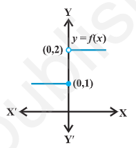
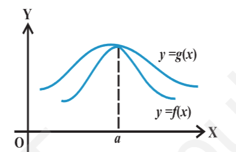
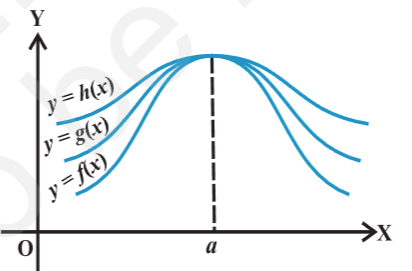

- 
- introduction
	- calculus is that branch of mathematics which mainly deals with the study of change in the value of a function as the points in the domain change.
- intuitive idea of derivatives
	- derivative: rate of change of function (i.e. slope of the tangent to the curve at that point)
- limits
	- f(x) $\lim_{x \to a} f(x) = l$
		- as x -> a (x tends to a) f(x) -> l (f(x) tends to l)
		- l is the limit of the function
		- there are essentially 2 ways x could approach a number a either from left or from right i.e., all the values of x near x could be less than a or could be greater than a. this naturally leads to 2 limits - the right hand limit and the left hand limit. right hand limit of a function f(x) is that value of f(x) which is dictated by the values of f(x) when x tends to a from the right. similarly the left hand limit.
		- 
			- consider the function
			  $$
			  f(x) =
			  \begin{cases}
			  1, & x \leq 0\\
			  2, & x > 0
			  \end{cases}
			  $$
			- it is clear that the value of f at 0 dictated by values of f(x) with $x \leq 0$ equals 1, i.e., the left hand limit of f(x) at 0 is 
			  $$
			  \lim_{x \to 0^-} f(x) = 1
			  $$
			  similarly the value of f at 0 dictated by values of f(x) with x > 0 equals 2, i.e., the right hand limit of f(x) at 0 is 
			  $$
			  \lim_{x \to 0^+} f(x) = 2
			  $$
			- in this case the right and left hand limits are different, and hence we say that the limit of f(x) as x tends to 0 does not exist (even though the function is defined at 0)
			- we say $$\lim_{x \to a^-} f(x)$$ is the expected value of f at x=a given the values of f near x to the left of a. this value is called the left hand limit of f at a.
			- we say $$\lim_{x \to a^+} f(x)$$ is the expected value of f at x=a given the values of f near x to the right of a. this value is called the right hand limit of f(x) at a.
			- if the right and left hand limits coincide, we call that common value as the limit of f(x) at x = a and denoted it by $$\lim_{x \to a} f(x)$$
	- algebra of limits
		- let f and g be 2 functions such that bot $$\lim_{x \to a} f(x)$$ and $$\lim_{x \to a} g(x)$$ exist. then
			- limit of sum of 2 functions is sum of the limits of the functions, i.e.,
			  $$\lim_{x \to a} [f(x) + g(x)] = \lim_{x \to a} f(x) + \lim_{x \to a} g(x)$$
			- limit of difference of 2 functions is difference of the limits of the functions, i.e.,
			  $$\lim_{x \to a} [f(x) - g(x)] = \lim_{x \to a} f(x) - \lim_{x \to a} g(x)$$
			- limit of product of 2 functions is product of the limits of the functions, i.e.,
			  $$\lim_{x \to a} [f(x) . g(x)] = \lim_{x \to a} f(x) . \lim_{x \to a} g(x)$$
				- special case when g is the constant function such that g(x) = \lambda, for some real number \lambda, we have
				  $$\lim_{x \to a} [(\lambda .f)(x)] = \lambda \lim_{x \to a} f(x)]$$
			- limit of quotient of 2 functions is quotient of the limits of the functions (whenever the denominator is non zero), i.e.,
			  $$\lim_{x \to a} \frac{f(x)}{g(x)} = \frac{\lim_{x \to a} f(x)}{\lim_{x \to a} g(x)}$$
	- limits of polynomials and rational functions
		- a function f is said to be a polynomial function if f(x) is zero function or if $f(x) = a_0 + a_1 x + a_2 x^2 + ... + a_n x^n$, where $a_i$ s are real numbers such that $a_n \neq 0$ for some natural number n.
		  we know that $\lim_{x \to a} x = a$. hence
		  $\lim_{x \to a} x^2 = \lim_{x \to a} (x . x) = \lim_{x \to a} x \lim_{x \to a} x = a . a = a^2$
		  an easy exercise in induction on n tells us that $\lim_{x \to a} x^n = a^n$
		  $\lim_{x \to a} f(x) = \lim_{x \to a}[a_0 + a_1 x + a_2 x^2 + ... + a_n x^n]$
		  $=\lim_{x \to a} a_0 + \lim_{x \to a} a_1 x + \lim_{x \to a} a_2 x^2 + ... + \lim_{x \to a} a_n x^n$
		  $= a_0 + a_1 \lim_{x \to a} x + a_2 \lim_{x \to a} x^2 + ... + a_n\lim_{x \to a} x^n$
		  $= a_0 + a_1 a + a_2 a^2 + ... + a_n a^n$
		  $= f(a)$
		- a function f is said to be a rational function, if $f(x) = \frac{g(x)}{h(x)}, where g(x) and h(x) are polynomials such that $h(x) \neq 0$. then
		  $$\lim_{x \to a} f(x) = \lim_{x \to a} \frac{g(x)}{h(x)} = \frac{\lim_{x \to a} g(x)}{\lim_{x \to a} h(x)} = \frac{g(a)}{h(a)}$$
			- if h(a) = 0, there are 2 scenarios
				- when g(a) \neq 0
					- limit does not exist
				- when g(a) = 0
					- $g(x) = (x - a)^k g_1(x)$, where k is the maximum of powers of (x-a) in g(x)
					- $h(x) = (x - a)^l h_1(x)$, where k is the maximum of powers of (x-a) in g(x) as h(a) = 0
					- now, if k > l, we have
					  $$\lim_{x \to a} f(x) = \lim_{x \to a} \frac{g(x)}{h(x)} = \frac{\lim_{x \to a} (x-a)^k g_1(x)}{\lim_{x \to a} (x-a)^l h_1(x)} $$
					  $$=\frac{\lim_{x \to a} (x-a)^{(k-l)} g_1(x)}{\lim_{x \to a} h_1(x)} = \frac{0 . g_1(a)}{h_1(a)} = 0$$
					- if k < l, the limit is not defined
		- for any positive integer n, $$\lim_{x \to a} \frac{x^n - a^n}{x - a} = na^{n-1}$$
			- the expression in the above theorem for the limit is true even if n is any rational number and a is positive
- limits of trigonometric functions
	- let f and g be 2 real valued functions with the same domain such that  $f(x) \leq g(x)$ for all x in the domain of definition, for some a, if both $\lim_{x \to a} f(x)$ and $\lim_{x \to a} g(x)$ exist, then $\lim_{x \to a} f(x) \leq \lim_{x \to a} g(x)$
		- 
	- sandwich theorem
		- let f, g and h be real functions such that $f(x) \leq g(x) \leq h(x)$ for all x in the common domain of definition. for some real number a, if $\lim_{x \to a} f(x) = l = \lim_{x \to a} h(x)$, then $\lim_{x \to a} g(x) = l$
		- 
	- $$\cos x < \frac{\sin x}{x} < 1 \quad \text{for } 0 < |x| < \frac{\pi}{2}$$
	- $\lim_{x \to 0} \frac{sin x}{x} = 1$
	- $\lim_{x \to 0} \frac{1 - cos x}{x} = 0$
	- we want to evaluate the limit $\lim_{x \to a} \frac{f(x)}{g(x)} = 1$ and the limit exists
		- first we check the value of f(a) and g(a)
		- if both are 0, then we see if we can get the factor which is causing the terms to vanish, i.e., see if we can write $f(x) = f_1(x) f_2(x)$ so that $f_1(a) = 0$ and $f_2(a) \neq 0$. similarly, we write $g(x) = g_1(x) g_2(x)$ so that $g_1(a) = 0$ and $g_2(a) \neq 0$. cancel out the common factors from f(x) and g(x) (if possible) and write
		  $\frac{f(x)}{g(x)} = \frac{p(x)}{q(x)}$, where $q(x) \neq 0$
		  then $\lim_{x \to a} \frac{f(x)}{g(x)} = \frac{p(a)}{q(a)}$
- derivatives
	- algebra of derivative of functions
	- derivative of polynomials and trigonometric functions
	-