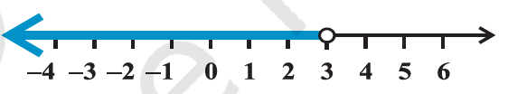
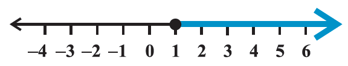
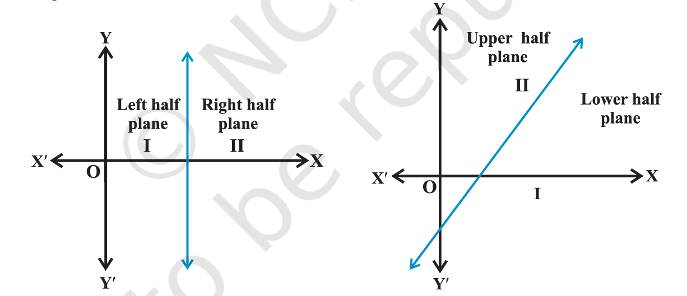
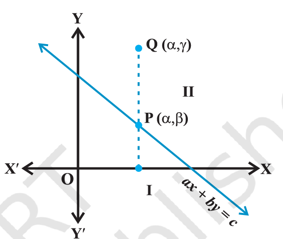

- definition: 2 real numbers or 2 algebraic expressions related by the symbol `<` (less than), `>` (greater than), $\leq$ (less than or equal) or $\geq$ (greater than or equal) form an `inequality`
	- 3 < 5; 7 > 5 are the examples of `numerical inequalities`
	- x < 5; y > 2; x $\geq$ 3, y $\leq$ 4 are examples of `literal inequalities`
	- 3 < 5 < 7, 3 $\leq$ x < 5 (read as x greater than or equal to 3 and less than 5) are the examples of `double inequalities`
	- ax + b < 0, ax + b > 0, ax + by < c, ax + by > c, $ax^2$ + bx + c > 0 are `strict inequalities`
	- ax + b $\leq$ 0, ax + b $\geq$ 0, ax + by $\leq$ c, ax + by $\geq$ c, $ax^2$ + bx + c $\leq$ 0 are called `slack inequalities`
	- ax + b < 0, ax + b > 0, ax + b $\leq$ 0, ax + b $\geq$ 0 are linear inequalities in 1 variable x when a $\neq$ 0
	- ax + by < c, ax + by > c, ax + by $\leq$ c, ax + by $\geq$ c are linear inequalities in 2 variables x and y when a $\neq$ 0, b $\neq$ 0
	- $ax^2$ + bx + c > 0, $ax^2$ + bx + c $\leq$ 0 are quadratic inequalities in 1 variable x when $a \neq 0$
- algebraic solutions of linear inequalities in 1 variable and their graphical representation
	- any solution of an inequality in 1 one variable is a value of the variable which makes it a true statement.
	- rules for solving linear equations
		- rule 1: equal numbers may be added to (or subtracted from) both sides of an equation
		- rule 2: both sides of an equation may be multiplied (or divided) by the same non-zero number
	- rules for solving inequality
		- rule 1: equal numbers may be added to (or subtracted from) both sides of an inequality without affecting the sign of inequality
		- rule 2: both sides of an inequality can be multiplied (or divided) by the same positive number. but when both sides are multiplied or divided by a negative number, then the sign of inequality is reversed
	- to represent x < a (or x > a) on a number line, put a circle on the number a and dark line to the left (or right) of the number a.
		- 
	- to represent x $\leq$ a (or x $\geq$ a) on a number line, put a dark circle on the number a and dark line to the left (or right) of the number a.
		- {:height 118, :width 576}
- graphical solutions of linear inequalities in 2 variables
	- 
	- a line divides the Cartesian plane into 2 parts. each part is known as half plane.
	- a vertical line will divide the plane in left and right half planes
	- a non-vertical line will divide the plane into lower and upper half planes
	- a point in the Cartesian plane will either lie on a line or will lie in either of the half planes I or II.
	- 
	- all points satisfying ax + by > c lies in one of the half planes II or I according as b > 0 or b < 0, and conversely
	- graph of the inequality ax + by > c will be one of the half plane (called solution region) and represented by shading in the corresponding half plane
	- the region containing all the solutions of an inequality is called the solution region
	- in order to identify the half plane represented by an inequality, it is just sufficient to take any point (a, b) (not on line) and check whether it satisfies the inequality or not. if it satisfies, then the inequality represents the half plane and shade the region which contains the point, otherwise, the inequality represents that the half plane which does not contain the point within it. for convenience, the point (0, 0) is preferred.
	- if an inequality is of type ax + by $\geq$ c or ax + by $\leq$ c, then the points on the line ax + by = c are also included in the solution region. so draw a dark line in the solution region.
	- if an inequality is of the form ax + by > c or ax + by < c, then the points on the line ax + by = c are not to be included in the solution region. so draw a dark a broken or dotted line in the solution region.
- solution of system of linear inequalities in 2 variables
	- the solution region of a system of inequalities is the region which satisfies all the given inequalities in the system simultaneously.