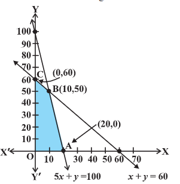

- 
- introduction
	- system of linear inequalities / equations to solve some real life problems.
- linear programming problem and its mathematical formulation
	- problem
		- a furniture dealer deals in only 2 items-tables and chairs. he has Rs. 50000 to invest and has storage space of at most 60 pieces. a table costs Rs 2500 and a chair Rs 500. he estimates that from the sale of one table, he can make a profit of Rs 250 and that from the sale of one chair a profit of Rs 75. he want to know how many tables and chairs he should buy from the available money so as to maximise his total profit, assuming that he can sell all the items which he buys.
		- types of problems which seek to maximise (or, minimise) profit (or, cost) form a general class of problems called `optimisation problems`. thus, an optimistaion problem may involve findind maximum profit, minimum cost or minimum use of resources etc.
		- a special but a very important class of optimisation problems is `linear programming problem`.
		- the above stated optimisation is an example of linear programming problem. linear programming problems are of much interest because of their wide applicability in industry, commerce, management science etc.
	- mathematical formulation of the problem
		- we begin with discussion of the above problem will further lead to a mathematical formulation of the problem in 2 variables.
			- 1) the dealer can invest his money in buying table or chairs or combination thereof. further he would earn different profits by following different investment strategies.
			- 2) there are certain `overriding conditions` or `constraints` viz., his investment is limited to `maximum` of Rs. 50000 and so is his storage space which is for a maximum of 60 pieces.
		- dealer can invest his money in different ways and he would earn different profits by following different investment strategies.
		- now the problem is: how should he invest his money in order to get maximum profit?
		- x be the number of tables and y number of chairs that the dealer buys.
		- obviously, x and y must be non-negative, i.e.,
			- $x \geq 0$
			- $y \geq 0$
			- non-negative constraints
		- the dealer is constrained by the maximum amount he can invest (here it is Rs 50000) and by the maximum number of items he can store (here it is 60)
		- stated mathematically
			- $2500 x + 500 y \leq 5000$ (investment constraint)
				- $5x + y \leq 100$
			- $x + y \leq 60$ (storage constraint)
		- the dealer want to invest in such a way so as to maximise his profit, say, Z which stated as a function of x and y is given by
		- z = 250x + 75y (called `objective function`)
		- mathematically, the given problems now reduces to :
			- maximise z = 250x + 75y
			- subject to the constraints:
				- $5x + y \leq 100$
				- $x + y \leq 60$
				- $x \geq 0, y \geq 0$
			- so we have to maximise the linear function z subject to certain conditions determined by a set of linear inequalities with variables as non-negative. there are also some other problems where we have to minimise a linear function subject to certain conditions determined by a set of linear inequalities with variables as non-negative. such problems are called `linear programming problems`.
			- thus, a linear programming problem is one that is concerned with finding the `optimal value` (maximum or minimum value) of a linear function (called `objective function`) of several variables (say x and y), subject to the conditions that the variables are `non-negative` and satisfy a set of linear inequalities (called `linear constraints`). the term `linear` implies that all the mathematical relations used in the problem are `linear relations` while the term programming refers to the method of determining a particular programme or plan of action.
			- before we proceed further, we now formally define some terms (which have been used above) which we shall be using in the linear programming problems:
			- `Objective function` linear function Z = ax + by, where a, b are constants, which has to be maximised or minimised is called a linear `objective function`
			- in the above example, Z = 250x + 75y is a linear objective function. variables x and y are called `decision variables`
			- `Constraints` the linear inequalities or equations or restrictions on the variables of a linear problem are called `constraints`. the conditions $x \geq 0, y \geq 0$ are called non-negative restrictions. in the above example, the set of inequalities are `constraints`.
			- `Optimisation problem` a problem which seeks to maximise or minimise a linear function (say of 2 variables x and y) subject to certain constraints as determined by a set of linear inequalities is called an `optiomisation problem`. linear programming problems are special type of optimisation problems. the above problem of investing a given sum by the dealer in purchasing chairs and tables is an example of an optimisation problem as well as of a linear programming problem.
	- graphical method of solving linear programming problems
		- 
		- the graph of this system (shaded region) consists of the points common to all half planes determined by the inequalities. each point in this region represents a `feasible choice` open to the dealer for investing in tables and chairs. the region, therefore is called the `feasible region` for the problem. every point of this region is called a `feasible solution` to the problem. thus, we have,
		- `Feasible region` the common region determined by all the constraints including non-negative constraints $x, y \geq 0$ of a linear programming problem is called the `feasible region (or solution region)` for the problem. the region OABC (shaded) is the feasible region for the problem. the region other than feasible region is called an `infeasible region`.
		- `Feasible solutions` points within and on the boundary of the feasible region represent feasible solutions of the constraints. every point within and on the boundary of the feasible region OABC represents feasible solution to the problem.
		- any point outside the feasible region is called an `infeasible solution`.
		- `optimal (feasible solution)` any point in the feasible region that give the optimal value (maximum or minimum) of the objective function is called an `optimal solution`.
		- now, we see that every point in the feasible region OABC satisfies all the constraints, and since there are `infinitely many points`, it is not evident how we should go about finding a point that gives a maximum value of the objective function. to handle this function, we use the following theorems which are fundamental in solving linear programming problems.
	- theorem 1
		- let R be the feasible region (convex polygon) for a linear programming problem and let Z = ax + by be the objective function. when Z has an optimal value (maximum or minimum), where the variables x and y are subject to constraints described by linear inequalities, this optimal value must occur at a corner point (vertex) of the feasible region.
		- a corner point of a feasible region is a point in the region which is the intersection of 2 boundary lines.
	- theorem 2
		- let R be the feasible region for a linear programming problem, and let Z = ax + by be the objective function. if R is bounded, then the objective function Z has both a maximum and minimum value on R and each of these occurs at a corner point (vertex) of R.
		- a feasible region of a system of linear inequalities is said to be bounded if it can be enclosed within a circle. otherwise it is called unbounded. unbounded means that the feasible region does extend indefinitely in any direction.
	- remark: if R is `unbounded`, then a maximum or a minimum value of the objective function may not exist. however, if it exists, it must occur at a corner point of R.
	- this method of solving linear programming problem is referred as `Corner Point Method`. this method comprises of the following steps:
		- find the feasible region of the linear programming problem and determine its corner points (vertices) either by inspection or by solving the 2 equations of the lines intersecting at that point.
		- evaluate the objective function Z = ax + by at each corner point, let M and m respectively denote the largest and smallest values of these points.
		- i) when the feasible region is `bounded`, M and m are the maximum and minimum values of Z
		- ii) in case, the feasible region is `unbounded`, we have:
		- a) M is the maximum value of Z, if the open half plane determined by ax + by > M has no point in common with the feasible region. otherwise, Z has no maximum value.
		- b) m is the minimum value of Z, if the open half plane determined by ax + by < M has no point in common with the feasible region. otherwise, Z has no minimum value.
- different types of linear programming problems
	- a few important linear programming problems are listed below:
		- manufacturing problems
		  logseq.order-list-type:: number
			- in these problems, we determine the number of units of different products which should be produced and sold by a firm when each product requires a fixed manpower, machine hours, labour hour per unit of product, warehouse space per unit of the output etc., in order to make maximum profit.
		- diet problems
		  logseq.order-list-type:: number
			- in these problems, we determine the amount of different kinds of constituents / nutrients which should be included in a diet so as to minimise the cost of the desired diet such that it contains a certain minimum amount of each constituent/nutrients.
		- transportation problems
		  logseq.order-list-type:: number
			- in these problems, we determine a transportation schedule in order to find the cheapest way of transporting a product from plants/factories situated at different locations to different markets.