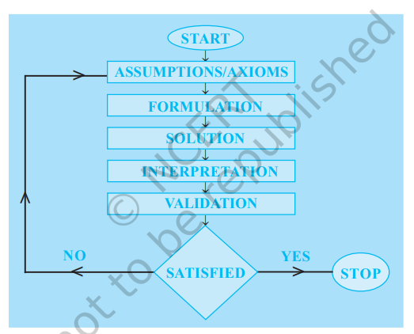

- 
- introduction
	- the process of translation of a real-life problem into a mathematical form can given a better representation and solution of certain problems. the process of translation is called Mathematical Modelling.
- preliminaries
	- steps involved
		- step 1: study the real-life problem, and identify the parameters
		- step 2: formulate the problem mathematically
		- step 3: solution of the problem. interpreting the mathematical solution to the real situation
	- a mathematical model is a representation which comprehends a situation
- what is mathematical modelling
	- definition: mathematical modelling is an attempt to study some part (or form) of the real-life problem in mathematical terms
	- conversion of physical situation into mathematics with some suitable conditions is knows as mathematical modelling. mathematical modelling is nothing but a technique and the pedagogy taken from fine arts and not from the basic sciences.
	- let us now understand the different processes involved in mathematical modelling. 4 steps are involved in this process. as an illustrative example, we consider the modelling done to study the motion of a simple pendulum.
	- understanding the problem
		- this involves, for example, understanding the process involved in the motion of simple pendulum. all of us are familiar with the simple pendulum. this pendulum is simply a mass (known as bob) attached to one end of a string whose other end is fixed at a point. we have studied that the motion of the simple pendulum is periodic. the period depends upon the length of the string and acceleration due to gravity. so, what we need to find is the period of oscillation. based on this, we give a precise statement of the problem as
	- statement
		- how do we find the period of oscillation of the simple pendulum?
		- the next step is formulation.
	- formulation: consists of 2 main steps.
		- identifying the relevant factors
			- in this, we find out what are the factors / parameters involved in the problem. for example, in the case of pendulum, the factors are period of oscillation (T), the mass of the bob (m), effective length (l) of the pendulum which is the distance between the point of suspension to the centre of mass of the bob. here we consider the length of string as effective length of the pendulum and acceleration due to gravity (g), which is assumed to be constant at a place.
			- so we have identified 4 parameters for studying the problem. now, our purpose is to find T. for this we need to understand what are the parameters that affect the period which can be done by performing a simple experiment.
			- we take 2 metal balls of 2 different masses and conduct experiment with each of them attached to 2 strings of equal lengths. we measure the period of oscillation. we make the observation that there is no appreciable change of the period with mass. now, we perform the same experiment on equal mass of balls but take strings of different lengths and observe that there is clear dependence of the period on the length of the pendulum.
			- this indicates that the mass m is not an essential parameter for finding period whereas the length l is an essential parameter.
			- this process of searching the `essential parameters` is necessary before we go to the next step.
		- mathematical description
			- this involves finding an equation, inequality or a geometric figure using the parameters already identified.
			- in the case of simple pendulum, experiments were conducted in which the values of period T were measured for different values of l. these values were plotted on a graph which resulted in a curve that resembled a parabola. it implies that the relation between T and l could be expressed
			  $T^2 = kl$
			  it was found that $k = \frac{4\pi{2}}{g}$. this give the equation
			  $T = 2\pi \sqrt{\frac{l}{g}}$
			  equation gives the mathematical formulation of the problem.
			- finding the solution
				- the mathematical formulation rarely gives the answer directly. usually we have to do some operation which involves solving an equation, calculation or applying a theorem etc. in the case of simple pendulums the solution involves applying the formula given in equation.
				- the period of oscillation calculated for different pendulums having different lengths.
			- interpretation / validation
				- a mathematical model is an attempt to study, the essential characteristic of a real life problem. many times model equations are obtained by assuming the situation in an idealised context. the model will be useful only if it explains all the facts that we would like it to explain. otherwise, we will reject it, or else, improve it, then test it again. in other words, `we measure the effectiveness of the model by comparing the results obtained from the mathematical model, with the known facts about the real problem. this process is called validation of the model`.
				- in the case of simple pendulum, we conduct some experiments on the pendulum and find out period of oscillation. now, we compare the measured values with the calculated values.
				- the difference in the observed values and calculated values gives the error.
				- once we accept the model, we have to interpret the model. `the process of describing the solution in the context of the real situation is called interpretation of the model`. in this case, we can interpret the solution in the following way:
					- a) the period is directly proportional to the square root of the length of the pendulum.
					- b) it is inversely proportional to the square root of the acceleration due to gravity.
				- our validation and interpretation of this model shows that the mathematical model is in good agreement with the practical (or observed) values. but we found that there is some error in the calculated result and measured result. this is because we have neglected the mass of the string and resistance of the medium. so in such situation we look for a better model and this process continues.
				- this leads us to an important observation. the real world is far too complex  to understand and describe completely. we just pick 1 or 2 main factors to be completely accurate that may influence the situation. then try to obtain a simplified model which gives some information about the situation. we study the simple situation with this model expecting that we can obtain a better model of the situation.
				- now, we summarise main process involved in the modelling as
					- a) formulation
					- b) solution
					- c) interpretation / validation
	- example 3
		- step 1
		- step 2
		- step 3
		- step 4
	- example 4
		- step 1: formulation
			- assumptions
		- step 2: solution
		- step 3: interpretation and validation
	- since a mathematical model is a simplified representation of a real problem, by its very nature, has built-in assumptions and approximations. obviously, the most important question is to decide whether our mode is a good one or not i.e., when the obtained results are interpreted physically whether or not the model gives reasonable answers. if a model is not accurate enough, we try to identify the sources of shortcomings. it may happen that we need a new formulation, new mathematical manipulation and hence a new evaluation. thus mathematical modelling can be a cycle of the modelling process as shown in the flowchart given below
	- 
	-