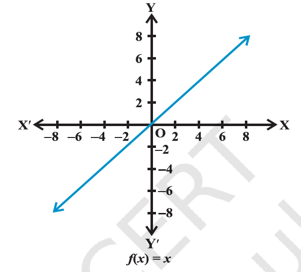
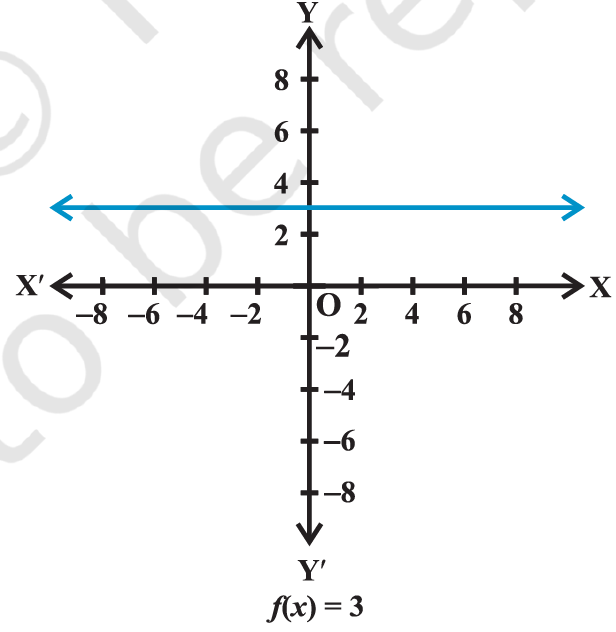
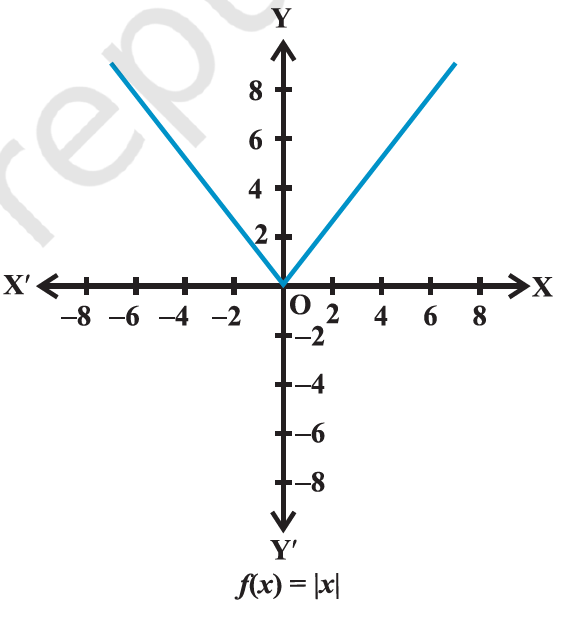
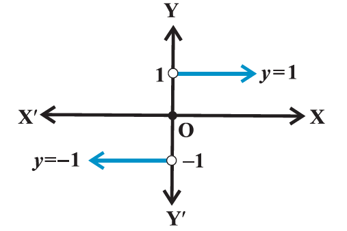

- Ordered pair
	- a pair of elements grouped together in a particular order
- Cartesian products of sets
	- given 2 non-empty sets P and Q. the Cartesian product P X Q is the set of all ordered pairs of elements from P and Q, i.e., P X Q = { (p,q) : p ∈ P, q ∈ Q}
	- if either P or Q is the null set, then P X Q will also be empty set, i.e., P X Q = ∅
	- 2 ordered pairs (of sets) are equal, if and only if the corresponding first elements are equal and the second elements are also equal.
	- if there are p elements in A and q elements in B, then there will be pq elements in A X B, i.e., if n(A) = p and n(B) = q, then n(A X B) = pq.
	- if A and B are non-empty sets and either A or B is an infinite set, then so is A X B
	- A X A X A = {(a, b, c) : a, b, c ∈ A}. here (a, b, c) is called an ordered triplet
	- R X R = { (x, y) : x, y \in R }
	- R X R X R = { (x, y, z) : x, y, z \in R }
	- A X B \neq B X A
- relations
	- a visual representation of this relation R (called an arrow diagram)
	- definition: a relation R from a non-empty set A to a non-empty set B is a subset of the Cartesian product A X B. the subset is derived by describing a relationship between the first element and the second element of the ordered pairs in A X B. the second element is called the `image` of the first element.
	- the set of all first elements of the ordered pairs in a relation R from a set A to a set B is called the `domain` of the relation R.
	- the set of all second elements in a relation R from a set A to a set B is called the `range` of the relation R. the whole set B is called the `codomain` of the relation R. note that range ⊂ codomain
	- a relation may be represented algebraically either by the Roster method or by the set-builder method
	- an arrow diagram is a visual representation of a relation
	- the total number of relations that can be defined from a set A to a set B is the number of possible subsets of A X B.
	- if n (A) = p and n (B) = q, then n (A X B) = pq
	- total number of relations is 2 ^ pq
	- a relation R from A to A is also stated as a relation on A
- functions
	- function is a special type of relation
	- definition: a `relation` `f` from a set A to a set B is said to be a `function` if every element of set A has one and only on image in set B.
	- a function is a relation from non-empty set A to a non-empty set B such that the domain of f is A and no 2 distinct ordered pairs in f have the same first element.
	- if `f` is a function from A to B and (a, b) ∈ f, then f(a) = b, where `b` is called the image of `a` under `f` and `a` is called the `preimage` of `b` under `f`
	- the function `f` from A to B is denoted by f: A -> B
	- a function which has either R or one of its subsets as its range is called a `real valued function`. further if its domain is also either R or a subset of R, it is called a `real function`
	- some functions and their graphs
		- identity function
		  collapsed:: true
			- let R be the set of real numbers. define the real valued function f: R -> R by y = f(x) = x for each x ∈ R. such a function is called the `identity function`. here the domain and range of f are R. the graph is a straight line. it passes through the origin.
			- 
			-
		- constant function
			- define the function f: R -> R by y = f(x) = c, x ∈ R where `c` is a constant and each x ∈ R.
			- here domain of f is R and its range is { c }
			- 
			- the graph is a line parallel to x-axis
		- polynomial function
			- a function f: R -> R is said to be polynomial function if for each x in R, y = f(x) = \(\ a_0 + a_1 x + a_2 x^2 + \dots \ +a_n x^n\), where `n` is a non-negative integer and \(\ a_0, a_1, a_2,...,a_n ∈ R\)
		- rational functions
			- are functions of the type \( f(x)/g(x) \), where f(x) and g(x) are polynomial functions of x defined in a domain, where g(x) ≠ 0
		- the modulus function
			- the function f: R-> R defined by f(x) = |x| for each x ∈ R is called `modulus function`
			- for each non-negative value of x, f(x) is equal to x. but for negative values of x, the value of f(x) is the negative of the value of x i.e., \( f(x) = \begin{cases} x^2, & x < 0 \\ x + 1, & x \ge 0 \end{cases} \)
			- 
		- signum function
			- the function f: R -> R defined by \( f(x) = \begin{cases} 1, & if x > 0 \\ 0,& if x = 0 \\ -1,& if x < 0 \end{cases} \) is called the `signum function`.
			- the domain of the signum function is R and the range is the set {-1, 0, 1}
			- 
			- \( f(x) = |x| / x, x >< 0 and 0 for x = 0\)
		- greatest integer function
			- the function f: R -> R defined by f(x) = [x], x ∈ R assumes the value of the greatest integer, less than or equal to x. such a function is called the `greatest integer function`.
			- ```
			  from the definition of [x], we can see that 
			  [x] = -1 for -1 ≤ x < 0
			  [x] = 0 for 0 ≤ x < 1
			  [x] = 1 for 1 ≤ x < 2
			  [x] = 2 for 2 ≤ x < 3 
			  and so on
			  ```
	- algebra of real functions
		- addition of 2 real functions
			- let f : X -> R and g : X -> R be any 2 real functions, where X ⊂ R, we define (f + g) : X -> R by (f + g) (x) = f (x) + g (x), for all x ∈ X
		- subtraction of a real function from another
			- let f : X -> R and g : X -> R be any 2 real functions, where X ⊂ R, then we define (f - g) : X -> R by (f - g) (x) = f(x) - g(x), for all x ∈ X
		- multiplication by a scalar
			- let f : X -> R be a real valued function and α be a scalar is a real number. here by scalar, we mean a real number. then the product α f is a function from X to R defined by (α f) (x) = α f(x), x ∈ X
		- multiplication of 2 real functions
			- the product (or multiplication) of 2 real functions f : X -> R and g : X -> R is a function fg : X -> R defined by (fg) (x) = f(x) g(x), for all x ∈ X. this is also called pointwise multiplication.
		- quotient of 2 real functions
			- let f and g be 2 real functions defined from X -> R, where X ⊂ R. the quotient of f by g denoted by \( f / g \) is a function defined by, \( (f / g) (x) = f(x) / g(x)\), provided g(x) \neq 0, x \in X
		- the function f defined by f(x) = mx + c, x \in R, is called `linear function`, where `m` and `c` are constants.