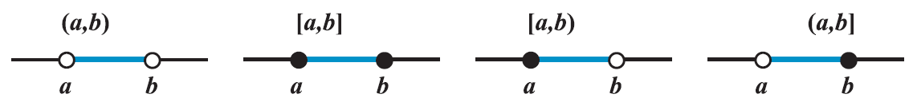
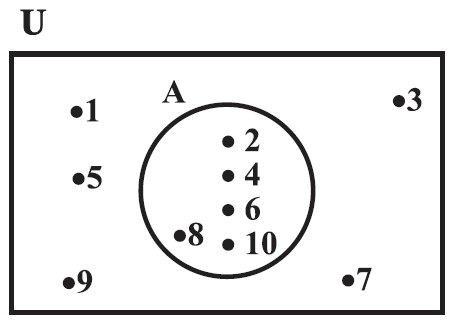
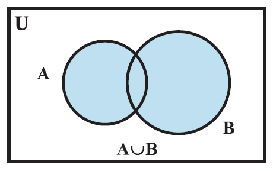
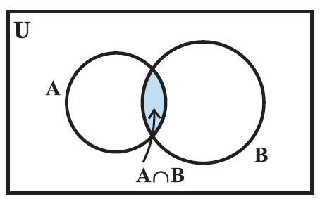
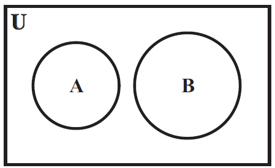
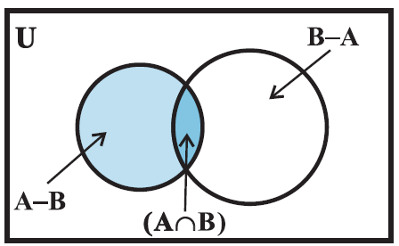
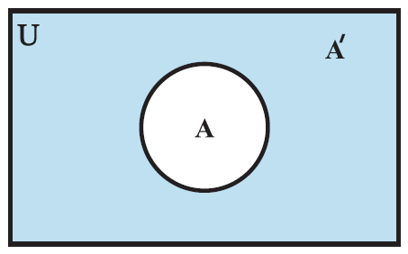

- introduction
	- fundamental part of mathematics
	- this concept is being used in almost every branch of mathematics
	- sets are used to define the concepts of relations and functions
	- theory of sets was developed by German mathematician Georg Cantor.
- sets and their representations
	- ```
	  examples:
	  N : the set of all natural numbers {1,2,3,4,...}
	  Z : the set of all integers {...,-3,-2,-1,0,1,2,3,...}
	  Q : the set of all rational numbers { p/q | p,q ∈ Z, q ≠ 0} i.e. all integers (since 5 = 5/1), all terminating decimals (like 0.25 = 1/4), all repeating decimals (like 0.333... = 1/3)
	  R : the set of real numbers
	  Z+ : the set of positive integers
	  Q+ : the set of positive rational numbers, and
	  R+ : the set of positive real numbers
	  ```
	- a set is a well-defined collection of objects
	- objects, elements, and members of a set are synonymous terms
	- sets are usually denoted by capital letters A, B, C, X, Y, Z etc.
	- the elements of a set are represented by small letters a, b, c, x, y, z etc.
	- if `a` is an element of a set `A`, we say that " a belongs to A" the Greek symbol `∈` (epsilon) is used to denote the phrase 'belongs to'. Thus, we write a ∈ A. if `b` is not an element of a set A, we write b ∉ A and read "b does not belong to A".
	- There are 2 methods of representing a set:
		- roster or tabular form
			- all the elements of a set are listed, the elements are separated by commas and are enclosed within braces { }.
			- ```
			  example:
			  the set of all even positive integers less than 7
			  {2, 4, 6}
			  ```
			- in roster form, the order in which the elements are listed is immaterial.
			- an element is not generally repeated i.e., all the elements are taken as distinct.
				- ```
				  example: the set of elements forming word SCHOOL
				  {S, C, H, O, L} or {H, O, L, C, S}
				  order of listing elements has no relevance.
				  ```
		- set-builder form
			- ```
			  example:
			  V = {a, e, i, o, u}
			  V = {x : x is a vowel in English alphabet}
			  the set of all x such that x is a vowel of the English.
			  { } stands for "the set of all" 
			  : stands for "such that"
			  ```
- the empty set
	- a set which does not contain any element is called the `empty set` or `null set` or the `void set`
	- denoted by ∅ or { }
- finite and infinite sets
	- number of elements of a set S denoted by n(S).
	- if n(S) is a natural number, then S is `non-empty finite` set
	- A set which is empty or consists of a definite number of elements is called `finite` otherwise, the set is called `infinite`.
	- all infinite sets cannot be described in the roster form. for example, set of real numbers.
- equal sets
	- 2 sets A and B are said to be `equal` if they have exactly the same elements and we write A = B. otherwise, the sets are said to be `unequal` and we write A ≠ B
- a set does not change if one or more elements of the set are repeated.
	- ```
	  example:
	  {2, 2, 1, 3, 3} is equale to {2, 1, 3} ordering is not relevant
	  ```
- subsets
	- a set A is said to be a subset of a set B if every element of A is also an element of B
	- subset symbol `⊂`, implies symbol `⇒`, iff (if and only if) symbol `⟺` mean two way implication
	- ```
	    A ⊂ B if a ∈ A ⇒ a ∈ B
	  read as A is a subset of B if a is an element of A implies that a is also an element of B
	  ```
	- ```
	  A ⊂ B and B ⊂ A ⟺ A = B
	  read as A is a subset of B and B is a subset of A if and only if A = B
	  ```
	- every set A is a subset of itself i.e., A ⊂ A
	- since empty set ∅ has no elements, ∅ is a subset of every set.
	- if A is not a subset of B, we write A ⊄ B
	- let A and B be 2 sets. if A ⊂ B and A ≠ B, then A is called a `proper subset of` B and B is called `superset of` A.
	- if a set has only one element, we call it a `singleton set`.
	- subsets of set of real numbers R
		- The set of natural numbers N = {1, 2, 3, 4, 5, ...}
		- The set of integers Z = {...,-3,-2,-1,0,1,2,3,...}
		  :LOGBOOK:
		  CLOCK: [2026-07-23 Thu 15:16:31]--[2026-07-23 Thu 15:16:31] =>  00:00:00
		  :END:
		- The set of rational numbers Q = {x : x = p/q, p,q ∈ Z and q ≠ 0} which is read Q is the set of all numbers x such that x equals the quotient p / q, where p and q are integers and q is not zero.
		- ```
		  The set of irrational numbers, denoted by T, is composed of all other real numbers.
		  T = {x : x ∈ R and x ∉ Q}, i.e., all real numbers that are not rational.
		  ```
		- N ⊂ Z ⊂ Q ⊂ R, T ⊂ R, N ⊄ T
		- intervals as subsets of R
			- let a, b ∈ R and a < b. then the set of real numbers { y : a < y < b } is called an `open interval` and is denoted by (a, b). all the points between a and b belong to the open interval (a, b) but a, b themselves do not belong to this interval.
			- ```
			  the interval which contains the end points also is called `closed interval` and is denoted by [a, b]. thus [ a, b ] = {x : a ≤ x ≤ b}
			  [a, b) = {x : a ≤ x < b} is an open interval from a to b, including a but excluding b.
			  (a, b] = {x : a < x ≤ b} is an open interval from a to b, including bbut excluding a.
			  ```
			- these notations an alternative way of designating sets
			- set [0, ∞) defines the set of non-negative real numbers
			- set (-∞, 0) defines the set of negative real numbers
			- set (-∞, ∞) describes the set of real numbers
			- 
			- ```
			  set {x : x ∈ R, -5 < x ≤ 7} written in set-builder form, can be written in interval form as (-5, 7]
			  interval [-3, 5) can be writtern in set-builder form as {x : -3 ≤ x < 5}
			  ```
			- the number (b - a) is called the `length of any of the intervals` (a, b), [a, b], [a, b) or (a, b]
- power set
	- the collection of all subsets of a set A is called the `power set` of A.
	- it is denoted by P(A)
	- in P(A), every element is a set.
	- ```
	  if A = {1, 2}, then P(A) = {∅, {1}, {2}, {1,2}}
	  also, note that n[P(A)] = 4 = 2 ^ 2
	  ```
	- if A is a set with n(A) = m, then it can be shown that n[P(A)] = 2 ^ m
- universal set
	- basic set is called "Universal Set" denoted by U and all its subsets by letters A, B, C etc.
- ven diagaram
	- most of the relationships between sets can be represented by means of diagrams which are known as `Venn diagrams` named after English logician, John Venn.
	- 
	- universal set is represented by a rectangle and its subsets by circles
	- elements of the sets are written in their respective circles
- operations on sets
	- some operations performed on 2 sets give rise to another set.
	- union of sets
		- the symbol `∪` is used to denote the `union`
		- symbolically, we write A ∪ B and usually read as `A union B`
		- definition: the union of 2 sets A and B is the set C which consists of all those elements which are either in A or in B (including those which are in both).
		- A ∪ B = { x : x ∈ A or x ∈ B}
		- {:height 297, :width 460}
		- properties of the operation of union
			- A ∪ B = B ∪ A (commutative law)
			  :LOGBOOK:
			  CLOCK: [2026-07-24 Fri 09:01:10]--[2026-07-24 Fri 09:01:10] =>  00:00:00
			  :END:
			- (A ∪ B) ∪ C = A ∪ (B ∪ C) (associative law)
			- A ∪ ∅ = A (law of identity element, ∅ is the identity of ∪)
			- A ∪ A = A (idempotent law)
			- U ∪ A = U (law of U)
	- intersection of sets
		- the symbol `∩` is used to denote the `intersection`
		- definition: the intersection of 2 sets A and B is the set of all those elements which belong to both A and B
		- A ∩ B = { x : x ∈ A and x ∈ B }
		- 
		- shaded portion indicates the intersection of A and B
		- if A and B are 2 sets such that A ∩ B = ∅, then A and B are called `disjoint` sets.
			- 
		- some properties of operation of intersection
			- A ∩ B = B ∩ A (commutative law)
			- (A ∩ B) ∩ C = A ∩ (B ∩ C) (associative law)
			- ∅ ∩ A = ∅, U ∩ A = A (law of ∅ and U)
			- A ∩ A = A (idempotent law)
			- A ∩ (B ∪ C) = (A ∩ B) ∪ (A ∩ C) (distributive law) i.e., ∩ distributes over ∪
	- difference of sets
		- the difference of the sets A and B in this order is the set of elements which belong to A but not to B.
		- symbolically, we write A - B and read as "A minus B"
		- set-builder notation: A - B = {x : x ∈ A and x ∉ B}
		- 
		- the sets A - B, A ∩ B and B - A are mutually disjoint sets, i.e., the intersection of any of these 2 sets is the null set.
- complement of a set
	- let U be the universal set and A a subset of U. then the complement of A is the set of all elements of U which are not the elements of A.
	- symbolically, we write A' to denote the complement of A with respect to U.
	- A' = { x : x ∈ U and x ∉ A}. obviously A' = U - A
	- if A is a subset of the universal set U, then its complement A' is also a subset of U
	- (A')' = { x : x ∈ U and x ∉ A'} = A
	- (A ∪ B)' = A' ∩ B', (A ∩ B)' = A' U B'
	- the complement of the union of 2 sets is the intersection of their complements and the complement of the intersection of 2 sets is the union of their complements. these are called De Morgan's laws named after the mathematician De Morgan
	- 
	- shaded portion represents the complement of the set A
	- some properties of complement sets
		- complement laws:
			- A ∪ A' = U
			- A ∩ A' = ∅
		- De Morgan's law:
			- (A ∪ B)' = A' ∩ B'
			- (A ∩ B)' = A' ∪ B'
		- law of double complementation: (A')' = A
		- laws of empty set and universal set:
			- ∅' = U
			- U' = ∅
- practical problems on union and intersection of 2 sets
	- let A and B be finite sets. if A ∩ B = ∅, then
		- n (A ∪ B) = n (A) + n(B)
	- in general, A and B are finite sets if A ∩ B ≠ ∅, then
		- n (A U B) = n (A) + n (B) - n (A ∩ B)
	- sets A - B, A ∩ B and B - A are disjoint and their union is A ∪ B
		- ```
		  n (A ∪ B) = n (A - B) + n (A ∩ B) + n (B - A)
		  			= n (A - B) + n (A ∩ B) + n (B - A) + n (A ∩ B) - n (A ∩ B)
		              = n (A) + n (B) - n (A ∩ B)
		  ```
	- if A, B and C are finite sets, then
		- ```
		  n (A ∪ B ∪ C) = n (A) + n (B) + n (C) - n (A ∩ B) - n (B ∩ C) - n (A ∩ C) + n (A ∩ B ∩ C)
		  ```
		- ```
		  proof:
		  n (A ∪ B ∪ C) = n (A) + n (B ∪ C) - n [A ∩ (B ∪ C)]
		  				= n (A) + n (B) + n (C) - n (B ∩ C) - n [A ∩ (B ∪ C)]
		                  
		  since A ∩ (B ∪ C) = (A ∩ B) ∪ (A ∩ C)
		  n[A ∩ (B ∪ C)] = n (A ∩ B) + n (A ∩ C) - n [(A ∩ B) ∪ (A ∩ C)]
		  				= n (A ∩ B) + n (A ∩ C) - n (A ∩ B ∩ C)
		                  
		  Therefore
		  n (A ∪ B ∪ C) = n (A) + n (B) + n (C) - n (A ∩ B) - n (B ∩ C) - n (A ∩ C) + n (A ∩ B ∩ C)
		  ```