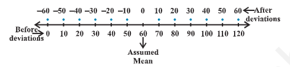
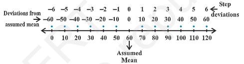

- 
- introduction
	- representation reveals certain salient features or characteristics of the data.
	- representative value for the given data is called the measure of central tendency.
	- mean (arithmetic mean), median and mode are 3 measures of central tendency.
	- a `measure of central tendency` gives us a rough idea where data points are centred.
	- in order to make better interpretation from the data, we should also have an idea how the data are scattered or how much they are bunched around a measure of central tendency
	- mean of a data (denoted by $\bar{x}$) is dividing the sum of the observations by number of observations i.e.,
	  $\bar{x} = \frac{1}{n}\sum_{i=1}^{n} x_i$
	- median is obtained by first arranging the data in ascending or descending order and applying the following rule
	  if number of observations is odd, then the median is $\left(\frac{n+1}{2}\right)^{th}$ observation
	  if the number of observations is even, then median is the mean of $\left(\frac{n}{2}\right)^{th}$ and $\left(\frac{n}{2} + 1\right)^{th}$ observations
- measures of dispersion
	- the dispersion of scatter in a data is measured on the basis of the observations and the types of the measure of central tendency, used there.
	- there are following measures of dispersion
		- range
		- quarile deviation
		- mean deviation
		- standard deviation
- range
	- range of a series = maximum value - minimum value
	- range of data gives us a rough idea of variability or scatter but does not tell about the dispersion of the data from a measure of central tendency.
	- the important measures of dispersion, which depend upon the deviations of the observations from a central tendency are mean deviation and standard deviation.
- mean deviation
	- mean deviation
		- `mean deviation` about a central value `a` is the mean of the absolute values of the deviations of the observations from `a`.
		- mean deviation from `a` is denoted by M.D.(a)
		- $$
		  \text{M.D.(a)}
		  =
		  \frac{\text{sum of absolute deviations from }a}
		  {\text{number of observations}}
		  $$
	- mean deviation for ungrouped data
		- let n observations be $x_1, x_2, x_3, ..., x_n$
		- steps in the calculation of mean deviation about mean or median
			- step 1: calculate the measure of central tendency about which we are to find the mean deviation. let it be 'a'
			- step 2: find the deviation of each $x_i$ from a, i.e., $x_1 - a, x_2 - a, x_3 - a, ..., x_n - a$
			- step 3: find the absolute values of the deviations, i.e., drop the minus sign (-), if it is there, i.e., $|x_1 - a|, |x_2 - a|, |x_3 - a|, ..., |x_n - a|$
			- step 4: find the mean of the absolute values of the deviations. this mean is the mean deviations about a, i.e.,
			  $\operatorname{M.D.}(a)=\frac{\sum_{i=1}^{n}\left|x_i-a\right|}{n}$
			  $\operatorname{M.D.}\bar{x})=\frac{\sum_{i=1}^{n}\left|x_i-\bar{x}\right|}{n}$, where $\bar{x}$ = Mean
			  $\operatorname{M.D.}\bar{M})=\frac{\sum_{i=1}^{n}\left|x_i-\bar{M}\right|}{n}$, where M = Median
	- mean deviation for grouped data
		- data can be grouped into 2 ways
			- discrete frequency distribution
			- continuous frequency distribution
		- discrete frequency distribution
			- given data consist of n distinct values $x_1, x_2, x_3, ..., x_n$ occurring with frequencies $f_1, f_2, ..., f_n$ respectively.
			  this data can be represented in tabular form and is called `discrete frequency distribution`
			  |x|x_1|x_2|x_3|...|x_n|
			  |f|f_1|f_2|f_3|...|f_n|
			- mean deviation about mean
				- first of all we find the mean $\bar{x}$ of the given data by using the formula
				  $\bar{x} = \frac{\sum_{i=1}^n x_if_i}{\sum_{i=1}^nf_i} = \frac{1}{N}\sum_{i=1}^n x_if_i$
				  where $\sum_{i=1}^n x_if_i$ denotes the sum of products of observations $x_i$ with their respective frequencies $f_i$ and $N = \sum_{i=1}^nf_i$ is the sum of the frequencies
				  then, we find the deviations of observations $x_i$ from the mean $\bar{x}$ and take their absolute values, i.e., $|x_i - \bar{x}|$ for all i = 1, 2, ..., n
				- after this, find the mean of the absolute values of the deviations, which is the required mean deviation about the mean. thus
				  $M.D(\bar{x}) = \frac{\sum_{i=1}^n f_i |x_i - \bar{x}|}{\sum_{i=1}^n f_i} = \frac{1}{N} \sum_{i=1}^n f_i|x_i - \bar{x}|$
			- mean deviation about median
				- to find mean deviation about median, we find the median of the given discrete frequency distribution. for this the observations are arranged in ascending order. after this the cumulative frequencies are obtained. then, we identify the observation whose cumulative frequency is equal to or just greater than N/2, where N is the sum of frequencies. this value of the observation lies in the middle of the data, therefore, it is the required median. after finding median, we obtain the mean of the absolute values of the deviations from median. thus
				  $M.D(M) = \frac{1}{N} \sum_{i=1}^n f_i|x_i - M|$
		- continuous frequency distribution
			- a continuous frequency distribution is a series in which the data are classified into different class-intervals without gaps along with their respective frequencies
				- example:
					- marks obtained by 100 students are represented in a continuous frequency distribution as follows:
						- |marks obtained|0-10|10-20|20-30|30-40|40-50|50-60|
						  |number of students|12|18|27|20|17|6|
			- mean deviation about mean
				- while calculating the mean of a continuous frequency distribution, we had made the assumption that the frequency in each class is centred at its mid-point. here also, we write the mid-point of each given class and proceed further as for a discrete frequency find the mean deviation
				- shortcut method for calculating mean deviation about mean
					- we can avoid the tedious calculations of computing $\bar{x}$ by following step-deviation method.
					- in this method, we assume mean which is in the middle in the data. the deviations of observations (or mid points of classes) are taken from the assumed mean. this is shifting origin from zero to assumed mean on number line.
						- 
						- if there is a common factor of all the deviations, we divide them by this common factor to further simplify the deviations. these are known as step-deviations. the process of taking step-deviations is the change of scale on the number line
						- 
						- the deviations and step-deviations reduce the size of the observations, so that the computations viz. multiplication, etc., become simpler.
						- let, the new variable be denoted by $d_i = \frac{x_i - a}{h}$, where `a` is the assumed mean and `h` is the common factor. then the mean $\bar{x}$ by step-deviation method is given by
							- $\bar{x} = a + \frac{\sum_{i=1}^n f_i d_i}{N} \text{x} h$
			- mean deviation about median
				- Median = $l + \frac{\frac{N}{2} - C}{f} \text{x} h$
				- where median class is the class interval whose cumulative frequency is just greater than or equal to N/2, N is sum of frequencies, l, f, h and C are, respectively the lower limit, the frequency, the width of the median class and C the cumulative frequency of the class just preceding the median class.
				- after finding the median, the absolute values of the deviations of mid-point $x_i$ of each class from the median i.e., $|x_i - M|$ are obtained.
				  $\text{M.D. (M)} = \frac{1}{N} \sum_{i=1}^{n}|x_i - M|$
	- limitations of mean deviations
		- in a series, where the degree of variability is very high, the median is not a representative central tendency. thus, the mean deviation about median calculated for such series can not be fully relied.
		- the sum of deviations from the mean (minus signs ignored) is more than the sum of of the deviations from median. therefore, the mean deviation about the mean is not very scientific. thus, in many cases, mean deviation may give unsatisfactory results. also mean deviation is calculated on the basis of absolute values of the deviations and therefore, cannot be subjected to further algebraic treatment.
- variance and standard deviation
	- variance
		- mean of the squares of the deviations from mean is called the `variance` (denoted by \sigma^{2} read as sigma square)
		- the variance of n observations $x_1, x_2, x_3, ..., x_n$ is given by $\sigma^{2} = \frac{1}{n} \sum_{i=1}^n (x_i - \bar{x})^2$
	- standard deviation
		- positive square-root of the variance is called `standard deviation` (denoted by \sigma)
		- $\sigma = \sqrt{ \frac{1}{n} \sum_{i=1}^n (x_i - \bar{x})^2}$
	- standard deviation of a discrete frequency distribution
		- given discrete frequency distribution be
		  |x|x_1|x_2|x_3|...|x_n|
		  |f|f_1|f_2|f_3|...|f_n|
		- in this case standard deviation $\sigma = \sqrt{ \frac{1}{N} \sum_{i=1}^n f_i(x_i - \bar{x})^2}$ where N = $\sum_{i=1}^n f_i$
	- standard deviation of a continuous frequency distribution
		- given continuous frequency distribution can be represented as a discrete frequency distribution by replacing each class by its mid-point. then, the standard deviation is calculated by the technique adopted in the case of a discrete frequency distribution.
		- if there is a frequency distribution of n classes each class defined by its mid-point $x_i$ with frequency $f_i$ the standard deviation will be obtained by the formula 
		  $\sigma = \sqrt{ \frac{1}{N} \sum_{i=1}^n f_i(x_i - \bar{x})^2}$ 
		  where $\bar{x}$ is the mean of the distribution and N = $\sum_{i=1}^n f_i$
		- another formula for standard deviation
			- variance $\sigma^{2} = \frac{1}{N} \sum_{i=1}^n f_i(x_i - \bar{x})^2$
			  $= \frac{1}{N} \sum_{i=1}^n f_i(x_i^2 + \bar{x}^2 - 2\bar{x}x_i)$
			  $= \frac{1}{N} \left[\sum_{i=1}^n f_i x_i^{2} + \sum_{i=1}^n \bar{x}^2 f_i - \sum_{i=1}^n2\bar{x} f_ix_i\right]$
			  $= \frac{1}{N} \left[\sum_{i=1}^n f_i x_i^{2} + \bar{x}^2\sum_{i=1}^n f_i - 2\bar{x}\sum_{i=1}^n f_ix_i\right]$
			  $= \frac{1}{N} \left[\sum_{i=1}^n f_i x_i^{2} + \bar{x}^2N - 2\bar{x} N\bar{x}\right]$
			  $= \frac{1}{N} \sum_{i=1}^n f_i x_i^{2} + \bar{x}^2 - 2\bar{x}^2$
			  $= \frac{1}{N} \sum_{i=1}^n f_i x_i^{2} - \bar{x}^2$
			  $= \frac{1}{N} \sum_{i=1}^n f_i x_i^{2} - \left[ \frac{\sum_{i=1}^n f_i x_i}{N}\right]^2$
			  $= \frac{1}{N^2}\left[N\sum_{i=1}^n f_i x_i^{2} - (\sum_{i=1}^n f_i x_i)^2\right]$
			- thus the standard deviation $(\sigma) = \frac{1}{N}\sqrt{N\sum_{i=1}^n f_i x_i^{2} - (\sum_{i=1}^n f_i x_i)^2}$
	- shortcut method to find variance and standard deviation
		- sometimes the values of $x_i$ in a discrete distribution or the mid points $x_i$ of different classes in a continuous distribution are large and so the calculation of mean and variance becomes tedious and time consuming.
		- by using step-deviation method, it is possible to simplify the procedure
			- let the assumed mean be A and the scale be reduced to 1/h times (h being the width of class-intervals). let the step-deviations or the new values be $y_i$
			- i.e. $y_i = \frac{x_i - A}{h}$ or $x_i = A + hy_i$
			- we know that $\bar{x} = \frac{\sum_{i=1}^n f_i x_i}{N}$
			- thus, $\bar x = A + h \bar{y}$
			- $\text{variance of the variable x} = \sigma_x^2 = \frac{1}{N} \sum_{i=1}^n f_i(x_i-\bar{x})^2 = h^2 \text{x} \text{variance of the variable y}$
			- $\sigma_x^2 = h^2 \sigma_y^2$
			- $\sigma_x = h \sigma_y$
			- $\sigma_x = \frac{h}{N} \sqrt{N \sum_{i=1}^n f_i y_i^{2} - (\sum_{i=1}^n f_i y_i)^2}$
- analysis of frequency distributions
	- the mean deviation and standard deviation have the same units in which the data are given
	- whenever we want to compare the variability of 2 series with same mean, which are measured in different units, we do not merely calculate the measures of dispersion but we require such measures which are independent of the units.
	- the measure of variability which is independent of units is called coefficient of variation (denoted as C.V.)
	- coefficient of variation is defined as C.V. = $\frac{\sigma}{\bar{x}} \text{x} 100, \bar{x} \neq 0$
	  where \sigma and $\bar{x}$ are the standard deviation and mean of the data
	- for comparing the variability or dispersion of 2 series, we calculate the coefficient of variance for each series. the series having greater C.V. is said to be more variable than the other. the series having lesser C.V. is said to be more consistent than the other.
	- comparison of 2 frequency distributions with same mean
		- let $\bar{x}_1$ and $\sigma_1$ be the mean and standard deviation of the first distribution, and $\bar{x}_2$ and $\sigma_2$ be the mean and standard deviation of the second distribution
		- then, C.V. (1st distribution) = $\frac{\sigma_1}{\bar{x}_1} \text{x} 100$
		  C.V. (2nd distribution) = $\frac{\sigma_2}{\bar{x}_2} \text{x} 100$
		  given $\bar{x}_1 = \bar{x}_2 = \bar{x}$ (say)
		- it is clear that 2 C.V.s can be compared on the basis of values of $\sigma_1$ and $\sigma_2$ only.
		- thus, we say that for 2 series with equal means, the series with greater standard deviation (or variance) is called more variable or dispersed than the other. also, the series with lesser value of standard deviation (or variance) is said to be more consistent than the other.
	- if each observation is multiplied by a constant k, the variance of the resulting observations becomes $k^2$ times the original value.
	- adding (or subtracting) a positive number (of from) each observation of a group does not affect the variance