- 
- introduction
	- 2 dimensional `coordinate geometry` is a combination of `algebra` and `geometry`
	- coordinate geometry basics:
		- coordinate axes
		- coordinate plane
		- plotting of points in a plane
		- distance between the points P ($x_1, y_1$) and Q($x_2, y_2$) is PQ = $\sqrt{(x_2 - x_1)^2 + (y_2 - y_1)^2}$
		- the coordinates of a point dividing a line segment joining the points ($x_1, y_1$) and ($x_2, y_2$) internally, in the ratio m : n are $\left(\frac{mx_2 + nx_1}{m + n}, \frac{my_2 + ny_1}{m + n}\right)$
		- if m = n, the coordinates of the mid-point of the line segment joining the points $(x_1, y_1$) and ($x_2, y_2$) are $\left(\frac{x_1 + x_2}{2}, \frac{y_1 + y_2}{2}\right)$
		- the area of the triangle whose vertices are $(x_1, y_1$), ($x_2, y_2$) and ($x_3, y_3$) is $\frac{1}{2} | x_1(y_2 - y_3) + x_2(y_3 - y_1) + x_3(y_1 - y_2)|$
			- if the area of the triangle AB is zero, then 3 points A, B and C lie on a line, i.e., they are collinear.
- slope of a line
	- 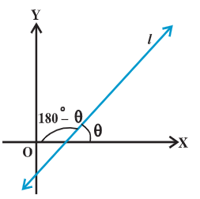
		- a line in a coordinate plane forms 2 angles with x-axis, which are supplementary. the angle \theta made by the line l with positive direction of x-axis and measured in anti clockwise is called the `inclination of the line`. obviously $0° \leq \theta \leq 180°$. we observe that lines parallel to x-axis, or coinciding with x-axis, have inclination of 0°. the inclination of a vertical line (parallel to or coinciding with y-axis) is 90°.
		- Definition: if \theta is the inclination of a line l, then tan \theta is called the `slope` or `gradient` of the line l.
		  the slope of a line whose inclination is 90° is not defined.
		  the slope of a line is denoted by m
		  thus, m = tan \theta, \theta $\neq$ 90°
		  it may be observed that the slope of x-axis is zero and slope y-axis is not defined.
	- slope of a line when coordinates of any 2 points on the line are given
		- 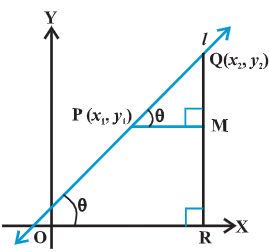 acute angle
		- 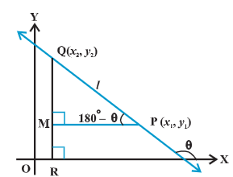 obtuse angle
		- slope of the line through the points P $(x_1, y_1$) and Q ($x_2, y_2$) on a non-vertical lone l whose inclination is \theta, obviously $x_2 \neq x_1$, is given by 
		  m = tan \theta = $\frac{MQ}{MP}$ = $\frac{y_2 - y_1}{x_2 - x_1}$, $x_2 \neq x_1$ for acute and obtuse angles
	- conditions for parallelism and perpendicularity of lines in terms of their slopes
		- 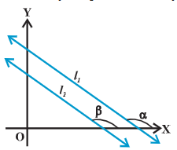{:height 199, :width 225}
		- in a coordinate plane, non-vertical lines $l_1$ and $l_2$ have slopes $m_1$ and $m_2$, inclinations be \alpha and \beta
			- if the line $l_1$ is parallel to $l_2$, then their inclinations are equal, i.e., \alpha = \beta and hence, tan \alpha = tan \beta
			- by the property of tangent function (between 0° and 180°), \alpha = \beta, therefore, the lines are parallel
			- 2 non-vertical lines $l_1$ and $l_2$ are parallel if and only if their slopes are equal
			- if the lines $l_1$ and $l_2$ are perpendicular, then \beta = \alpha + 90°
			  tan \beta = tan (\alpha + 90°) = - cot \alpha = - $\frac{1}{tan \alpha}$
			  i.e., $m_2 = -\frac{1}{m_1} \quad or \quad m_1 m_2 = -1$
			  conversely, if $m_1 m_2 = -1$, i.e., tan \alpha tan \beta = -1
			  then tan \alpha = - cot \beta = tan (\beta + 90°) or tan (\beta - 90°)
			  therefore, \alpha and \beta differ by 90°
			  thus, lines $l_1$ and $l_2$ are perpendicular to each other.
			  hence, 2 non-vertical lines are perpendicular to each other if and only if their slopes are negative reciprocals of each other, 
			  i.e., $m_2 = -\frac{1}{m_1} \quad or \quad m_1 m_2 = -1$
	- angle between 2 lines
		- 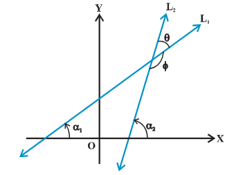{:height 261, :width 351}
		- $L_1, L_2$ be 2 non-vertical lines with slope $m_1, m_2$, if \alpha_1, \alpha_2 are inclinations of lines $L_1$ and $L_2$, 
		  then $m_1 = tan \alpha_1 \quad m_2 = tan \alpha_2$
		- when 2 lines intersect each other, they make 2 pairs of vertically opposite angles such that the sum of any 2 adjacent angles is 180°
		- \theta and \phi be the adjacent angles between lines $L_1, L_2$, 
		  then $\theta = \alpha_2 - \alpha_1$ and $\alpha_1, \alpha_2 \neq 90°$
		- therefore $tan \theta = tan (\alpha_2 - \alpha_1) = \frac{tan \alpha_2 - tan \alpha_1}{1 + tan \alpha_1 \alpha_2} = \frac{m_2 - m_1}{1 + m_1 m_2} \quad (as 1 + m_1 m_2 \neq 0) and \phi = 180° - \theta$
		  so that $tan \phi = tan (180° - \theta) = - tan \theta = - \frac{m_2 - m_1}{1 + m_1 m_2}, as 1 + m_1 m_2 \neq 0$
		- if $\frac{m_2 - m_1}{1 + m_1 m_2}$ is positive, then tan \theta will be positive and tan \phi will be negative, which means \theta will be acute and \phi will be obtuse.
		- if $\frac{m_2 - m_1}{1 + m_1 m_2}$ is negative, then tan \theta will be negative and tan \phi will be positive, which means \theta will be  obtuse and \phi will be acute.
		  $tan \theta = \left| \frac{m_2 - m_1}{1 + m_1 m_2} \right|, as \quad 1 + m_1 m_2 \neq 0$
		- \phi can be found out using \phi = 180° - \theta
	- collinearity of 3 points
		- 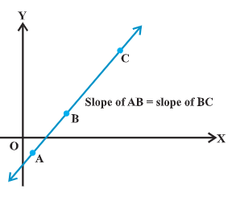{:height 263, :width 288}
		- we know that slopes of 2 parallel lines are equal.
		- if 2 lines having the same slope pass through a common point, then 2 lines will coincide.
		- hence, if A, B and C are 3 points in the XY-plane, then they will lie on a line, i.e., 3 points are collinear if and only if slope of AB = slpe of BC
- various forms of the equation of a line
	- P (x, y) is an arbitrary point in the XY-plane and L is the given line. for the equation of L, we wish to construct a `statement` (an algebraic equation involving variables x and y) or `condition` for the point P that is true, when P is on L, otherwise false.
	- horizontal and vertical lines
		- 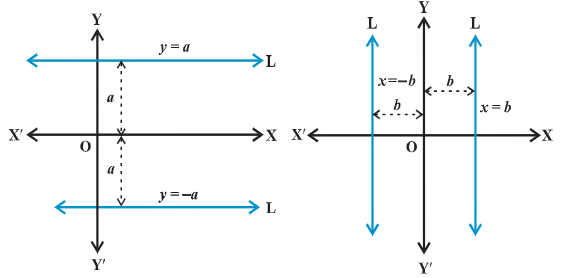
		- if a horizontal line L is at a distance `a` from x-axis then ordinate (means y coordinate of a point) of every point lying on the line is either `a` or `-a`.
		- the equation of a vertical line at a distance `b` from y-axis is either x = b or x = -b
	- point-slope form
		- 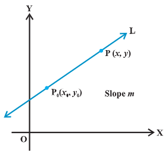
		- $P_0 (x_0, y_0) is a fixed point on a non-vertical line L, whose slope is m.
		- P (x, y) arbitrary point on L
		- slope of L is $m = \frac{y - y_0}{x - x_0}, i.e., y - y_0 = m (x - x_0)$
		- since the point $P_0 (x_0, y_0)$ along with all points (x, y) on L satisfies the equation and no other point in the plane satisfies the equation. equation is indeed the equation for the given line L.
		- point (x, y) lies on the line with slope m through the fixed point $(x_0, y_0)$, if and only if, its coordinates satisfy the equation
		  $y - y_0 = m (x - x_0)$
	- 2-point form
		- 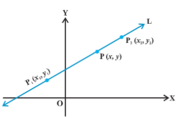{:height 242, :width 354}
		- the line L passes through 2 given points $P_1 (x_1, y_1)$ and $P_2 (x_2, y_2)$. P (x, y) be a general point on L.
		- 3 points, $P_1, P_2$, and P are collinear, therefor, we have 
		  slope of $P_1 P$ = slope of $P_1 P_2$
		  i.e., $\frac{y - y_1}{x - x_1} = \frac{y_2 - y_1}{x_2 - x_1}$
		  or $y - y_1 = \frac{y_2 - y_1}{x_2 - x_1} (x - x_1)$
		- equation of line passing through the points (x_1, y_1) and (x_2, y_2) is given by $y - y_1 = \frac{y_2 - y_1}{x_2 - x_1} (x - x_1)$
	- slope-intercept form
		- 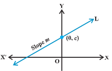
		- line is known to us with its slope and an intercept on one of the axes.
		- case 1: y-axis intercept is known
			- a line L with slope m cuts the y-axis at a distance c from the origin. distance c is called `y-intercept` of the line L. coordinates of the point where the line meet the y-axis are (0, c). thus, L has slope m and passes through a fixed point (0, c). therefore, by point-slope form, the equation of L is 
			  y-c = m (x - 0)
			  or
			  y = mx + c
			  thus, the point (x, y) on the line with slope m and y-intercept c lies on the line if and only if 
			  y = mx + c
			  the value of c will be positive or negative according as the intercept is made on the positive or negative side of the y-axis
		- case 2: suppose line L with slope m makes x-intercept d. then equation L is y = m(x-d)
	- intercept-form
		- 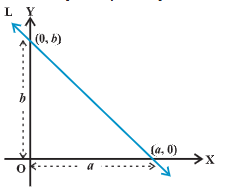
		- line L makes x-intercept a and y-intercept b on the axes. obviously L meets x axis at the point (a, 0) and y-axis at the point (0, b).
		  by 2-point form of equation of the line, we have 
		  y - 0 = \frac{b - 0}{0 - a} (x - a) or ay = -bx + ab
		  i.e., $\frac{x}{a} + \frac{x}{b} = 1$
		  thus, equation of the line making intercepts a and b on x- and y-axis is $\frac{x}{a} + \frac{x}{b} = 1$
	- normal form
		- a non-vertical line known with the following data
			- length of the perpendicular (normal) from origin to the line
			- angle which normal makes with the positive direction of x-axis
		- L be the line, perpendicular distance from origin O be OA = p and the angle between positive x-axis and OA be /angle XOA = ω
		- 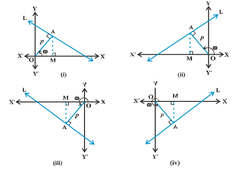
		- the possible positions of line L in the Cartesian plane are shown.
		- Draw a perpendicular AM on the x-axis
		  OM = p cos ω and MA = p sin ω, so the coordinates of point A are (p cos ω, p sin ω)
		  line L perpendicular to OA
		  therefore slope of the line $L = - \frac{1}{slope of OA} = - \frac{1}{tan ω} =- \frac{cos ω}{sin ω}$
		  line L has slope $-\frac{cos ω}{sin ω}$ and point A (p cosω, p sin ω) on it.
		  by point-slope form, the equation of line L is 
		  $y - p sin ω = - \frac{cos ω}{sin ω} (x - p cos ω)$
		  or
		  $x cos ω + y sin ω = p(sin^2 ω + cos^2 ω)$
		  or 
		  x cos ω + y sin ω = p
		  hence, the equation of the line having normal distance p from the origin and angle ω which the normal makes with the positive direction of x-axis is given by
		  x cos ω + y sin ω = p
	- equation y = mx + c, contains 2 constants m and c. for finding 2 constants, we need 2 conditions satisfied by the equation of line.
- general equation of a line
	- general equation of first degree in 2 variables, where A, B and C are real constants such that A and B are not zero simultaneously.
	- graph of the equation Ax + By +C = 0 is always a straight line.
	- equation of the form Ax + By + C = 0, where A and B are not zero simultaneously is called `general linear equation` or `general equation of a line`
	- different forms of Ax + By + C = 0
		- the general equation of a line can be reduced into various forms of the equation of a line
		- slope-intercept form
			- if $B \neq 0$, then Ax + By + C = 0 can be written as
			  $y =  -\frac{A}{B} x - \frac{C}{B} \quad or \quad y = mx + c$
			  where $m = - \frac{A}{B} \quad and \quad c = - \frac{C}{B}$
			- equation is the slope-intercept form of the equation of a line whose slope is $-\frac{A}{B}$, and y-intercept is $-\frac{C}{B}$
			- if B = 0, then x = $-\frac{C}{A}$, which is a vertical line whose slope is undefined and x-intercept is $-\frac{C}{A}$
		- intercept form
			- if $C \neq 0$, then Ax + By + C = 0 can be written as 
			  $\frac{x}{-\frac{C}{A}} + \frac{y}{-\frac{C}{B}} = 1 \quad or \quad \frac{x}{a} + \frac{x}{b} = 1$
			  where $a = -\frac{C}{A} \quad and \quad b = -\frac{C}{B}$
			- equation is intercept form of the equation of a line whose x-intercept is $-\frac{C}{A}$ and y-intercept is $-\frac{C}{B}$
			- if C = 0, the Ax + By + C = 0 can be written as Ax + By = 0, which is a line passing through the origin and, therefore, has zero intercepts on the axes
		- normal form
			- x cos ω + y sin ω = p be the normal form of the line represented by the equation Ax + By + C = 0 or Ax + By = -C. both equations are same and therefore $\frac{A}{cos ω} = \frac{B}{sin ω} = - \frac{C}{p}$
			  which gives cos ω = - \frac{Ap}{C} and sin ω = - \frac{-Bp}{C}
			  $sin^2ω + cos^2ω = \left(-\frac{Ap}{C} \right)^2 + \left(-\frac{Bp}{C} \right)^2 = 1$
			  or $p^2 = \frac{C^2}{A^2 + B^2}$
			  or $p = \pm \frac{C}{\sqrt{A^2 + B^2}}$
			  therefore cos ω = $\pm \frac{A}{\sqrt{A^2 + B^2}}$ and $sin ω = \pm \frac{B}{\sqrt{A^2 + B^2}}$
			- thus, normal form of the equation Ax + By + C = 0 is x cos ω + y sin ω = p, where cos ω = $\pm \frac{A}{\sqrt{A^2 + B^2}}$, $sin ω = \pm \frac{B}{\sqrt{A^2 + B^2}}$ and $p = \pm \frac{C}{\sqrt{A^2 + B^2}}$
			  proper choice of signs is made so that p should be positive
- distance of a point from a line
	- 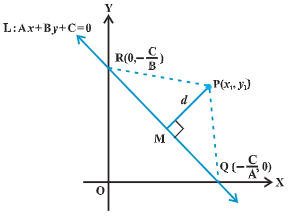
		- distance of a point from a line is the length of the perpendicular drawn from the point to the line.
		  L be a line Ax + By + C = 0, whose distance from the point P $(x_1, y_1)$ is d. draw a perpendicular PM from the point P to the line L. if the line meets the x- and y-axes at points Q and R, then the coordinates of the points are Q$\left(-\frac{C}{A}, 0\right) and R (0, -\frac{C}{B})$
		  area $\triangle PQR = \frac{1}{2} PM QR$, which gives PM = $\frac{2 area \triangle PQR}{QR}$
		- coordinate area formula: for a triangle with vertices $P(x_1,y_1), Q(x_2,y_2), R(x_3,y_3)$
		  area $(\triangle PQR)= \frac{1}{2} |x_1(y_2−y_3)+x_2(y_3−y_1)+x_3(y_1−y_2)|$
		- area $(\triangle PQR)= \frac{1}{2}|x_1(0+\frac{C}{B})+-(\frac{C}{A})(-\frac{C}{B}-y_1)+0(y_1-0)|$
		                             = $\frac{1}{2}|x_1(\frac{C}{B})+y_1(\frac{C}{A})+\frac{C^2}{AB}|$
		  2 area $(\triangle PQR)= |\frac{C}{AB}| |Ax_1 + By_1 + C|$
		  $QR = \sqrt{\left(0 + \frac{C}{A}\right)^2 + \left(\frac{C}{B} - 0\right)^2} = |\frac{C}{AB}| \sqrt{A^2 + B^2}$
		- PM = d = $\frac{|Ax_1 + By_1 + C|}{\sqrt{A^2 + B^2}}$
		- thus, the perpendicular distance (d) of a line Ax + By + C = 0 from a point ($x_1, y_1$) is given by d = $\frac{|Ax_1 + By_1 + C|}{\sqrt{A^2 + B^2}}$
	- distance between 2 parallel lines
		- 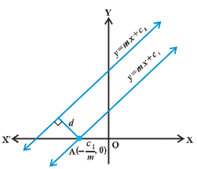
		- slopes of 2 parallel lines are equal
		- $y = mx + c_1$, $y = mx + c_2$
		- line 1 will intersect x-axis at point $A (-\frac{c}{m}, 0)$
		- distance between 2 lines is equal to the length of the perpendicular from point A to line 2 is 
		  $\frac{|(-m)(-\frac{c}{m}) + (-c_2)|}{\sqrt{1 + m^2}}$
		  or
		  d = $\frac{|c_1 - c_2|}{\sqrt{1 + m^2}}$
		- thus, the distance d between 2 parallel lines $y= mx + c_1$ and $y = mx + c_2| is d = $\frac{|c_1 - c_2|}{\sqrt{1 + m^2}}$
		- if lines are given in general form, i.e., $Ax + By + C_1 = 0$ and $Ax + By + C_2 = 0$, then d = $\frac{|C_1 - C_2|}{\sqrt{A^2 + B^2}}$