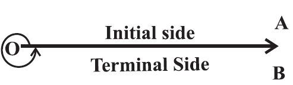
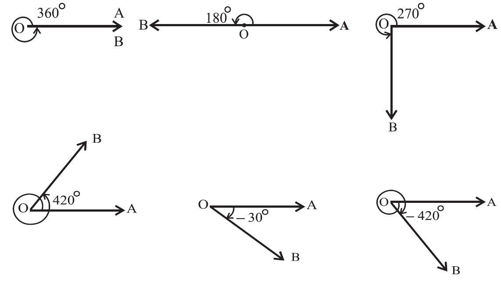
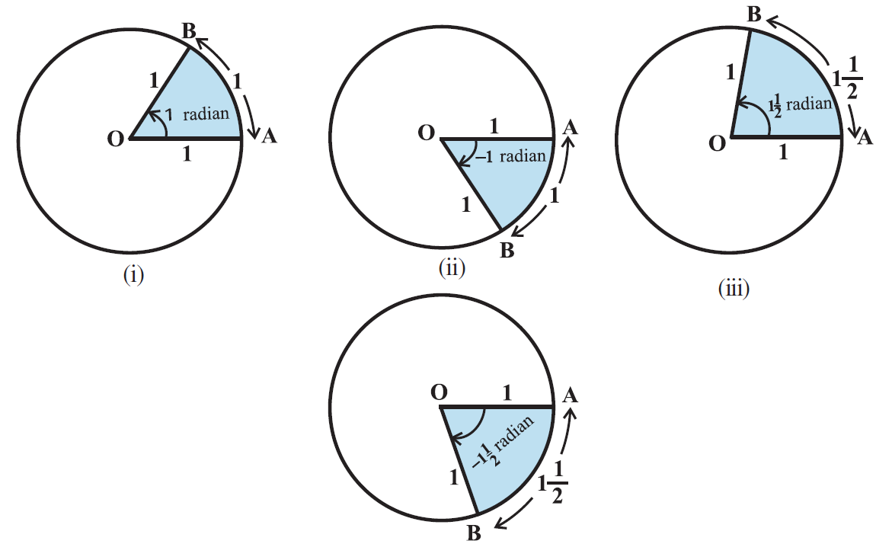
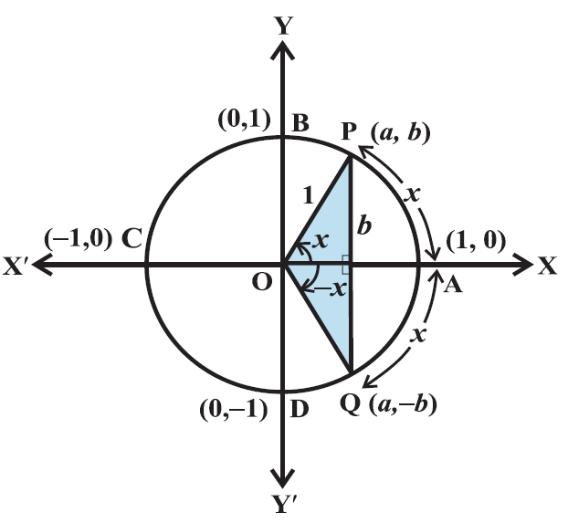
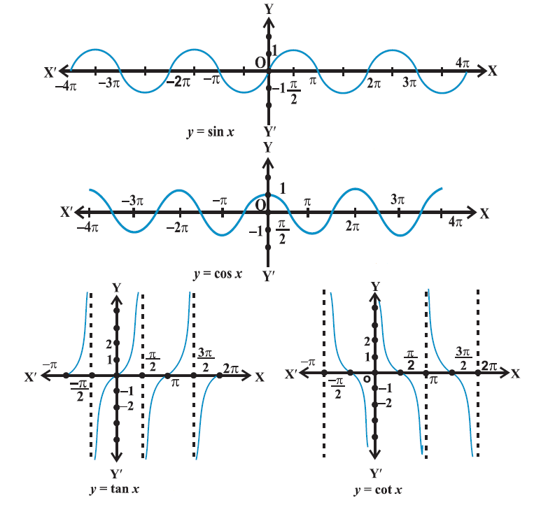
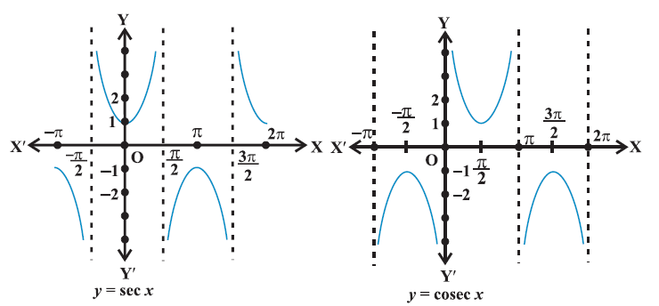

- introduction
	- word `trigonometry` is derived from greek words `trigon` and `metron` and it means `measuring the sides of a triangle`.
- angles
	- angle
		- angle is a measure of rotation of a given ray about its initial point.
		- the original ray is called the `initial side` and the final position of the ray after rotation is called `terminal side` of the angle.
		- the point of rotation is called the `vertex`.
		- if the `direction of rotation` is `anticlockwise`, the angle is said to be `positive`
		- if the `direction of rotation` is `clockwise`, then angle is `negative`
		- 
		- the measure of an angle is the amount of rotation performed to get the terminal side from the initial side.
		- there are several units for measuring angles
			- the definition of an angle suggests a unit, viz. `one complete revolution` from the position of the initial side.
			- units of measurement of angles `degree measure` and `radian measure`
		- degree measure
			- if a rotation from the initial side to terminal side is $\frac{1}{360}^\text{th}$ of a revolution, the angle is said to have a measure of `one degree`, written as 1\deg.
			- a degree is divided into 60 minutes, and a minute is divided into 60 seconds.
			- one sixtieth of a `degree` is called a `minute`, written as `1'`, and one sixtieth of a minute is called a `second`, written as `1"`
			- 1\deg = 60'
			- 1' = 60"
			- 
		- radian measure
		  collapsed:: true
			- angle subtended at the centre by an arc of length 1 unit in a unit circle (circle of radius 1 unit) is said to have a measure of 1 radian
			- in the figure OA is initial side and OB is the terminal side
				- 
				- circumference of a circle of radius 1 unit is 2\pi. one complete revolution of the initial side subtends an angle of 2\pi radain.
				- a circle of radius r, an arc of length r will subtend an angle of 1 radian.
				- equal arcs of a circle subtends equal angle at the centre.
				- an arc of length `l` subtend an angle of $\frac{l}{r}$ radian.
				- in a circle of radius r, an arc of length l subtends an angle \theta radian at the center $\theta = \frac{l}{r}$ or $l = r\theta$
		- relation between radian and real numbers
			- unit circle with centre O. A be any point on the circle. OA is initial side of an angle. length of an arc of circle will give the radian measure of the angle which the arc will subtend at the centre of the circle. line PAQ tangent to circle at A. point A represent the real number zero, AP represents positive real number and AQ represents negative real numbers. if we rope the line AP in the anticlockwise direction along the circle, and AQ in the clockwise direction, then every real number will correspond to a radian measure and conversely. thus, radian measures and real numbers can be considered as one and the same.
		- relation between degree and radian
			- 2\pi = 360\deg or \pi = 180\deg
			- \pi = $\frac{22}{7}$
			- 1 radian = $\frac{180^\circ}{\pi}$ = 57 \deg 16' approximately
			- 1\deg = $\frac{\pi}{180}$ radian = 0.01746 radian approximately
			- |degree|30\deg|45\deg|60\deg|90\deg|180\deg|270\deg|360\deg|
			  |radian|$\frac{\pi}{6}$|$\frac{\pi}{4}$|$\frac{\pi}{3}$|$\frac{\pi}{2}$|\pi|$\frac{3\pi}{2}$|2\pi|
			- national convention
				- we adopt convention that when we write angle \theta\deg, we mean the angle whose `degree measure` is \theta
					- whenever we write angle \beta, we mean the angle whose`radian mease` is \beta
					- when an angle is expressed in radians, the word `radian` is frequently omitted. with understanding \pi and $\frac{\pi}{4}$ are radian measures
					- $radian measure = \frac{\pi}{180} X degree measure$
					- $degree measure = \frac{180}{\pi} X radian measure$
	- trigonometric functions
		- trigonometric function
		  collapsed:: true
			- trigonometric ratios to any angle in terms of radian measure
			- ```
			  a unit circle with centre at origin of the coordinate axes. 
			  P (a, b) be any point on the circle with angle AOP = x radian, i.e., length of arc AP = x. 
			  cos x = a and sin x = b
			  △OMP is a right triangle
			  OM ^2 + MP ^2 = OP ^2
			  a ^2 + b ^2 = 1 or cos ^2 x + sin ^2 = 1
			  ```
			- all angles which are integral multiples of $\frac{\pi}{2}$ are called `quadrantal angles`
			- the coordinates of the points A, B, C and D are, respectively (1, 0), (0, 1), (-1, 0), (0, -1)
				- cos 0\deg = 1
				- sin 0\deg = 0
				- cos $\frac{\pi}{2}$ = 0
				- sin $\frac{\pi}{2}$ = 1
				- cos \pi = -1
				- sin \pi = 0
				- cos $\frac{3\pi}{2}$ = 0
				- sin $\frac{3\pi}{2}$ = -1
				- cos 2\pi = 1
				- sin 2\pi = 0
			- if we take one complete revolution from the point P, we again comeback to the same point P. we observer if x increases (or decreases by any integral multiple of 2\pi), the values of sine and cosine functions do not change
			  collapsed:: true
				- sin (2n\pi + x) = sin x, n \in Z
				- cos (2n\pi + x) = cos x, n \in Z
				- sin x = 0, if x = 0, \pm \pi, \pm 2\pi, \pm 3\pi, ..., when x is an integral multiple of \pi
				- cos x = 0, if x = \pm $\frac{\pi}{2}$, \pm $\frac{3\pi}{2}$, \pm $\frac{5\pi}{2}$, ... i.e., cos x vanishes when x is an odd multiple of $\frac{\pi}{2}$
				- sin x = 0 implies x = n\pi, where n is any integer
				- cos x = 0 implies x = (2n + 1) $\frac{\pi}{2}$, where n is any integer
				- cosec x, sec x, cot x are reciprocal of sin x, cos x, tan x respectively
				- cosec x = $\frac{1}{sin x}$, x \ne n\pi, where n is any integer
				- sec x = $\frac{1}{cos x}$, x \ne (2n + 1) $\frac{\pi}{2}$, where n is any integer
				- tan x = $\frac{sin x}{cos x}$, x \ne (2n + 1)$\frac{\pi}{2}$, where n is any integer
				- cot x = $\frac{cos x}{sin x}$, x \ne n\pi, where n is any integer
				- $1 + tan ^ 2 x = sec ^ 2 x$
					- ```
					  sin^2 x + cos^2 x = 1
					  divide by cos^2 x
					  (sin^2 x / cos^2 x) + 1 = 1 / cos^2 x
					  1 + tan^2 x = sec^2 x
					  ```
				- $1 + cot^2x = cosec^2 x$
					- ```
					  sin^2 x + cos^2 x = 1
					  divide by sin^2 x
					  1 + (cos^2 x / sin^2 x) = 1 / sin^2 x
					  1 + cot^2 x = cosec^2 x
					  ```
				- values of trigonometric functions for angles
					- ||0|$\frac{\pi}{6}$|$\frac{\pi}{4}$|$\frac{\pi}{3}$|$\frac{\pi}{2}$|\pi|$\frac{3\pi}{2}$|2\pi|
					  |sin|0|$\frac{1}{2}$|$\frac{1}{\sqrt{2}}$|$\frac{\sqrt{3}}{2}$|1|0|-1|0|
					  |cos|1|$\frac{\sqrt{3}}{2}$|$\frac{1}{\sqrt{2}}$|$\frac{1}{2}$|0|-1|0|1|
					  |tan|0|$\frac{1}{\sqrt{3}}$|1|$\sqrt{3}$|not defined|0|not defined|0|
		- sign of trigonometric functions
			- 
			- P (a, b) a point on the unit circle with centre at the origin such that \angle AOP = x, if /angle AOQ = -x then the coordinates of the point Q will be (a, -b)
			  cos (-x) = cos x
			  sing (-x) = -sin x
			- for every point P (a, b) on the unit circle, -1 \le a \le 1 and -1 \le b \le 1, we have -1 \le cos x \le 1 and -1 \le sin x \le 1 for all x.
			- ||Quadrant I|II|III|IV|
			  |sin x| + | + | - | - |
			  |cos x| + | - | - | + |
			  |tan x| + | - | + | - |
			  |cosec x| + | + | - | - |
			  |sec x| + | - | - | + |
			  |cot x| + | - | + | - |
		- domain and range of trigonometric functions
			- for each real number x
			  -1 \le sin x \le 1 and -1 \le cos x \le 1
			- thus domain of y = sin x and y = cos x is the set of all real numbers and range is the interval [-1, 1], i.e., -1 \le y \le 1
			- since cosec x = $\frac{1}{sin x}$, the domain of y = cosec x is the set { x : x \in R and x \ne n\pi, n \in Z } and range is the set { y : y \in R, y \ge 1 or y \le -1 }
			- similarly the domain of y = sec x is the set { x : x \in R and x \ne (2n + 1) $\frac{\pi}{2}$, n \in Z } and range is the set { y : y \in R, y \le -1 or y \ge 1 }
			- the domain of y = tan x is the set { x : x \in R and x \ne (2n + 1) \frac{\pi}{2}, n \in Z } and range is the set of all real numbers.
			- the domain of y = cot x is the set { x : x \in R and x \ne n\pi, n \in Z} and the range is the set of all real numbers.
			- || Quadrant I | II | III | IV |
			  :LOGBOOK:
			  CLOCK: [2026-07-27 Mon 14:06:38]--[2026-07-27 Mon 14:06:39] =>  00:00:01
			  :END:
			  | sin | increases from 0 to 1 | decreases from 1 to 0 | decreases from 0 to -1 | increases from -1 to 0|
			  | cos | decreases from 1 to 0 | decreases from 0 to -1 | increases from -1 to 0 | increases from 0 to 1|
			  | tan | increases from 0 to \infty | increases from -\infty to 0 | increases from 0 to \infty | increases from -\infty to 0 |
			  | cot | decreases from \infty to 0 | decreases from 0 to -\infty | decreases from \infty to 0 | decreases from 0 to -\infty |
			  | sec | increases from 1 to \infty | increases from -\infty to -1 | decreases from -1 to -\infty | decreases from \infty to 1 |
			  | cosec | decreases from \infty to 1 | increases from 1 to \infty | increases from -\infty to -1 | decreases from -1 to -\infty |
			- sin x and cos x repeats after an interval of 2\pi, hence values of cosec x and sec x will also repeat after an interval of 2\pi.
			- tan (\pi + x) = tan x, its values repeat after an interval of \pi.
			- since cot x is reciprocal of tan x, its values also repeat after an interval of \pi
			- 
			- 
- trigonometric functions of sum and difference of 2 angles
	- trigonometric identifies
		- sin (-x) = - sin x
		- cos (-x) = cos x
	- cos (x + y) = cos x cos y - sin x sin y
	- cos (x - y) = cos x cos y + sin x sin y
	- cos ($\frac{\pi}{2}$ - x) = sin x
		- in the above formula replace x with $\frac{\pi}{2}$ and y with x
	- sin ($\frac{\pi}{2}$ - x) = cos x
	- sin (x + y) = sin x cos y + cos x sin y
		- ```
		  sin (x + y) = cos [π/2 - (x+y)] = cos [(π/2 - x) - y]
		  			= cos (π/2 - x) cos y + sin (π/2 - x) sin y
		              = sin x cos y + cos x sin y
		  ```
	- sin (x - y) = sin x cos y - cos x sin y
	- cos (π/2 + y) = - sin x
	- sing (π/2 + x) = cos x
	- cos (π - x) = - cos x
	- sin (π - x) = sin x
	- cos (π + x) = - cos x
	- sin (π + x) = - sin x
	- cos (2π - x) = cos x
	- sin (2π - x) = - sin x
	- if none of the angles x, y and (x+y) is an odd multiple of π/2, then 
	  tan (x + y) = $\frac{tan x + tan y}{1 - tan x tan y}$
	- tan (x - y) = $\frac{tan x - tan y}{1 + tan x tan y}$
	- if none of the angles x, y and (x+y) is an odd multiple of π, then 
	  cot (x + y) = $\frac{cot x cot y-1}{cot y + cot x}$
	- cot (x - y) = $\frac{cot x cot y+1}{cot y - cot x}$
	- cos 2x = $\cos^2 x - \sin^2 x$ = 2$cos^2 x - 1$ = 1 - 2 $\sin^2 x$ 
	  = $\frac{1 - tan^2 x}{1 + tan ^2 x}$, x \ne (2n + 1)\pi/2, where n is an integer
	- sin 2x = 2 sin x cos x = $\frac{2 tan x}{1 + tan^2 x}$, x \ne (2n + 1)\pi/2, where n is an integer
	- tan 2x = $\frac{2tan x}{1 - tan^2 x}$, 2x \ne (2n + 1)\pi/2, where n is an integer
	- sin 3x = 3 sin x - 4 $sin^3 x$
	- cos 3x = 4 $cos^3 x$ - 3 cos x
	- tan 3x = $\frac{3 tan x - tan ^ 3 x}{1 - 3 tan^2 x}$, 3x \ne (2n + 1)\pi/2, where n is an integer
	- cos x + cos y = 2 cos $\frac{x + y}{2}$ cos $\frac{x - y}{2}$
	- cos x - cos y = - 2 sin $\frac{x + y}{2}$ sin $\frac{x - y}{2}$
	- sin x + sin y = 2 sin $\frac{x + y}{2}$ cos $\frac{x - y}{2}$
	- sin x - sin y = 2 cos $\frac{x + y}{2}$ sin $\frac{x - y}{2}$
	- 2 cos x cos y = cos (x + y) + cos (x - y)
	- - 2 sin x sin y = cos (x + y) - cos (x - y)
	- 2 sin x cos y = sin (x + y) + sin (x - y)
	- 2 cos x sin y = sin (x + y) - sin (x - y)
- trigonometric equations
	- equations involving trigonometric functions of a variable are called `trigonometric equations`
	- the solutions of a trigonometric equation for which 0 \le x \lt 2\pi are called `principal solutions`
	- the expression involving integer `n` which gives all solutions of a trigonometric equation is called the `general solution`. we shall use `Z` to denote the set of integers.
	- sin x = 0 gives x = n\pi, where n \in Z
	- cos x = 0 gives x = (2n + 1) $\frac{\pi}{2}$, where n \in Z
	- for any real numbers x and y, sin x = sin y implies x = n\pi + $(-1)^n y$, where n \in Z
	- for any real numbers x and y, cos x = cos y, implies x = 2n\pi \pm y, where n \in Z
	- if x and y are not odd multiple of \pi/2, then tan x = tan y implies x = n\pi + y, where n \in Z