- 
- introduction
	- scalars
		- scalar quantities such as length, mass, time, distance, speed, area, volume, temperature, volume, temperature, work, money, voltage, density, resistance etc.
	- vectors
		- vector quantities like displacement, velocity, acceleration, force, weight, momentum, electric field intensity etc.
		- algebraic and geometric properties. these 2 types of properties, when considered together give a full realisation to the concept of vectors, and lead to their vital applicability in various areas.
- some basic concepts
	- vector
		- definition: a quantity that has magnitude as well as direction is called a vector
		- 
		- i & ii are line given 2 directions by means of arrow heads are called `directed line`
		- if we restrict line l to the line segment AB, then a magnitude is prescribed on the line l with one of the 2 directions, so that we obtain a `directed line segment`. thus, a directed line segment has magnitude as well as direction and is denoted as $\overrightarrow{AB}$ or \overrightarrow{a}$ and read as vector $\overrightarrow{AB}$ or vector $\overrightarrow{a}$
		- the point A from where the vector $\overrightarrow{AB}$ starts is called its `initial point`, and the point B where it ends is called its `terminal point`. the distance between initial and terminal points of a vector is called the `magnitude` (or length) of the vector, denoted as $|\overrightarrow{AB}|$ or $|\overrightarrow{a}|$ or a. the arrow indicates the direction of the vector.
		- note: since the length is never negative, the notation $|\overrightarrow{a}|$ < 0 has no meaning
	- position vector
		- 
		- consider a point P in space, having coordinates (x, y, z) with respect to the origin O (0, 0, 0). then, the vector $\overrightarrow{OP}$ having O and P as its initial and terminal points, respectively, is called the `position vector` of the point P with respect to O. using distance formula, the magnitude of $\overrightarrow{OP}$ (or $\overrightarrow{r}$) is given by
		  |$\overrightarrow{OP}$| = $\sqrt{x^2 + y^2 + Z^2}$
		- in practice, the position vectors of points A, B, C etc., with respect to the origin O are denoted by $\overrightarrow{a}, \overrightarrow{b}, \overrightarrow{c}$
	- direction cosines
		- consider the position vector $\overrightarrow{OP}$ or $\overrightarrow{r}$ of a point P(z, y, z). the angles \alpha, \beta, \gama made by the verctor $\overrightarrow{r}$ with the positive directions of x, y and z- axes respectively, are called its `direction angles`. the cosine values of these angles, i.e., cos \alpha, cos \beta and cos \gamma are called `direction cosines` of the vector $\overrightarrow{r}$, and usually denoted by l, m and n.
		- 
		- triangle OAP is right angles, $cos \alpha = \frac{x}{r}$ (r stands for |$\overrightarrow{r}$|)
		- from right angled triangles OBP and OCP, $cos \beta = \frac{y}{r}$, cos \gamma = $\frac{z}{r}$
		- coordinates of the point P may also be expressed as (lr, mr, nr) proportional to the direction cosines are called as `direction ratios` of vector $\overrightarrow{r}$, denoted as a, b, c
		- note: $l^2 + m^2 + n^2 = 1$ but $a^2 + b^2 + c^2 \neq 1, in general$
- types of vectors
	- zero vector
		- a vector whose initial and terminal points coincide, is called a zero vector (or null vector), and denoted as $\overrightarrow{0}$
		- zero vector can not be assigned a definite direction as it has zero magnitude. or alternatively otherwise, it may be regarded as having any direction.
		- the vectors $\overrightarrow{AA}$, $\overrightarrow{BB}$ represent the zero vector
	- unit vector
		- a vector whose magnitude is unity (i.e., 1 unit) is called a unit vector. the unit vector in the direction of a given vector $\overrightarrow{a}$ is denoted by $\hat{\mathbf{a}}$
	- coinitial vectors
		- 2 or more vectors having the same initial point are called coinitial vectors
	- collinear vectors
		- 2 or more vectors are said to be collinear if they are parallel to the same line, irrespective of their magnitudes and directions
	- equal vectors
		- 2 vectors $\overrightarrow{a}$ and $\overrightarrow{b}$ are said to be equal, if they have the same magnitude and direction regardless of the positions of their initial points, and written as $\overrightarrow{a}$ = $\overrightarrow{b}$
	- negative of a vector
		- a vector whose magnitude is the same as that of a given vector (say, $\overrightarrow{AB}$), but direction is opposite to that of it, is called negative of the given vector.
		- vector $\overrightarrow{BA}$ is negative of the vector $\overrightarrow{AB}$, and written as $\overrightarrow{BA}$ = - $\overrightarrow{AB}$
	- remark
		- the vectors may be subject to its parallel displacement without changing its magnitude and direction. such vectors are called `free vectors`
- addition of vectors
	- a vector $\overrightarrow{AB}$ simply means the displacement from a point A to the point B.
	- if we have 2 vectors $\overrightarrow{a}$, $\overrightarrow{b}$, then to add them, they are positioned so that the initial point of one coincides with the terminal point of the other.
	- triangle law of vector addition
		- $\overrightarrow{AC} = \overrightarrow{AB} + \overrightarrow{BC}$
		- 
	- 
		- if we have 2 vectors $\overrightarrow{a}$ and $\overrightarrow{b}$ as per fig i, then to add them, they are positioned so that the initial point of one coincides with the terminal point of the other fig ii.
		- we shifted vector $\overrightarrow{b}$ without changing its magnitude and direction, so that it's initial point coincides with the terminal point of $\overrightarrow{a}$. then, the vector $\overrightarrow{a}$ + $\overrightarrow{b}$, represented by the 3rd side AC of the triangle ABC, gives us the sum (or resultant) of the vectors $\overrightarrow{a}$ and $\overrightarrow{b}$ i.e., in triangle ABC, we have
		  $\overrightarrow{AB} + \overrightarrow{BC} = \overrightarrow{AC}$
		- since $\overrightarrow{AC}$ = - $\overrightarrow{CA}$
		  $\overrightarrow{AB} + \overrightarrow{BC} + \overrightarrow{CA} = \overrightarrow{AA} = \overrightarrow{0}$
		- when the sides of a triangle are taken in order, it leads to zero resultant as the initial and terminal points get coincided (fig iii)
		- construct a vector $\overrightarrow{BC'}$ so that its magnitude is same as the vector $\overrightarrow{BC}$, but the direction opposite to that of it (fig iii), i.e., 
		  $\overrightarrow{BC} = - \overrightarrow{BC}$
		- apply triangle law for fig iii,
		  $\overrightarrow{AC'} = \overrightarrow{AB} + \overrightarrow{BC'} = \overrightarrow{AB} + (-\overrightarrow{BC}) = \overrightarrow{a} - \overrightarrow{b}$
		- the vector $\overrightarrow{AC'}$ is said to represent the `difference` of $\overrightarrow{a}$ and $\overrightarrow{b}$
		- parallelogram law of vector addition
			- 
			- 2 vectors$\overrightarrow{a}$, $\overrightarrow{b}$ represented by the 2 adjacent sides of a parallelogram in magnitude and direction, then their sum $\overrightarrow{a}$ + $\overrightarrow{b}$ is represented in magnitude and direction by the diagonal of the parallelogram through their common point. this is known as the parallelogram law of vector addition.
			- triangle law and parallelogram law of vector addition are equivalent to each other
	- properties of vector addition
		- property 1
			- for any 2 vectors $\overrightarrow{a}$ and $\overrightarrow{b}$ 
			  $\overrightarrow{a}$ + $\overrightarrow{b}$ = $\overrightarrow{b}$ + $\overrightarrow{a}$ (commutative property)
		- property 2
			- for any 3 vectors $\overrightarrow{a}$, $\overrightarrow{b}$ and  $\overrightarrow{c}$
			  ($\overrightarrow{a}$ + $\overrightarrow{b}$) + $\overrightarrow{c}$ =  $\overrightarrow{a}$ + ($\overrightarrow{b}$ + $\overrightarrow{c}$)
			- associative property of vector addition enables us to write the sum of 2 vectors $\overrightarrow{a}$, $\overrightarrow{b}$, $\overrightarrow{c}$ as $\overrightarrow{a}$ + $\overrightarrow{b}$ + $\overrightarrow{c}$ without brackets
			- for any vector $\overrightarrow{a}$, we have
			  $\overrightarrow{a}$ + $\overrightarrow{0}$ = $\overrightarrow{0}$ + $\overrightarrow{a}$ = $\overrightarrow{a}$
			  here, the zero vector $\overrightarrow{0}$ is called the `additive identity` for the vector addition
- multiplication of a vector by a scalar
	- $\overrightarrow{a}$ be a given vector and \lambda a scalar. then the product of the vector $\overrightarrow{a}$ by the scalar \lambda, denoted as \lambda $\overrightarrow{a}$, is called the multiplication of vector $\overrightarrow{a}$ by the scalar \lambda. note that, \lambda $\overrightarrow{a}$ is also a vector, collinear to the vector $\overrightarrow{a}$. the vector \lambda $\overrightarrow{a}$ has the direction same (or opposite) to that of vector $\overrightarrow{a}$ according as the value of \lambda is positive (or negative). also, the magnitude of vector \lambda $\overrightarrow{a}$ is |\lambda| times the magnitude of the vector $\overrightarrow{a}$, i.e.,
	  $$
	  |\lambda \overrightarrow{a}| = |\lambda| |\overrightarrow{a}|
	  $$
		- 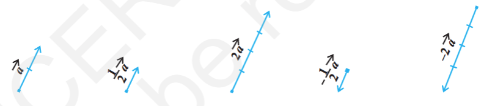
		- when \lambda = -1, then \lambda $\overrightarrow{a}$ = - $\overrightarrow{a}$, which is a vector having magnitude equal to the magnitude of $\overrightarrow{a}$ and direction opposite to that of the direction $\overrightarrow{a}$.
		- the vector -$\overrightarrow{a}$ is called the `negative (or additive inverse) of vector` $\overrightarrow{a}$ and we always have
		  $\overrightarrow{a}$ + (-$\overrightarrow{a}$) = (-$\overrightarrow{a}$) + $\overrightarrow{a}$ = $\overrightarrow{0}$
		- also, if $\lambda = \frac{1}{|\overrightarrow{a}|}$, provided $\overrightarrow{a} \neq 0$, i.e., $\overrightarrow{a}$ is not a null vector, then
		  $$
		  |\lambda \overrightarrow{a}| = |\lambda| |\overrightarrow{a}| = \frac{1}{|\overrightarrow{a}|} |\overrightarrow{a}| = 1
		  $$
		  so, \lambda $\overrightarrow{a}$ represents the unit vector in the direction of $\overrightarrow{a}$. we write it as
		  $\hat{a} = \frac{1}{|\overrightarrow{a}|} \overrightarrow{a}$
		- for any scalar k, $k \overrightarrow{0} = \overrightarrow{0}$
	- components of a vector
		- 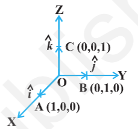
		- 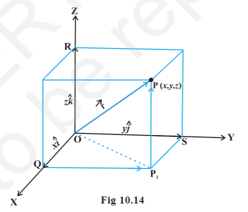
		- take the points A(1, 0, 0), B(0, 1, 0) C(0, 0, 1) on the x-axis, y-axis, z-axis.
		- $|\overrightarrow{OA}| = 1, |\overrightarrow{OB}| = 1, |\overrightarrow{OC}| = 1$
		- vectors $|\overrightarrow{OA}|$, $|\overrightarrow{OB}|$, $|\overrightarrow{OC}|$ each having magnitude 1, are called `unit vectors along the axes` OX, OY, OZ and denoted by $\hat{i}, \hat{j}, \hat{k}$
		- now, consider the position vector $\overrightarrow{OP}$ of a point P(x, y, z).  $P_1$ be the foot of the perpendicular from P on the plane XOY. $P_1 P$ is parallel to z-axis.
		- $\hat{i}, \hat{j}, \hat{k}$ are unit vectors along the x, y, z-axes, by definition of the coordinates of P, we have $\overrightarrow{P_1P} = \overrightarrow{OR} = z\hat{k}$
		  similarly $\overrightarrow{QP_1} = \overrightarrow{OS} = y\hat{j}$ and $\overrightarrow{OQ} = x\hat{i}$
		- therefore, $\overrightarrow{OP_1} = \overrightarrow{OQ} + \overrightarrow{QP_1} = x\hat{i} + y\hat{j}$
		  $\overrightarrow{OP} = \overrightarrow{OP_1} + \overrightarrow{P_1P} = x\hat{i} + y\hat{j} + z\hat{k}$
		- hence, the position vector of P with reference to O is given by
		  $\overrightarrow{OP} (\text{or } \overrightarrow{r}) = x\hat{i} + y\hat{j} + z\hat{k}$
		  this form of any vector is called its `component form`. here, x, y and z are called as the `scalar components` of $\overrightarrow{r}$ and $x\hat{i}, y\hat{j}, z\hat{k}$ are called the `vector components` of $\overrightarrow{r}$ along the respective axes. sometimes x, y and z are also termed as `rectangular components`
		- the length of any vector $\overrightarrow{r} = x\hat{i} + y\hat{j} + z\hat{k}$, is 
		  $$
		  |\overrightarrow{r}| = |x\hat{i} + y\hat{j} + z\hat{k}| = \sqrt{x^2 + y^2 + z^2}
		  $$
		- if $\overrightarrow{a}$ and $\overrightarrow{b}$ are any 2 vectors given in the component form $a_1\hat{i} + a_2\hat{j} + a_3\hat{k}$ and $b_1\hat{i} + b_2\hat{j} + b_3\hat{k}$, respectively, then
			- the sum (or resultant) of the vectors $\overrightarrow{a}$ and $\overrightarrow{b}$ is given by
			  $\overrightarrow{a} + \overrightarrow{b} = (a_1 + b_1)\hat{i} + (a_2 + b_2)\hat{j} + (a_3 + b_3)\hat{k}$
			- the difference of the vectors $\overrightarrow{a}$ and $\overrightarrow{b}$ is given by
			  $\overrightarrow{a} - \overrightarrow{b} = (a_1 - b_1)\hat{i} + (a_2 - b_2)\hat{j} + (a_3 - b_3)\hat{k}$
			- the vectors $\overrightarrow{a}$ and $\overrightarrow{b}$ are equal if and only if
			  $a_1 = b_1, a_2 = b_2, a_3 = b_3$
			- the multiplication of vector $\overrightarrow{a}$ by any scalar \lambda is given by
			  $\lambda \overrightarrow{a} = (\lambda a_1)\hat{i} + (\lambda a_2)\hat{j} + (\lambda a_3)\hat{k}$
			- the addition of vectors and the multiplication of a vector by a scalar together give the following distributive laws:
				- $\overrightarrow{a}$, $\overrightarrow{b}$ any 2 vectors and k, m any scalars then
					- $k \overrightarrow{a} + m \overrightarrow{a} = (k + m) \overrightarrow{a}$
					- $k(m\overrightarrow{a}) = (km) (\overrightarrow{a})$
					- $k(\overrightarrow{a} + \overrightarrow{b}) = k \overrightarrow{a} + k \overrightarrow{b}$
			- Remarks
				- one may observe that whatever be the value of \lambda, the vector $\lambda \overrightarrow{a}$ is always collinear to the vector $\overrightarrow{a}$. in fact, 2 vectors
				- in fact, 2 vectors $\overrightarrow{a}$ and $\overrightarrow{b}$ are collinear if and only if there exists a nonzero scalar \lambda such that $\overrightarrow{b} = \lambda \overrightarrow{a}$. if the vectors $\overrightarrow{a}$ and $\overrightarrow{b}$ are given in the component form, i.e., $\overrightarrow{a} =a_1\hat{i} + a_2\hat{j} + a_3\hat{k}$ and $\overrightarrow{b} = b_1\hat{i} + b_2\hat{j} + b_3\hat{k}$, then the 2 vectors are collinear if and only if
				  $b_1\hat{i} + b_2\hat{j} + b_3\hat{k} = \lambda (a_1\hat{i} + a_2\hat{j} + a_3\hat{k})$
				  $b_1 = \lambda a_1, b_2 = \lambda a_2, b_3 = \lambda a_3$
				  $\frac{b_1}{a_1} = \frac{b_2}{a_2} = \frac{b_3}{a_3} = \lambda$
				- if $\overrightarrow{a} = a_1\hat{i} + a_2\hat{j} + a_3\hat{k}$, then $a_1, a_2, a_3$ are also called direction ratios of $\overrightarrow{a}$
				- in case if it is given that l, m, n are direction cosines of a vector, then $l \hat{i} + m \hat{j} + n \hat{k} = (cos \alpha)\hat{i} + (cos \beta)\hat{j} + (cos \gamma) \hat{k}$ is the unit vector in the direction of that vector, where $\alpha, \beta, \gamma$ are the angles which the vector makes with x, y and z axes.
	- vector joining 2 points
		- 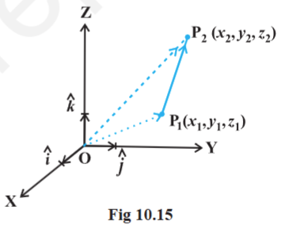
		- if $P_1 (x_1, y_1, z_1)$ and $P_2(x_2, y_2, z_2)$ are 2 points then the vector joining $P_1$ and $P_2$ is vector $P_1P_2$
		- $|\overrightarrow{P_1P_2}| = \sqrt{(x_2 - x_1)^2 + (y_2 - y_1)^2 + (z_2 - z_1)^2}$
	- section formula
		- P, Q 2 points represented by the position vectors $\overrightarrow{OP}$, $\overrightarrow{OQ}$ with respect to origin O.
		- the line segment joining the points P and Q may be divided by a 3rd point, say R in 2 ways - internally and externally.
		- case 1
			- when R divides PQ internally
			- 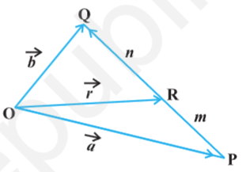
			- if R divides $\overrightarrow{PQ}$ such that $n\overrightarrow{PR} = m \overrightarrow{RQ}$
			- where m and n are positive scalars, we say that the point R divides $\overrightarrow{PQ}$ internally in the ratio of m : n
			- from triangles ORQ, OPR, we have
			  id:: 6a8ac1fe-f521-4266-b013-dc9472930741
			  $\overrightarrow{RQ} = \overrightarrow{OQ} - \overrightarrow{OR} = \overrightarrow{b} - \overrightarrow{r}$
			  $\overrightarrow{PR} = \overrightarrow{OR} - \overrightarrow{OP} = \overrightarrow{r} - \overrightarrow{a}$
			- m ($\overrightarrow{b} - \overrightarrow{r}$) = n ($\overrightarrow{r} - \overrightarrow{a}$)
			  $\overrightarrow{r}$ = $\frac{m\overrightarrow{b} + n\overrightarrow{a}}{m + n}$
			- hence, the position vector of the point R which divides P and Q internally in the ratio of m : n is given by
			  $\overrightarrow{OR}$ = $\frac{m\overrightarrow{b} + n\overrightarrow{a}}{m + n}$
		- case 2
			- 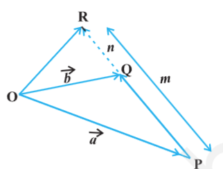
			- when R divides PQ externally in the ration m : n i.e. $\frac{PR}{QR} = \frac{m}{n}$ position vector is given by
			  $\overrightarrow{OR}$ = $\frac{m\overrightarrow{b} - n\overrightarrow{a}}{m - n}$
			- remark
				- if R is the midpoint of PQ, then m = n. from case 1, position vector is
				  $\overrightarrow{OR}$ = $\frac{\overrightarrow{a} + \overrightarrow{b}}{2}$
- product of 2 vectors
	- LATER multiplication of 2 functions pointwise and composition of 2 functions.
	- multiplication of 2 vectors is also defined in 2 ways, namely,
		- scalar (or dot) product
			- where the result is a scalar
		- vector (or cross) product
			- where the result is a vector
	- scalar (or dot) product of 2 vectors
		- definition
			- the scalar product of 2 nonzero vectors $\overrightarrow{a}$ and $\overrightarrow{b}$, denoted by $\overrightarrow{a} . \overrightarrow{b}$, is defined as
			  $\overrightarrow{a} . \overrightarrow{b} = |\overrightarrow{a}| |\overrightarrow{b}| cos \theta$
			  where, \theta is the angle between $\overrightarrow{a}$ and $\overrightarrow{b}$, $0 \leq \theta \leq \pi$
			- if either $\overrightarrow{a} = \overrightarrow{0}$ or $\overrightarrow{b} = \overrightarrow{0}$, then \theta is not defined, and in this case, we define $\overrightarrow{a} . \overrightarrow{b} = 0$
		- observations
			- $\overrightarrow{a} . \overrightarrow{b}$ is a real number
			- $\overrightarrow{a}$ and $\overrightarrow{b}$ be 2 nonzero vectors, then $\overrightarrow{a} . \overrightarrow{b} = 0$ if and only if $\overrightarrow{a}$ and $\overrightarrow{b}$ are perpendicular to each other. i.e.
			  $\overrightarrow{a} . \overrightarrow{b} = 0$ <=> $\overrightarrow{a} ⊥ \overrightarrow{b}$
			- if \theta = 0, the $\overrightarrow{a} . \overrightarrow{b} = |$\overrightarrow{a}| |\overrightarrow{b}|$
			  in particular $\overrightarrow{a} . \overrightarrow{a} = |\overrightarrow{a}|^2$, as \theta in this case is 0
			- if \theta = \pi, then $\overrightarrow{a} . \overrightarrow{b} = -|$\overrightarrow{a}| |\overrightarrow{b}|$
			  in particular $\overrightarrow{a} (-\overrightarrow{a}) = -|\overrightarrow{a}|^2$, as \theta in this case is \pi
			- for mutually perpendicular unit vectors $\hat{i}, \hat{j}, \hat{k}$ 
			  $\hat{i} . \hat{i} = \hat{j} . \hat{j} = \hat{k} . \hat{k} = 1$
			  $\hat{i} . \hat{j} = \hat{j} . \hat{k} = \hat{k} . \hat{i} = 0$
			- the angle between 2 nonzero vectors $\overrightarrow{a}$ and $\overrightarrow{b}$ is given by
			  $cos \theta = \frac{\overrightarrow{a} . \overrightarrow{b}}{|\overrightarrow{a}| |\overrightarrow{b}|}$
			  $\theta = cos^{-1} \frac{\overrightarrow{a} . \overrightarrow{b}}{|\overrightarrow{a}| |\overrightarrow{b}|}$
			- the scalar product is commutative
			  $\overrightarrow{a} . \overrightarrow{b}  = \overrightarrow{b} . \overrightarrow{a}$
		- property: distributivity of scalar product over addition
		  $\overrightarrow{a}, \overrightarrow{b}, \overrightarrow{c}$ 3 vectors
		  $\overrightarrow{a} . (\overrightarrow{b} + \overrightarrow{c}) = \overrightarrow{a} . \overrightarrow{b} + \overrightarrow{a} . \overrightarrow{c}$
		- property: $\overrightarrow{a}, \overrightarrow{b}$ 2 vectors, \lambda scalar.
		  $(\lambda \overrightarrow{a}) . \overrightarrow{b} =  \lambda (\overrightarrow{a} . \overrightarrow{b}) = \overrightarrow{a} . (\lambda \overrightarrow{b})$
		- 2 vectors $\overrightarrow{a}, \overrightarrow{b}$ are given in component form as $a_1\hat{i} + a_2\hat{j} + a_3\hat{k}$ and $b_1\hat{i} + b_2\hat{j} + b_3\hat{k}$, then their scalar product is given as
		  $\overrightarrow{a} . \overrightarrow{b} = a_1b_1 + a_2b_2 + a_3b_3$
	- projection of a vector on a line
		- a vector $\overrightarrow{AB}$ makes an angle \theta with a given directed line l, in the anticlockwise direction. then the projection of $\overrightarrow{AB}$ on l  is a vector $\overrightarrow{p}$ with magnitude $|\overrightarrow{AB}| cos \theta$ and the direction of $\overrightarrow{p}$ being the same (or opposite) to that of the line l, depending upon whether cos \theta is positive or negative.
		- the vector $\overrightarrow{p}$ is called the `projection vector` and its magnitude |$\overrightarrow{p}$| is called as `projection` of the vector $\overrightarrow{AB}$ on the directed line l.
		- 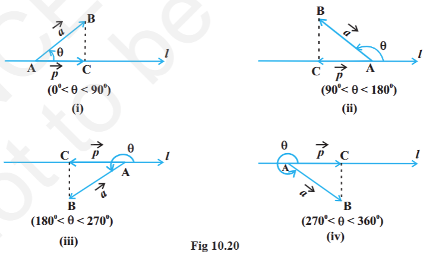
		- projection vector of $\overrightarrow{AB}$ along the line l is vector $\overrightarrow{AC}$
		- observations
			- if $\hat{p}$ is the unit vector along a line l, then the projection of a vector $\overrightarrow{a}$ on the line l is given by $\overrightarrow{a} \hat{p}$
			- projection of a vector $\overrightarrow{a}$ on the other vector $\overrightarrow{b}$, is given by
			  $\overrightarrow{a} . \hat{b}$ or $\overrightarrow{a} . \left( \frac{\overrightarrow{b}}{|\overrightarrow{b}|}\right)$ or $\frac{1}{|\overrightarrow{b}|}(\overrightarrow{a} . \overrightarrow{b})$
			- if \theta = 0, then the projection vector of $\overrightarrow{AB}$ will be $\overrightarrow{AB}$ itself and if \theta = \pi, then the projection vector of $\overrightarrow{AB}$ will be $\overrightarrow{BA}$
			- if \theta = $\frac{\pi}{2}$ or $\frac{3\pi}{2}$, then the projection vector of $\overrightarrow{AB}$ will be zero vector
		- remarks
			- if \alpha, \beta, \gamma are direction angles of vector $\overrightarrow{a} = a_1 \hat{i} + a_2 \hat{j} + a_3 \hat{k}$, then its direction cosines 
			  $$
			  cos \alpha = \frac{\overrightarrow{a} \hat{i}}{|\overrightarrow{a}| |\hat{i}|} = \frac{a_1}{|\overrightarrow{a}|}, cos \beta = \frac{a_2}{|\overrightarrow{a}|}, cos \gamma = \frac{a_3}{|\overrightarrow{a}|} 
			  $$
			- $|\overrightarrow{a}| cos \alpha, |\overrightarrow{a}| cos \beta, |\overrightarrow{a}| cos \gamma$ are projections of $|\overrightarrow{a}|$ along OX, OY, OZ i.e., the scalar components $a_1, a_2, a_3$ of vector $\overrightarrow{a}$ are projections of $\overrightarrow{a}$ along x, y, z-axis.
			- if $\overrightarrow{a}$ is a unit vector in terms of direction cosines
			  $\overrightarrow{a} = cos \alpha \hat{i} + cos \beta \hat{j} + cos \gamma \hat{k}$
	- vector (or cross) product of 2 vectors
		- in a right handed coordinate system, the thumb of the right hand points in the direction of the positive z-axis when the fingers are curled in the direction away from the positive x-axis toward the positive y-axis
		- 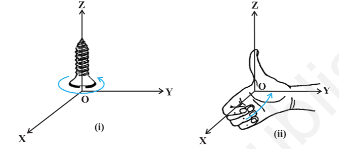
		- definition: the vector product of 2 nonzero vectors $\overrightarrow{a}$ and $overrightarrow{b}$, is denoted by and defined as
		  $\overrightarrow{a} \times \overrightarrow{b} = |\overrightarrow{a}| |\overrightarrow{b}|\ sin\theta\ \hat{n}$
		- where \theta is the angle between $\overrightarrow{a}$ and $\overrightarrow{b}$, $0 \leq \theta \leq \pi$ and $\hat{n}$ is a unit vector perpendicular to both $\overrightarrow{a}$ and $\overrightarrow{b}$, such that $\overrightarrow{a}$, $\overrightarrow{b}$ and $\hat{n}$ form a right handed system i.e., the right handed system rotated from $\overrightarrow{a}$ to $\overrightarrow{b}$ moves in the direction of $\hat{n}$
		- 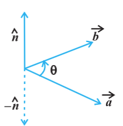
		- if either $\overrightarrow{a} = \overrightarrow{0}$ or $\overrightarrow{b} = \overrightarrow{0}$, the $\theta$ is not defined and in this case, we define $\overrightarrow{a} \times \overrightarrow{b} = \overrightarrow{0}$
		  id:: 6a8e8684-3c4c-4c8f-8b37-9587f7af1faa
		- observations
			- $\overrightarrow{a} \times \overrightarrow{b}$ is a vector
			- $\overrightarrow{a}$, $\overrightarrow{b}$ 2 nonzero vectors. then $\overrightarrow{a} \times \overrightarrow{b} = \overrightarrow{0}$ if and only if $\overrightarrow{a}$ and $\overrightarrow{b}$ are parallel (or collinear) to each other i.e.,
			  $\overrightarrow{a} \times \overrightarrow{b} = 0$ <=> $\overrightarrow{a} || \overrightarrow{b}$
			  in particular, $\overrightarrow{a} \times \overrightarrow{a} = \overrightarrow{0}$ and $\overrightarrow{a} \times (- \overrightarrow{a}) = \overrightarrow{0}$, since in the first situation, $\theta = 0$ and in the second one, $\theta = \pi$, making the value of $sin \theta$ to be 0.
			- if $\theta = \frac{\pi}{2}$ then $\overrightarrow{a} \times \overrightarrow{b} = |\overrightarrow{a}| |\overrightarrow{b}|$
			- for mutually perpendicular unit vectors $\hat{i}$, $\hat{j}$, $\hat{k}$
			  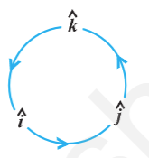
			  $\hat{i} \times \hat{i} = \hat{j} \times \hat{j} = \hat{k} \times \hat{k} = \overrightarrow{0}$
			  $\hat{i} \times \hat{j} = \hat{k}, \hat{j} \times \hat{k} = \hat{i}, \hat{k} \times \hat{i} = \hat{j}$
			- in terms of vector product, the angle between 2 vectors give as
			  $sin \theta = \frac{|\overrightarrow{a} \times \overrightarrow{b}|}{|\overrightarrow{a}| |\overrightarrow{b}|}$
			- it is always true that the vector product is not commutative, as $\overrightarrow{a} \times \overrightarrow{b} = - \overrightarrow{b} \times \overrightarrow{a}$
				- indeed, $\overrightarrow{a} \times \overrightarrow{b} = |\overrightarrow{a}| |\overrightarrow{b}|\ sin \theta\ \hat{n}$, where $\overrightarrow{a}$, $\overrightarrow{b}$, $\hat{n}$ form a right handed system i.e., \theta is traversed from $\overrightarrow{a}$ to $\overrightarrow{b}$
				  while $\overrightarrow{b} \times \overrightarrow{a} = |\overrightarrow{a}| |\overrightarrow{b}|\ sin \theta\ \hat{n_1}$, where $\overrightarrow{b}$, $\overrightarrow{a}$, $\hat{n_1}$ form a right handed system i.e., \theta is traversed from $\overrightarrow{b}$ to $\overrightarrow{a}$.
				  if $\overrightarrow{a}$, $\overrightarrow{b}$ to lie in the plane of the paper, then $\hat{n}$ and $\hat{n_1}$ both will be perpendicular to the plane of the paper. $\hat{n}$ directed above the paper and $\hat{n_1}$ directed below the paper i.e. $\hat{n_1} = - \hat{n}$
				  $\overrightarrow{a} \times \overrightarrow{b} = |\overrightarrow{a}| |\overrightarrow{b}|\ sin \theta\ \hat{n}$
				  $= - |\overrightarrow{a}| |\overrightarrow{b}|\ sin \theta\ \hat{n_1} = -  |\overrightarrow{b}| \times |\overrightarrow{a}|$
				- 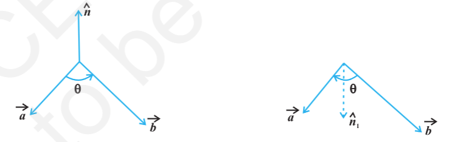
			- $\hat{j} \times \hat{i} = - \hat{k}, \hat{k} \times \hat{j} = -\hat{i}, \hat{i} \times \hat{k} = -\hat{j}$
			- $\overrightarrow{a}$, $\overrightarrow{b}$ represent adjacent sides of a triangle then its area is given as $\frac{1}{2} |\overrightarrow{a} \times \overrightarrow{b}|$
				- 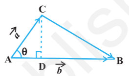
				- Area of triangle ABC = $\frac{1}{2} AB CD = \frac{1}{2} |\overrightarrow{b}| |\overrightarrow{a}| sin \theta = \frac{1}{2} |\overrightarrow{a} \times \overrightarrow{b}|$
			- $\overrightarrow{a}$, $\overrightarrow{b}$ represent adjacent sides of a parallelogram, then its area is given by $|\overrightarrow{a} \times \overrightarrow{b}|$
			  collapsed:: true
				- 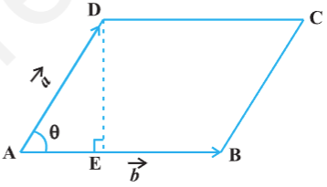
				- area of parallelogram ABCD = AB . DE  = $\overrightarrow{b} \overrightarrow{a} sin \theta = |\overrightarrow{a} \times \overrightarrow{b}|$
		- property: distributivity of vector product over addition
			- $\overrightarrow{a}$, $\overrightarrow{b}$, $\overrightarrow{c}$ 3 vectors and $\lambda$ be a scalar, then
				- $\overrightarrow{a} \times (\overrightarrow{b} + \overrightarrow{c}) = \overrightarrow{a} \times \overrightarrow{b} + \overrightarrow{a} \times \overrightarrow{c}$
				- $\lambda (\overrightarrow{a} \times \overrightarrow{b}) = (\lambda \overrightarrow{a}) \times \overrightarrow{b} = \overrightarrow{a} \times (\lambda \overrightarrow{b})$
		- $\overrightarrow{a}$, $\overrightarrow{b}$ be 2 vectors in component form as $a_1 \hat{i} + a_2 \hat{j} + a_3 \hat{k}$ and $b_1 \hat{i} + b_2 \hat{j} + b_3 \hat{k}$, then
		  $$
		  \overrightarrow{a} \times \overrightarrow{b} = 
		  \begin{vmatrix}
		  \hat{i} & \hat{j} & \hat{k} \\
		  a_1 & a_2 & a_3 \\
		  b_1 & b_2 & b_3
		  \end{vmatrix}
		  $$