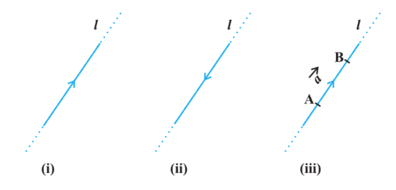
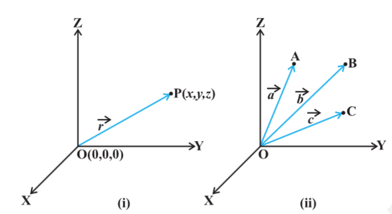
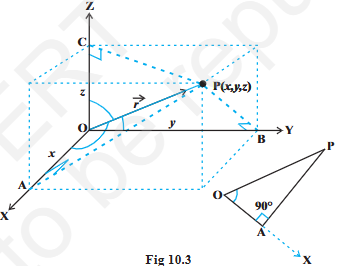
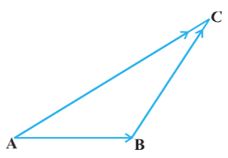
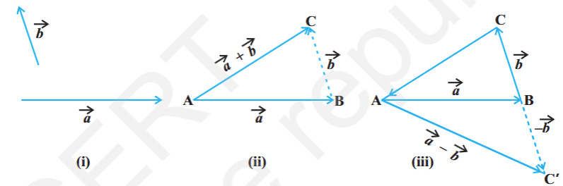
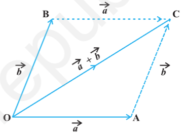

- 
- introduction
	- scalars
		- scalar quantities such as length, mass, time, distance, speed, area, volume, temperature, volume, temperature, work, money, voltage, density, resistance etc.
	- vectors
		- vector quantities like displacement, velocity, acceleration, force, weight, momentum, electric field intensity etc.
		- algebraic and geometric properties. these 2 types of properties, when considered together give a full realisation to the concept of vectors, and lead to their vital applicability in various areas.
- some basic concepts
	- vector
		- definition: a quantity that has magnitude as well as direction is called a vector
		- 
		- i & ii are line given 2 directions by means of arrow heads are called `directed line`
		- if we restrict line l to the line segment AB, then a magnitude is prescribed on the line l with one of the 2 directions, so that we obtain a `directed line segment`. thus, a directed line segment has magnitude as well as direction and is denoted as $\overrightarrow{AB}$ or \overrightarrow{a}$ and read as vector $\overrightarrow{AB}$ or vector $\overrightarrow{a}$
		- the point A from where the vector $\overrightarrow{AB}$ starts is called its `initial point`, and the point B where it ends is called its `terminal point`. the distance between initial and terminal points of a vector is called the `magnitude` (or length) of the vector, denoted as $|\overrightarrow{AB}|$ or $|\overrightarrow{a}|$ or a. the arrow indicates the direction of the vector.
		- note: since the length is never negative, the notation $|\overrightarrow{a}|$ < 0 has no meaning
	- position vector
		- 
		- consider a point P in space, having coordinates (x, y, z) with respect to the origin O (0, 0, 0). then, the vector $\overrightarrow{OP}$ having O and P as its initial and terminal points, respectively, is called the `position vector` of the point P with respect to O. using distance formula, the magnitude of $\overrightarrow{OP}$ (or $\overrightarrow{r}$) is given by
		  |$\overrightarrow{OP}$| = $\sqrt{x^2 + y^2 + Z^2}$
		- in practice, the position vectors of points A, B, C etc., with respect to the origin O are denoted by $\overrightarrow{a}, \overrightarrow{b}, \overrightarrow{c}$
	- direction cosines
		- consider the position vector $\overrightarrow{OP}$ or $\overrightarrow{r}$ of a point P(z, y, z). the angles \alpha, \beta, \gama made by the verctor $\overrightarrow{r}$ with the positive directions of x, y and z- axes respectively, are called its `direction angles`. the cosine values of these angles, i.e., cos \alpha, cos \beta and cos \gamma are called `direction cosines` of the vector $\overrightarrow{r}$, and usually denoted by l, m and n.
		- 
		- triangle OAP is right angles, $cos \alpha = \frac{x}{r}$ (r stands for |$\overrightarrow{r}$|)
		- from right angled triangles OBP and OCP, $cos \beta = \frac{y}{r}$, cos \gamma = $\frac{z}{r}$
		- coordinates of the point P may also be expressed as (lr, mr, nr) proportional to the direction cosines are called as `direction ratios` of vector $\overrightarrow{r}$, denoted as a, b, c
		- note: $l^2 + m^2 + n^2 = 1$ but $a^2 + b^2 + c^2 \neq 1, in general$
- types of vectors
	- zero vector
		- a vector whose initial and terminal points coincide, is called a zero vector (or null vector), and denoted as $\overrightarrow{0}$
		- zero vector can not be assigned a definite direction as it has zero magnitude. or alternatively otherwise, it may be regarded as having any direction.
		- the vectors $\overrightarrow{AA}$, $\overrightarrow{BB}$ represent the zero vector
	- unit vector
		- a vector whose magnitude is unity (i.e., 1 unit) is called a unit vector. the unit vector in the direction of a given vector $\overrightarrow{a}$ is denoted by $\hat{\mathbf{a}}$
	- coinitial vectors
		- 2 or more vectors having the same initial point are called coinitial vectors
	- collinear vectors
		- 2 or more vectors are said to be collinear if they are parallel to the same line, irrespective of their magnitudes and directions
	- equal vectors
		- 2 vectors $\overrightarrow{a}$ and $\overrightarrow{b}$ are said to be equal, if they have the same magnitude and direction regardless of the positions of their initial points, and written as $\overrightarrow{a}$ = $\overrightarrow{b}$
	- negative of a vector
		- a vector whose magnitude is the same as that of a given vector (say, $\overrightarrow{AB}$), but direction is opposite to that of it, is called negative of the given vector.
		- vector $\overrightarrow{BA}$ is negative of the vector $\overrightarrow{AB}$, and written as $\overrightarrow{BA}$ = - $\overrightarrow{AB}$
	- remark
		- the vectors may be subject to its parallel displacement without changing its magnitude and direction. such vectors are called `free vectors`
- addition of vectors
	- a vector $\overrightarrow{AB}$ simply means the displacement from a point A to the point B.
	- if we have 2 vectors $\overrightarrow{a}$, $\overrightarrow{b}$, then to add them, they are positioned so that the initial point of one coincides with the terminal point of the other.
	- triangle law of vector addition
		- $\overrightarrow{AC} = \overrightarrow{AB} + \overrightarrow{BC}$
		- 
	- 
		- if we have 2 vectors $\overrightarrow{a}$ and $\overrightarrow{b}$ as per fig i, then to add them, they are positioned so that the initial point of one coincides with the terminal point of the other fig ii.
		- we shifted vector $\overrightarrow{b}$ without changing its magnitude and direction, so that it's initial point coincides with the terminal point of $\overrightarrow{a}$. then, the vector $\overrightarrow{a}$ + $\overrightarrow{b}$, represented by the 3rd side AC of the triangle ABC, gives us the sum (or resultant) of the vectors $\overrightarrow{a}$ and $\overrightarrow{b}$ i.e., in triangle ABC, we have
		  $\overrightarrow{AB} + \overrightarrow{BC} = \overrightarrow{AC}$
		- since $\overrightarrow{AC}$ = - $\overrightarrow{CA}$
		  $\overrightarrow{AB} + \overrightarrow{BC} + \overrightarrow{CA} = \overrightarrow{AA} = \overrightarrow{0}$
		- when the sides of a triangle are taken in order, it leads to zero resultant as the initial and terminal points get coincided (fig iii)
		- construct a vector $\overrightarrow{BC'}$ so that its magnitude is same as the vector $\overrightarrow{BC}$, but the direction opposite to that of it (fig iii), i.e., 
		  $\overrightarrow{BC} = - \overrightarrow{BC}$
		- apply triangle law for fig iii,
		  $\overrightarrow{AC'} = \overrightarrow{AB} + \overrightarrow{BC'} = \overrightarrow{AB} + (-\overrightarrow{BC}) = \overrightarrow{a} - \overrightarrow{b}$
		- the vector $\overrightarrow{AC'}$ is said to represent the `difference` of $\overrightarrow{a}$ and $\overrightarrow{b}$
		- parallelogram law of vector addition
			- 
			- 2 vectors$\overrightarrow{a}$, $\overrightarrow{b}$ represented by the 2 adjacent sides of a parallelogram in magnitude and direction, then their sum $\overrightarrow{a}$ + $\overrightarrow{b}$ is represented in magnitude and direction by the diagonal of the parallelogram through their common point. this is known as the parallelogram law of vector addition.
			- triangle law and parallelogram law of vector addition are equivalent to each other
	- properties of vector addition
		- property 1
		- property 2
- multiplication of a vector by a scalar
	- components of a vector
	- vector joining 2 points
	- section formula
- product of 2 vectors
	- scalar (or dot) product of 2 vectors
	- projection of a vector on a line
	- vector (or cross) product of 2 vectors